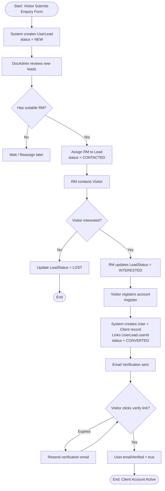
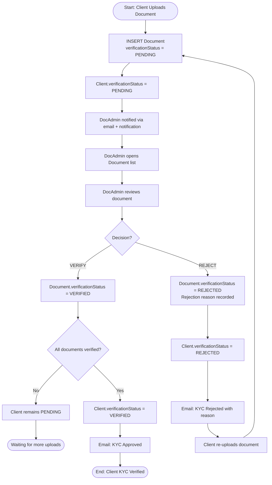
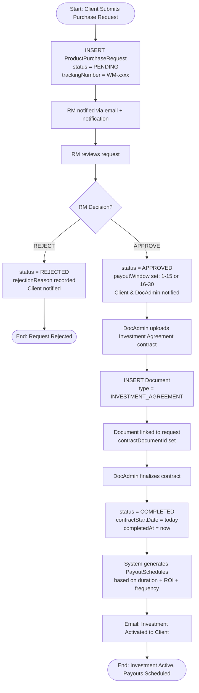
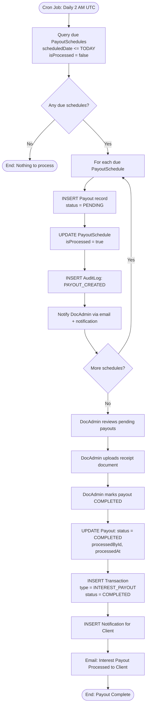
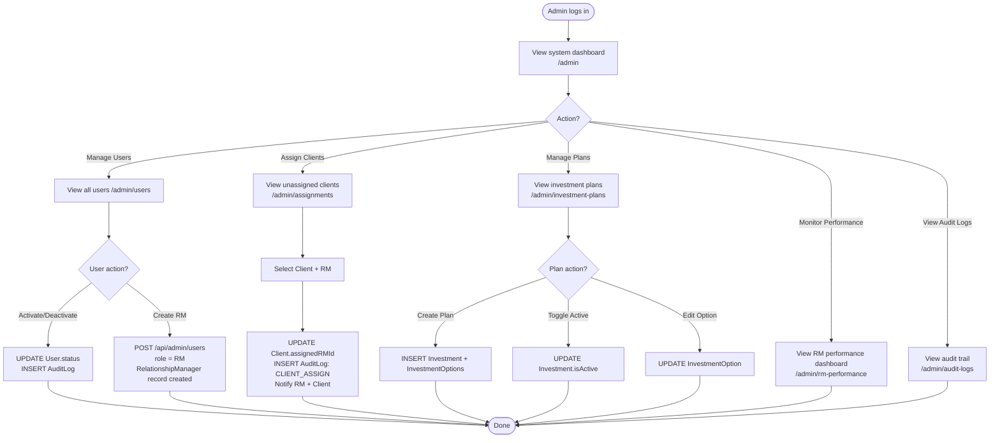

# Activity Diagrams — EMDEE Ventures Wealth Management CRM

---

## 1. Lead → Client Conversion Activity

---

## 2. KYC Document Verification Activity

---

## 3. Investment Purchase Request Lifecycle

---

## 4. Automated Payout Processing Activity

---

## 5. Admin User & RM Management Activity

