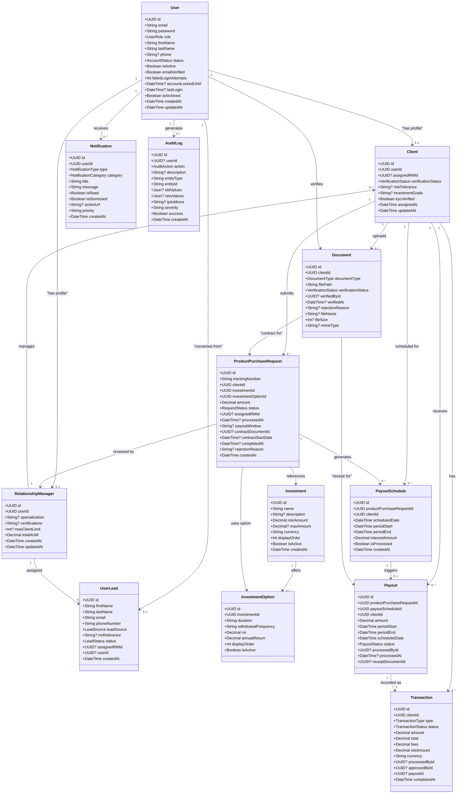
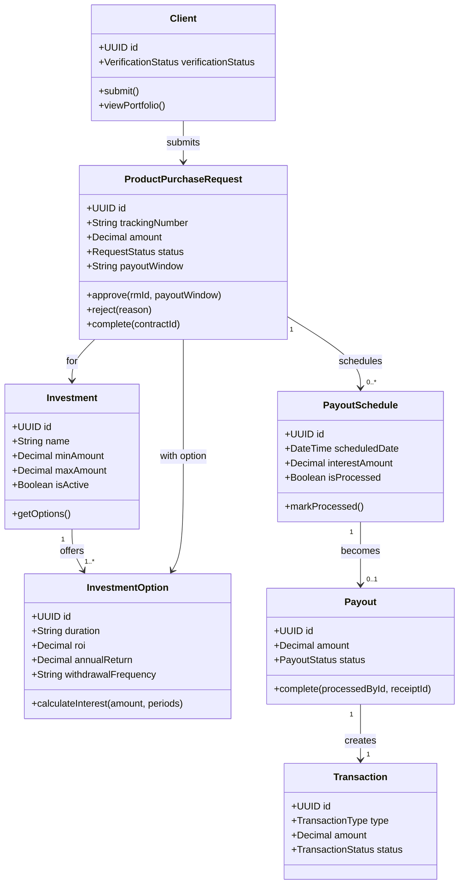
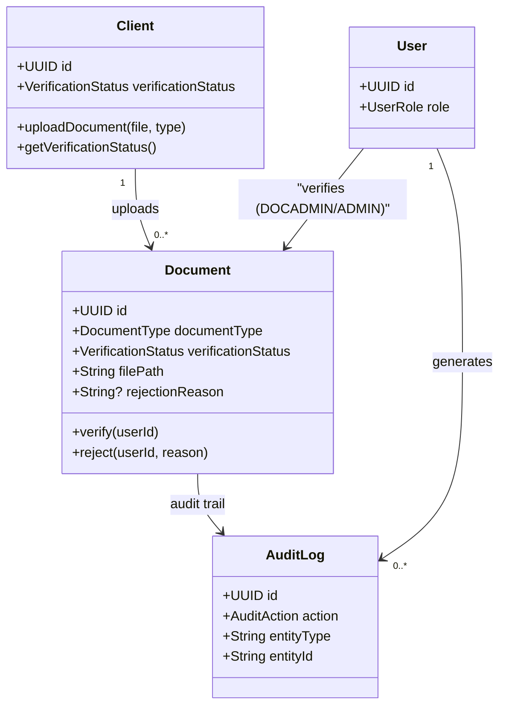
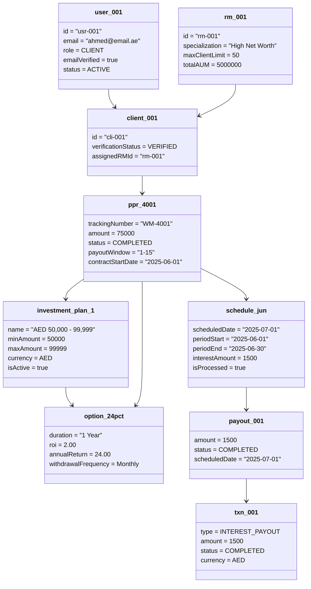
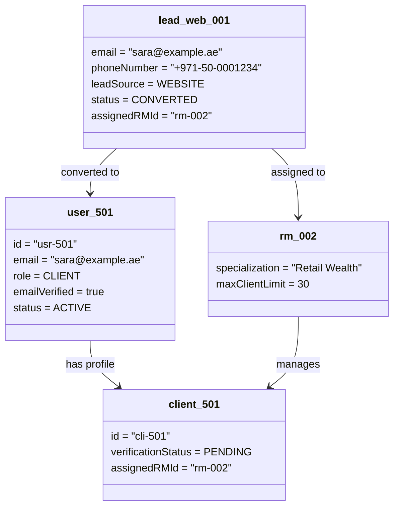

# Class Diagrams — EMDEE Ventures Wealth Management CRM

---

## 1. Core System Class Diagram

---

## 2. Investment & Payout Workflow Class Diagram

---

## 3. Document Verification Class Diagram

---

## 4. Object Diagram — Single Investment Contract with Payout

---

## 5. Object Diagram — Lead Converted to Client

