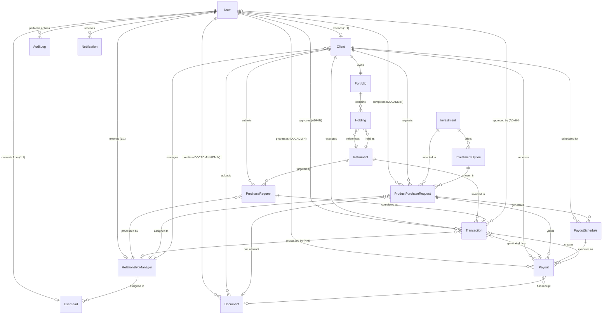

# Wealth Management CRM - Complete Database Documentation

> **Database**: PostgreSQL 15+  
> **ORM**: Prisma  
> **Total Tables**: 17  
> **Total Enums**: 13

---

## 📊 Entity-Relationship Diagram



---

## 📋 Complete Table Schemas

### 1. **users** (`User`)

**Purpose**: Base authentication and user management table for all system actors.

| Column | Type | Constraints | Description |
|--------|------|-------------|-------------|
| `id` | UUID | PRIMARY KEY | Unique identifier |
| `email` | VARCHAR | UNIQUE, NOT NULL | Login email |
| `password` | VARCHAR | NOT NULL | bcrypt hashed password |
| `role` | UserRole | NOT NULL | CLIENT, RM, ADMIN, DOCADMIN |
| `firstName` | VARCHAR | NOT NULL | User's first name |
| `lastName` | VARCHAR | NOT NULL | User's last name |
| `phone` | VARCHAR | NULLABLE | Contact number |
| `status` | AccountStatus | DEFAULT: ACTIVE | Account status |
| `isActive` | BOOLEAN | DEFAULT: true | Active flag |
| `emailVerified` | BOOLEAN | DEFAULT: false | Email verification status |
| `failedLoginAttempts` | INTEGER | DEFAULT: 0 | Security counter |
| `accountLockedUntil` | TIMESTAMP | NULLABLE | Lock expiration |
| `lastLogin` | TIMESTAMP | NULLABLE | Last successful login |
| `lastFailedLogin` | TIMESTAMP | NULLABLE | Last failed attempt |
| `isArchived` | BOOLEAN | DEFAULT: false | Archival flag (KYC expired) |
| `archivedAt` | TIMESTAMP | NULLABLE | When archived |
| `createdAt` | TIMESTAMP | DEFAULT: now() | Creation timestamp |
| `updatedAt` | TIMESTAMP | AUTO UPDATE | Last update |
| `deletedAt` | TIMESTAMP | NULLABLE | Soft delete timestamp |

**Indexes**: `email`, `role`, `status`, `isArchived`

**Relationships**:
- 1:1 → `Client` (via `userId`)
- 1:1 → `RelationshipManager` (via `userId`)
- 1:1 → `UserLead` (via `userId`)
- 1:N → `AuditLog`, `Notification`, `Document` (verifier), `Transaction` (approver), `ProductPurchaseRequest` (completer), `Payout` (processor)

---

### 2. **clients** (`Client`)

**Purpose**: Client-specific profile extending User with investment preferences and KYC data.

| Column | Type | Constraints | Description |
|--------|------|-------------|-------------|
| `id` | UUID | PRIMARY KEY | Unique identifier |
| `userId` | UUID | UNIQUE, FK → users.id, CASCADE | Reference to User |
| `assignedRMId` | UUID | NULLABLE, FK → relationship_managers.id | Assigned RM |
| `riskTolerance` | VARCHAR | NULLABLE | LOW, MEDIUM, HIGH |
| `investmentGoals` | TEXT | NULLABLE | Client's goals |
| `kycVerified` | BOOLEAN | DEFAULT: false | KYC completion flag |
| `kycDocuments` | TEXT | NULLABLE | JSON array of document URLs |
| `verificationStatus` | VerificationStatus | DEFAULT: NOT_SUBMITTED | Document verification state |
| `assignedAt` | TIMESTAMP | DEFAULT: now() | When RM was assigned |
| `archivedReason` | TEXT | NULLABLE | Reason for archival |

**Indexes**: `assignedRMId`, `verificationStatus`

**Relationships**:
- N:1 → `User` (via `userId`)
- N:1 → `RelationshipManager` (via `assignedRMId`)
- 1:1 → `Portfolio`
- 1:N → `PurchaseRequest`, `Transaction`, `Document`, `ProductPurchaseRequest`, `PayoutSchedule`, `Payout`

---

### 3. **relationship_managers** (`RelationshipManager`)

**Purpose**: RM-specific data extending User with performance metrics.

| Column | Type | Constraints | Description |
|--------|------|-------------|-------------|
| `id` | UUID | PRIMARY KEY | Unique identifier |
| `userId` | UUID | UNIQUE, FK → users.id, CASCADE | Reference to User |
| `specialization` | VARCHAR | NULLABLE | e.g., "High Net Worth" |
| `certifications` | TEXT | NULLABLE | JSON array of certs |
| `maxClientLimit` | INTEGER | DEFAULT: 50 | Max clients allowed |
| `totalAUM` | DECIMAL(15,2) | DEFAULT: 0 | Assets Under Management |

**Relationships**:
- N:1 → `User` (via `userId`)
- 1:N → `Client`, `PurchaseRequest`, `Transaction`, `ProductPurchaseRequest`, `UserLead`

---

### 4. **portfolios** (`Portfolio`)

**Purpose**: Aggregated view of a client's investment holdings.

| Column | Type | Constraints | Description |
|--------|------|-------------|-------------|
| `id` | UUID | PRIMARY KEY | Unique identifier |
| `clientId` | UUID | UNIQUE, FK → clients.id, CASCADE | Owner client |
| `totalValue` | DECIMAL(15,2) | DEFAULT: 0 | Current portfolio value |
| `totalInvested` | DECIMAL(15,2) | DEFAULT: 0 | Total invested amount |
| `totalGainLoss` | DECIMAL(15,2) | DEFAULT: 0 | Unrealized P&L |
| `totalGainLossPercent` | DECIMAL(10,4) | DEFAULT: 0 | P&L percentage |
| `dayChange` | DECIMAL(15,2) | DEFAULT: 0 | 24h change |
| `dayChangePercent` | DECIMAL(10,4) | DEFAULT: 0 | 24h change % |
| `weekChange` | DECIMAL(15,2) | DEFAULT: 0 | 7d change |
| `monthChange` | DECIMAL(15,2) | DEFAULT: 0 | 30d change |
| `yearChange` | DECIMAL(15,2) | DEFAULT: 0 | 365d change |
| `lastUpdatedAt` | TIMESTAMP | DEFAULT: now() | Last recalculation |
| `createdAt` | TIMESTAMP | DEFAULT: now() | Creation timestamp |
| `updatedAt` | TIMESTAMP | AUTO UPDATE | Last update |

**Indexes**: `clientId`, `totalValue`, `lastUpdatedAt`

**Relationships**:
- N:1 → `Client` (via `clientId`)
- 1:N → `Holding`

---

### 5. **instruments** (`Instrument`)

**Purpose**: Master table of investable financial instruments.

| Column | Type | Constraints | Description |
|--------|------|-------------|-------------|
| `id` | UUID | PRIMARY KEY | Unique identifier |
| `symbol` | VARCHAR(20) | UNIQUE, NOT NULL | Ticker symbol |
| `name` | VARCHAR(255) | NOT NULL | Instrument name |
| `type` | InstrumentType | NOT NULL | Asset class |
| `isin` | VARCHAR(12) | UNIQUE, NULLABLE | ISIN code |
| `description` | TEXT | NULLABLE | Description |
| `currentPrice` | DECIMAL(15,4) | NOT NULL | Latest price |
| `currency` | VARCHAR(3) | DEFAULT: 'USD' | Currency code |
| `lastPriceUpdate` | TIMESTAMP | DEFAULT: now() | Price update time |
| `exchange` | VARCHAR(50) | NULLABLE | Exchange name |
| `sector` | VARCHAR(100) | NULLABLE | Industry sector |
| `marketCap` | DECIMAL(20,2) | NULLABLE | Market capitalization |
| `yearlyHigh` | DECIMAL(15,4) | NULLABLE | 52-week high |
| `yearlyLow` | DECIMAL(15,4) | NULLABLE | 52-week low |
| `dividendYield` | DECIMAL(5,4) | NULLABLE | Dividend yield % |
| `peRatio` | DECIMAL(10,2) | NULLABLE | P/E ratio |
| `riskRating` | VARCHAR(20) | NULLABLE | Risk level |
| `minimumInvestment` | DECIMAL(15,2) | NULLABLE | Min investment |
| `isActive` | BOOLEAN | DEFAULT: true | Active status |
| `isPublic` | BOOLEAN | DEFAULT: true | Visibility flag |
| `launchDate` | TIMESTAMP | NULLABLE | Launch date |
| `prospectusUrl` | VARCHAR(500) | NULLABLE | Prospectus URL |
| `createdAt` | TIMESTAMP | DEFAULT: now() | Creation timestamp |
| `updatedAt` | TIMESTAMP | AUTO UPDATE | Last update |
| `deletedAt` | TIMESTAMP | NULLABLE | Soft delete |

**Indexes**: `symbol`, `type`, `isActive`, `isPublic`

**Relationships**:
- 1:N → `Transaction`, `Holding`, `PurchaseRequest`

---

### 6. **holdings** (`Holding`)

**Purpose**: Individual positions within a client's portfolio.

| Column | Type | Constraints | Description |
|--------|------|-------------|-------------|
| `id` | UUID | PRIMARY KEY | Unique identifier |
| `portfolioId` | UUID | FK → portfolios.id, CASCADE | Parent portfolio |
| `instrumentId` | UUID | FK → instruments.id | Held instrument |
| `quantity` | DECIMAL(15,6) | NOT NULL | Units held |
| `averagePurchasePrice` | DECIMAL(15,4) | NOT NULL | Cost basis per unit |
| `totalCost` | DECIMAL(15,2) | NOT NULL | Total invested |
| `currentPrice` | DECIMAL(15,4) | NOT NULL | Current market price |
| `currentValue` | DECIMAL(15,2) | NOT NULL | Current total value |
| `gainLoss` | DECIMAL(15,2) | NOT NULL | Unrealized P&L |
| `gainLossPercent` | DECIMAL(10,4) | NOT NULL | P&L percentage |
| `dayChange` | DECIMAL(15,2) | DEFAULT: 0 | 24h change |
| `dayChangePercent` | DECIMAL(10,4) | DEFAULT: 0 | 24h change % |
| `allocationPercent` | DECIMAL(5,2) | DEFAULT: 0 | Portfolio allocation % |
| `firstPurchasedAt` | TIMESTAMP | NOT NULL | First purchase date |
| `lastUpdatedAt` | TIMESTAMP | DEFAULT: now() | Last recalculation |
| `createdAt` | TIMESTAMP | DEFAULT: now() | Creation timestamp |
| `updatedAt` | TIMESTAMP | AUTO UPDATE | Last update |
| `deletedAt` | TIMESTAMP | NULLABLE | Soft delete |

**Unique Constraint**: `(portfolioId, instrumentId)` - One holding per instrument per portfolio

**Indexes**: `portfolioId`, `instrumentId`, `currentValue`

**Relationships**:
- N:1 → `Portfolio` (via `portfolioId`)
- N:1 → `Instrument` (via `instrumentId`)

---

### 7. **purchase_requests** (`PurchaseRequest`)

**Purpose**: Client-initiated requests to purchase instruments (legacy/traditional flow).

| Column | Type | Constraints | Description |
|--------|------|-------------|-------------|
| `id` | UUID | PRIMARY KEY | Unique identifier |
| `trackingNumber` | VARCHAR(50) | UNIQUE, NOT NULL | Client reference number |
| `clientId` | UUID | FK → clients.id, CASCADE | Requesting client |
| `instrumentId` | UUID | FK → instruments.id | Target instrument |
| `amount` | DECIMAL(15,2) | NOT NULL | Investment amount |
| `quantity` | DECIMAL(15,4) | NULLABLE | Calculated quantity |
| `requestedPrice` | DECIMAL(15,4) | NULLABLE | Price at request time |
| `status` | RequestStatus | DEFAULT: PENDING | Request status |
| `processedById` | UUID | NULLABLE, FK → relationship_managers.id | Processing RM |
| `processedAt` | TIMESTAMP | NULLABLE | Processing timestamp |
| `bankStatementRef` | VARCHAR | NULLABLE | Bank statement reference |
| `paymentProof` | TEXT | NULLABLE | Payment proof URL |
| `clientNotes` | TEXT | NULLABLE | Client's notes |
| `rmNotes` | TEXT | NULLABLE | RM's notes |
| `rejectionReason` | TEXT | NULLABLE | Rejection reason |
| `createdAt` | TIMESTAMP | DEFAULT: now() | Creation timestamp |
| `updatedAt` | TIMESTAMP | AUTO UPDATE | Last update |

**Indexes**: `clientId`, `status`, `createdAt`, `processedById`

**Relationships**:
- N:1 → `Client` (via `clientId`)
- N:1 → `Instrument` (via `instrumentId`)
- N:1 → `RelationshipManager` (via `processedById`)
- 1:1 → `Transaction` (completion)

---

### 8. **transactions** (`Transaction`)

**Purpose**: Immutable ledger of all completed financial transactions.

| Column | Type | Constraints | Description |
|--------|------|-------------|-------------|
| `id` | UUID | PRIMARY KEY | Unique identifier |
| `clientId` | UUID | FK → clients.id, CASCADE | Transaction owner |
| `instrumentId` | UUID | NULLABLE, FK → instruments.id | Related instrument |
| `type` | TransactionType | NOT NULL | Transaction type |
| `status` | TransactionStatus | DEFAULT: COMPLETED | Transaction status |
| `amount` | DECIMAL(15,2) | NOT NULL | Transaction amount |
| `price` | DECIMAL(15,4) | NULLABLE | Unit price |
| `quantity` | DECIMAL(15,6) | NULLABLE | Number of units |
| `total` | DECIMAL(15,2) | NOT NULL | Total value |
| `fees` | DECIMAL(15,2) | DEFAULT: 0 | Transaction fees |
| `netAmount` | DECIMAL(15,2) | NOT NULL | Amount after fees |
| `currency` | VARCHAR(3) | DEFAULT: 'USD' | Currency code |
| `bankStatementReference` | TEXT | NULLABLE | Bank statement ref |
| `paymentProof` | TEXT | NULLABLE | Payment proof URL |
| `processedById` | UUID | NULLABLE, FK → relationship_managers.id | Processing RM |
| `approvedById` | UUID | NULLABLE, FK → users.id | Approving admin |
| `purchaseRequestId` | UUID | UNIQUE, NULLABLE, FK → purchase_requests.id | Source request |
| `payoutId` | UUID | UNIQUE, NULLABLE | Related payout |
| `completedAt` | TIMESTAMP | DEFAULT: now() | Completion time |
| `notes` | TEXT | NULLABLE | Transaction notes |
| `metadata` | TEXT | NULLABLE | JSON metadata |
| `failureReason` | TEXT | NULLABLE | Failure reason |
| `createdAt` | TIMESTAMP | DEFAULT: now() | Creation timestamp |
| `updatedAt` | TIMESTAMP | AUTO UPDATE | Last update |
| `deletedAt` | TIMESTAMP | NULLABLE | Soft delete |

**Indexes**: `clientId`, `type`, `status`, `completedAt`, `instrumentId`, `processedById`, `createdAt`

**Relationships**:
- N:1 → `Client` (via `clientId`)
- N:1 → `Instrument` (via `instrumentId`)
- N:1 → `RelationshipManager` (via `processedById`)
- N:1 → `User` (via `approvedById`)
- 1:1 → `PurchaseRequest` (via `purchaseRequestId`)
- 1:1 → `Payout` (via `payoutId`)

---

### 9. **audit_logs** (`AuditLog`)

**Purpose**: Comprehensive audit trail for compliance and security.

| Column | Type | Constraints | Description |
|--------|------|-------------|-------------|
| `id` | UUID | PRIMARY KEY | Unique identifier |
| `userId` | UUID | FK → users.id | Actor user |
| `action` | AuditAction | NOT NULL | Action performed |
| `description` | TEXT | NULLABLE | Human-readable description |
| `entityType` | VARCHAR(50) | NOT NULL | Affected entity type |
| `entityId` | VARCHAR | NOT NULL | Affected entity ID |
| `oldValues` | JSON | NULLABLE | Previous state |
| `newValues` | JSON | NULLABLE | New state |
| `ipAddress` | VARCHAR(45) | NULLABLE | Client IP |
| `userAgent` | TEXT | NULLABLE | Browser/client info |
| `metadata` | JSON | NULLABLE | Additional context |
| `severity` | VARCHAR(20) | DEFAULT: 'INFO' | Log severity |
| `success` | BOOLEAN | DEFAULT: true | Action success flag |
| `errorMessage` | TEXT | NULLABLE | Error details |
| `sessionId` | VARCHAR(100) | NULLABLE | Session identifier |
| `retentionDate` | TIMESTAMP | NULLABLE | Archival date |
| `createdAt` | TIMESTAMP | DEFAULT: now() | Creation timestamp |

**Indexes**: `userId`, `action`, `(entityType, entityId)`, `createdAt`, `severity`, `ipAddress`

**Relationships**:
- N:1 → `User` (via `userId`)

---

### 10. **notifications** (`Notification`)

**Purpose**: In-app notification system for user alerts.

| Column | Type | Constraints | Description |
|--------|------|-------------|-------------|
| `id` | UUID | PRIMARY KEY | Unique identifier |
| `userId` | UUID | FK → users.id, CASCADE | Recipient user |
| `type` | NotificationType | NOT NULL | Notification type |
| `category` | NotificationCategory | NOT NULL | Category |
| `title` | VARCHAR(255) | NOT NULL | Notification title |
| `message` | TEXT | NOT NULL | Notification message |
| `isRead` | BOOLEAN | DEFAULT: false | Read status |
| `readAt` | TIMESTAMP | NULLABLE | When read |
| `isDismissed` | BOOLEAN | DEFAULT: false | Dismissed flag |
| `actionUrl` | VARCHAR(500) | NULLABLE | Action link |
| `actionText` | VARCHAR(100) | NULLABLE | Action button text |
| `entityType` | VARCHAR(50) | NULLABLE | Related entity type |
| `entityId` | VARCHAR | NULLABLE | Related entity ID |
| `priority` | VARCHAR(20) | DEFAULT: 'NORMAL' | Priority level |
| `expiresAt` | TIMESTAMP | NULLABLE | Expiration time |
| `metadata` | JSON | NULLABLE | Additional data |
| `createdAt` | TIMESTAMP | DEFAULT: now() | Creation timestamp |
| `updatedAt` | TIMESTAMP | AUTO UPDATE | Last update |

**Indexes**: `(userId, isRead)`, `(userId, createdAt)`, `category`, `type`, `expiresAt`

**Relationships**:
- N:1 → `User` (via `userId`)

---

### 11. **verification_tokens** (`VerificationToken`)

**Purpose**: Email verification and password reset tokens.

| Column | Type | Constraints | Description |
|--------|------|-------------|-------------|
| `id` | UUID | PRIMARY KEY | Unique identifier |
| `email` | VARCHAR(255) | NOT NULL | Target email |
| `token` | VARCHAR(255) | UNIQUE, NOT NULL | Verification token |
| `expiresAt` | TIMESTAMP | NOT NULL | Token expiration |
| `type` | VARCHAR(50) | DEFAULT: 'EMAIL_VERIFICATION' | Token type |
| `used` | BOOLEAN | DEFAULT: false | Usage flag |
| `usedAt` | TIMESTAMP | NULLABLE | When used |
| `createdAt` | TIMESTAMP | DEFAULT: now() | Creation timestamp |
| `updatedAt` | TIMESTAMP | AUTO UPDATE | Last update |

**Indexes**: `email`, `token`, `expiresAt`, `type`

---

### 12. **documents** (`Document`)

**Purpose**: Client document storage for KYC, contracts, and receipts.

| Column | Type | Constraints | Description |
|--------|------|-------------|-------------|
| `id` | UUID | PRIMARY KEY | Unique identifier |
| `clientId` | UUID | FK → clients.id, CASCADE | Document owner |
| `documentType` | DocumentType | NOT NULL | Document category |
| `filePath` | VARCHAR(500) | NOT NULL | Storage path |
| `verificationStatus` | VerificationStatus | DEFAULT: PENDING | Verification state |
| `verifiedById` | UUID | NULLABLE, FK → users.id | Verifier (DOCADMIN/ADMIN) |
| `verifiedAt` | TIMESTAMP | NULLABLE | Verification time |
| `rejectionReason` | TEXT | NULLABLE | Rejection reason |
| `fileName` | VARCHAR(255) | NULLABLE | Original filename |
| `fileSize` | INTEGER | NULLABLE | File size (bytes) |
| `mimeType` | VARCHAR(100) | NULLABLE | MIME type |
| `description` | TEXT | NULLABLE | Document description |
| `expiryDate` | TIMESTAMP | NULLABLE | Document expiry |
| `uploadedAt` | TIMESTAMP | DEFAULT: now() | Upload time |
| `createdAt` | TIMESTAMP | DEFAULT: now() | Creation timestamp |
| `updatedAt` | TIMESTAMP | AUTO UPDATE | Last update |

**Indexes**: `clientId`, `(clientId, documentType)`, `documentType`, `verificationStatus`, `verifiedById`, `uploadedAt`

**Relationships**:
- N:1 → `Client` (via `clientId`)
- N:1 → `User` (via `verifiedById`)
- 1:N → `ProductPurchaseRequest` (as contract), `Payout` (as receipt)

---

### 13. **user_leads** (`UserLead`)

**Purpose**: Lead capture from public forms before user registration.

| Column | Type | Constraints | Description |
|--------|------|-------------|-------------|
| `id` | UUID | PRIMARY KEY | Unique identifier |
| `firstName` | VARCHAR(255) | NOT NULL | Lead's first name |
| `lastName` | VARCHAR(255) | NOT NULL | Lead's last name |
| `email` | VARCHAR(255) | UNIQUE, NOT NULL | Contact email |
| `phoneNumber` | VARCHAR(50) | NOT NULL | Contact phone |
| `leadSource` | LeadSource | NOT NULL | Lead origin |
| `rmReference` | VARCHAR(255) | NULLABLE | RM reference code |
| `status` | LeadStatus | DEFAULT: NEW | Lead status |
| `assignedRMId` | UUID | NULLABLE, FK → relationship_managers.id | Assigned RM |
| `userId` | UUID | UNIQUE, NULLABLE, FK → users.id | Converted user |
| `createdAt` | TIMESTAMP | DEFAULT: now() | Creation timestamp |
| `updatedAt` | TIMESTAMP | AUTO UPDATE | Last update |

**Indexes**: `email`, `leadSource`, `status`, `assignedRMId`, `createdAt`

**Relationships**:
- N:1 → `RelationshipManager` (via `assignedRMId`)
- 1:1 → `User` (via `userId`)

---

### 14. **investments** (`Investment`)

**Purpose**: Investment product tiers/categories (e.g., amount ranges).

| Column | Type | Constraints | Description |
|--------|------|-------------|-------------|
| `id` | UUID | PRIMARY KEY | Unique identifier |
| `name` | VARCHAR(255) | NOT NULL | Tier name |
| `description` | TEXT | NULLABLE | Description |
| `minAmount` | DECIMAL(15,2) | NOT NULL | Minimum amount |
| `maxAmount` | DECIMAL(15,2) | NULLABLE | Maximum amount (null = unlimited) |
| `currency` | VARCHAR(3) | DEFAULT: 'AED' | Currency code |
| `displayOrder` | INTEGER | DEFAULT: 0 | Display order |
| `isActive` | BOOLEAN | DEFAULT: true | Active status |
| `createdAt` | TIMESTAMP | DEFAULT: now() | Creation timestamp |
| `updatedAt` | TIMESTAMP | AUTO UPDATE | Last update |

**Indexes**: `isActive`, `displayOrder`

**Relationships**:
- 1:N → `InvestmentOption`, `ProductPurchaseRequest`

---

### 15. **investment_options** (`InvestmentOption`)

**Purpose**: Specific investment terms (duration, ROI, frequency).

| Column | Type | Constraints | Description |
|--------|------|-------------|-------------|
| `id` | UUID | PRIMARY KEY | Unique identifier |
| `investmentId` | UUID | FK → investments.id, CASCADE | Parent investment |
| `duration` | VARCHAR(50) | NOT NULL | Lock-in period |
| `withdrawalFrequency` | VARCHAR(50) | NOT NULL | Payout frequency |
| `roi` | DECIMAL(5,2) | NOT NULL | ROI percentage |
| `annualReturn` | DECIMAL(5,2) | NOT NULL | Annual return % |
| `displayOrder` | INTEGER | DEFAULT: 0 | Display order |
| `isActive` | BOOLEAN | DEFAULT: true | Active status |
| `createdAt` | TIMESTAMP | DEFAULT: now() | Creation timestamp |
| `updatedAt` | TIMESTAMP | AUTO UPDATE | Last update |

**Indexes**: `investmentId`, `isActive`

**Relationships**:
- N:1 → `Investment` (via `investmentId`)
- 1:N → `ProductPurchaseRequest`

---

### 16. **investment_purchase_requests** (`ProductPurchaseRequest`)

**Purpose**: Client requests for investment products (fixed-income flow).

| Column | Type | Constraints | Description |
|--------|------|-------------|-------------|
| `id` | UUID | PRIMARY KEY | Unique identifier |
| `trackingNumber` | VARCHAR(50) | UNIQUE, NOT NULL | Client reference |
| `clientId` | UUID | FK → clients.id, CASCADE | Requesting client |
| `investmentId` | UUID | FK → investments.id | Selected investment |
| `investmentOptionId` | UUID | FK → investment_options.id | Selected option |
| `amount` | DECIMAL(15,2) | NOT NULL | Investment amount |
| `status` | RequestStatus | DEFAULT: PENDING | Request status |
| `assignedRMId` | UUID | NULLABLE, FK → relationship_managers.id | Assigned RM |
| `processedAt` | TIMESTAMP | NULLABLE | Processing time |
| `payoutWindow` | VARCHAR(10) | NULLABLE | "1-15" or "16-30" |
| `contractDocumentId` | UUID | NULLABLE, FK → documents.id | Contract document |
| `contractStartDate` | TIMESTAMP | NULLABLE | Contract start date |
| `completedAt` | TIMESTAMP | NULLABLE | Completion time |
| `completedById` | UUID | NULLABLE, FK → users.id | Completing DOCADMIN |
| `clientNotes` | TEXT | NULLABLE | Client's notes |
| `rmNotes` | TEXT | NULLABLE | RM's notes |
| `rejectionReason` | TEXT | NULLABLE | Rejection reason |
| `createdAt` | TIMESTAMP | DEFAULT: now() | Creation timestamp |
| `updatedAt` | TIMESTAMP | AUTO UPDATE | Last update |

**Indexes**: `clientId`, `investmentId`, `investmentOptionId`, `assignedRMId`, `status`, `createdAt`, `contractDocumentId`

**Relationships**:
- N:1 → `Client`, `Investment`, `InvestmentOption`, `RelationshipManager`, `Document` (contract), `User` (completer)
- 1:N → `PayoutSchedule`, `Payout`

---

### 17. **payout_schedules** (`PayoutSchedule`)

**Purpose**: Auto-generated schedule of future interest payments.

| Column | Type | Constraints | Description |
|--------|------|-------------|-------------|
| `id` | UUID | PRIMARY KEY | Unique identifier |
| `productPurchaseRequestId` | UUID | FK → investment_purchase_requests.id, CASCADE | Source request |
| `clientId` | UUID | FK → clients.id | Recipient client |
| `scheduledDate` | TIMESTAMP | NOT NULL | Scheduled payout date |
| `periodStart` | TIMESTAMP | NOT NULL | Interest period start |
| `periodEnd` | TIMESTAMP | NOT NULL | Interest period end |
| `interestAmount` | DECIMAL(15,2) | NOT NULL | Calculated interest |
| `isProcessed` | BOOLEAN | DEFAULT: false | Processing flag |
| `createdAt` | TIMESTAMP | DEFAULT: now() | Creation timestamp |
| `updatedAt` | TIMESTAMP | AUTO UPDATE | Last update |

**Unique Constraint**: `(productPurchaseRequestId, scheduledDate)`

**Indexes**: `productPurchaseRequestId`, `clientId`, `scheduledDate`, `isProcessed`

**Relationships**:
- N:1 → `ProductPurchaseRequest`, `Client`
- 1:1 → `Payout`

---

### 18. **payouts** (`Payout`)

**Purpose**: Actual payout execution records (DOCADMIN processed).

| Column | Type | Constraints | Description |
|--------|------|-------------|-------------|
| `id` | UUID | PRIMARY KEY | Unique identifier |
| `productPurchaseRequestId` | UUID | FK → investment_purchase_requests.id | Source request |
| `payoutScheduleId` | UUID | UNIQUE, FK → payout_schedules.id | Source schedule |
| `clientId` | UUID | FK → clients.id | Recipient client |
| `amount` | DECIMAL(15,2) | NOT NULL | Payout amount |
| `periodStart` | TIMESTAMP | NOT NULL | Interest period start |
| `periodEnd` | TIMESTAMP | NOT NULL | Interest period end |
| `scheduledDate` | TIMESTAMP | NOT NULL | Original scheduled date |
| `status` | PayoutStatus | DEFAULT: PENDING | Payout status |
| `processedById` | UUID | NULLABLE, FK → users.id | Processing DOCADMIN |
| `processedAt` | TIMESTAMP | NULLABLE | Processing time |
| `receiptDocumentId` | UUID | UNIQUE, NULLABLE, FK → documents.id | Receipt document |
| `transactionId` | UUID | UNIQUE, NULLABLE, FK → transactions.id | Generated transaction |
| `notes` | TEXT | NULLABLE | Processing notes |
| `createdAt` | TIMESTAMP | DEFAULT: now() | Creation timestamp |
| `updatedAt` | TIMESTAMP | AUTO UPDATE | Last update |

**Indexes**: `productPurchaseRequestId`, `clientId`, `status`, `scheduledDate`, `processedById`

**Relationships**:
- N:1 → `ProductPurchaseRequest`, `PayoutSchedule`, `Client`, `User` (processor), `Document` (receipt)
- 1:1 → `Transaction`

---

## 🔗 Relationship Mapping Summary

| Parent Table | Child Table | Relationship Type | Foreign Key | Delete Behavior |
|--------------|-------------|-------------------|-------------|-----------------|
| `users` | `clients` | 1:1 | `userId` | CASCADE |
| `users` | `relationship_managers` | 1:1 | `userId` | CASCADE |
| `users` | `user_leads` | 1:1 | `userId` | - |
| `users` | `audit_logs` | 1:N | `userId` | - |
| `users` | `notifications` | 1:N | `userId` | CASCADE |
| `users` | `documents` (verifier) | 1:N | `verifiedById` | - |
| `users` | `transactions` (approver) | 1:N | `approvedById` | - |
| `users` | `product_purchase_requests` | 1:N | `completedById` | - |
| `users` | `payouts` | 1:N | `processedById` | - |
| `relationship_managers` | `clients` | 1:N | `assignedRMId` | - |
| `relationship_managers` | `purchase_requests` | 1:N | `processedById` | - |
| `relationship_managers` | `transactions` | 1:N | `processedById` | - |
| `relationship_managers` | `product_purchase_requests` | 1:N | `assignedRMId` | - |
| `relationship_managers` | `user_leads` | 1:N | `assignedRMId` | - |
| `clients` | `portfolios` | 1:1 | `clientId` | CASCADE |
| `clients` | `purchase_requests` | 1:N | `clientId` | CASCADE |
| `clients` | `transactions` | 1:N | `clientId` | CASCADE |
| `clients` | `documents` | 1:N | `clientId` | CASCADE |
| `clients` | `product_purchase_requests` | 1:N | `clientId` | CASCADE |
| `clients` | `payout_schedules` | 1:N | `clientId` | - |
| `clients` | `payouts` | 1:N | `clientId` | - |
| `portfolios` | `holdings` | 1:N | `portfolioId` | CASCADE |
| `instruments` | `holdings` | 1:N | `instrumentId` | - |
| `instruments` | `purchase_requests` | 1:N | `instrumentId` | - |
| `instruments` | `transactions` | 1:N | `instrumentId` | - |
| `purchase_requests` | `transactions` | 1:1 | `purchaseRequestId` | - |
| `investments` | `investment_options` | 1:N | `investmentId` | CASCADE |
| `investments` | `product_purchase_requests` | 1:N | `investmentId` | - |
| `investment_options` | `product_purchase_requests` | 1:N | `investmentOptionId` | - |
| `documents` | `product_purchase_requests` (contract) | 1:N | `contractDocumentId` | - |
| `documents` | `payouts` (receipt) | 1:N | `receiptDocumentId` | - |
| `product_purchase_requests` | `payout_schedules` | 1:N | `productPurchaseRequestId` | CASCADE |
| `product_purchase_requests` | `payouts` | 1:N | `productPurchaseRequestId` | - |
| `payout_schedules` | `payouts` | 1:1 | `payoutScheduleId` | - |
| `payouts` | `transactions` | 1:1 | `transactionId` | - |

---

## 📊 Enum Definitions

### UserRole
```
CLIENT       - End user/investor
RM           - Relationship Manager
ADMIN        - System administrator
DOCADMIN     - Document administrator
```

### AccountStatus
```
ACTIVE       - Account is active
INACTIVE     - Account is inactive
LOCKED       - Account is locked (security)
SUSPENDED    - Account is suspended
```

### RequestStatus
```
PENDING      - Awaiting processing
PROCESSING   - Currently being processed
APPROVED     - Approved by RM/Admin
REJECTED     - Rejected
COMPLETED    - Fully completed
CANCELLED    - Cancelled by client/system
```

### TransactionType
```
PURCHASE          - Asset purchase
WITHDRAWAL        - Fund withdrawal (legacy)
INTEREST_PAYOUT   - Automated interest payment
DIVIDEND          - Dividend payment
ADJUSTMENT        - Manual adjustment
```

### PayoutStatus
```
PENDING      - Awaiting processing
COMPLETED    - Successfully paid
FAILED       - Payment failed
```

### TransactionStatus
```
COMPLETED           - Successfully completed
FAILED              - Transaction failed
REVERSED            - Transaction reversed
PENDING_SETTLEMENT  - Awaiting settlement
```

### InstrumentType
```
STOCK            - Equity stock
BOND             - Fixed-income bond
MUTUAL_FUND      - Mutual fund
ETF              - Exchange-traded fund
COMMODITY        - Commodity
CRYPTOCURRENCY   - Digital currency
REAL_ESTATE      - Real estate investment
OTHER            - Other asset types
```

### VerificationStatus
```
NOT_SUBMITTED  - No documents submitted
PENDING        - Documents submitted
UNDER_REVIEW   - Being reviewed
VERIFIED       - Successfully verified
REJECTED       - Rejected, resubmission needed
EXPIRED        - Verification expired
```

### DocumentType
```
IDENTITY_PROOF         - Government ID, passport
INVESTMENT_AGREEMENT   - Signed contracts
OTHER                  - Other documents (receipts, etc.)
```

### LeadSource
```
INSTAGRAM      - Instagram ads/organic
YOUTUBE        - YouTube marketing
FACEBOOK_ADS   - Facebook advertising
GOOGLE_ADS     - Google advertising
WEBSITE        - Direct website
REFERRAL       - Referral program
OTHER          - Other sources
```

### LeadStatus
```
NEW             - New lead
CONTACTED       - RM contacted
INTERESTED      - Showed interest
NOT_INTERESTED  - Not interested
CONVERTED       - Converted to user
LOST            - Lost/dead lead
```

### NotificationType
```
INFO       - Informational
SUCCESS    - Success message
WARNING    - Warning
ERROR      - Error message
ALERT      - Alert/urgent
```

### NotificationCategory
```
TRANSACTION  - Transaction-related
REQUEST      - Request-related
ASSIGNMENT   - Assignment changes
SYSTEM       - System notifications
PORTFOLIO    - Portfolio updates
SECURITY     - Security alerts
```

### AuditAction
```
LOGIN, LOGOUT, PASSWORD_CHANGE, MFA_ENABLE, MFA_DISABLE
USER_CREATE, USER_UPDATE, USER_DELETE, USER_ACTIVATE, USER_DEACTIVATE
CLIENT_ASSIGN, CLIENT_REASSIGN
PURCHASE_REQUEST_CREATE, PURCHASE_REQUEST_APPROVE, PURCHASE_REQUEST_REJECT, PURCHASE_REQUEST_CANCEL
WITHDRAWAL_REQUEST_CREATE, WITHDRAWAL_REQUEST_RM_APPROVE, WITHDRAWAL_REQUEST_RM_REJECT, 
WITHDRAWAL_REQUEST_ADMIN_APPROVE, WITHDRAWAL_REQUEST_ADMIN_REJECT, WITHDRAWAL_REQUEST_CANCEL
TRANSACTION_CREATE, TRANSACTION_REVERSE, TRANSACTION_FAIL
INSTRUMENT_CREATE, INSTRUMENT_UPDATE, INSTRUMENT_DELETE, INSTRUMENT_ACTIVATE, INSTRUMENT_DEACTIVATE
PORTFOLIO_CREATE, PORTFOLIO_UPDATE, HOLDING_CREATE, HOLDING_UPDATE, HOLDING_DELETE
DOCUMENT_UPLOAD, DOCUMENT_VERIFY, DOCUMENT_REJECT, DOCUMENT_DELETE, CLIENT_VERIFICATION_STATUS_UPDATE
PAYOUT_SCHEDULE_CREATED, PAYOUT_CREATED, PAYOUT_COMPLETED, PAYOUT_FAILED, PAYOUT_RECEIPT_UPLOADED
CLIENT_ARCHIVE, CLIENT_RESTORE
SYSTEM_CONFIG_CHANGE, DATA_EXPORT, DATA_IMPORT
```

---

## 🔍 Key Design Patterns

### 1. **User Polymorphism**
- Base `User` table with role-based extensions (`Client`, `RelationshipManager`)
- 1:1 relationships via `userId` foreign key
- Cascade delete ensures data integrity

### 2. **Dual Investment Flows**
- **Traditional**: `PurchaseRequest` → `Transaction` → `Holding`
- **Product-based**: `ProductPurchaseRequest` → `PayoutSchedule` → `Payout` → `Transaction`

### 3. **Soft Deletes**
- `deletedAt` timestamp on critical tables
- Preserves audit trail and referential integrity

### 4. **Archival System**
- `isArchived` flag on `User` for KYC-expired clients
- `archivedReason` tracks compliance requirements

### 5. **Document Workflow**
- Multi-purpose `Document` table with `documentType` enum
- Supports KYC, contracts, and payout receipts
- Verification workflow via `verificationStatus`

### 6. **Audit Trail**
- Comprehensive `AuditLog` with JSON change tracking
- Captures `oldValues` and `newValues` for all mutations
- IP address and session tracking for security

---

## 📈 Database Statistics

- **Total Tables**: 18
- **Total Enums**: 13
- **Total Relationships**: 40+
- **Cascade Deletes**: 10
- **Unique Constraints**: 15+
- **Composite Indexes**: 5+
- **JSON Fields**: 4 (audit logs, metadata)

---

*Generated from Prisma Schema v1.0*  
*Database: PostgreSQL 15+*
