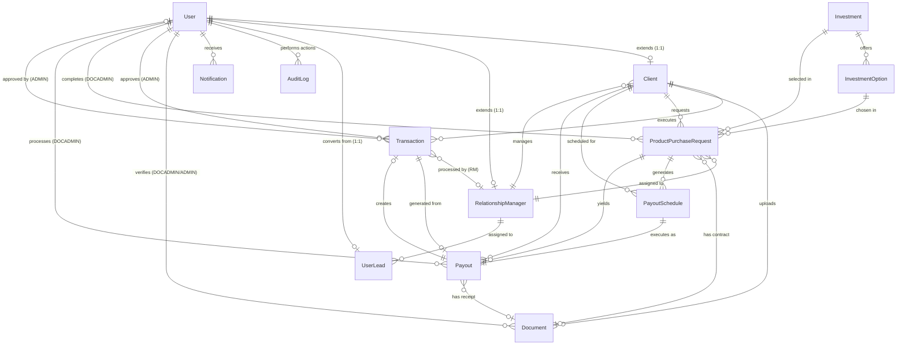

# Wealth Management CRM - Complete Database Documentation

> **Database**: PostgreSQL 15+
> **ORM**: Prisma 5.20+
> **Total Tables**: 14
> **Total Enums**: 13

---

## Table of Contents

1. [Entity-Relationship Diagram](#entity-relationship-diagram)
2. [Database Architecture Overview](#database-architecture-overview)
3. [Complete Table Schemas](#complete-table-schemas)
   - [users](#1-users)
   - [clients](#2-clients)
   - [relationship_managers](#3-relationship_managers)
   - [transactions](#4-transactions)
   - [audit_logs](#5-audit_logs)
   - [notifications](#6-notifications)
   - [verification_tokens](#7-verification_tokens)
   - [documents](#8-documents)
   - [user_leads](#9-user_leads)
   - [investments](#10-investments)
   - [investment_options](#11-investment_options)
   - [investment_purchase_requests](#12-investment_purchase_requests)
   - [payout_schedules](#13-payout_schedules)
   - [payouts](#14-payouts)
4. [Enum Definitions](#enum-definitions)
5. [Relationship Mapping](#relationship-mapping)
6. [Index Reference](#index-reference)

---

## Entity-Relationship Diagram



---

## Database Architecture Overview

```
users
 ├── clients              (1:1 extension via userId)
 │    ├── transactions
 │    ├── documents
 │    ├── investment_purchase_requests
 │    │    ├── payout_schedules
 │    │    └── payouts
 │    └── payouts
 └── relationship_managers (1:1 extension via userId)
      ├── clients          (1:many managed clients)
      └── user_leads       (1:many assigned leads)

investments
 └── investment_options
      └── investment_purchase_requests

audit_logs               (system-wide trail, nullable userId)
notifications            (per user)
verification_tokens      (email/password reset tokens)
user_leads               (public form submissions)
```

---

## Complete Table Schemas

### 1. `users`

Base entity for all authenticated users. All roles (CLIENT, RM, ADMIN, DOCADMIN) share this table.

| Column | Type | Nullable | Default | Description |
|--------|------|----------|---------|-------------|
| `id` | UUID | No | `uuid()` | Primary key |
| `email` | VARCHAR | No | — | Unique email address |
| `password` | TEXT | No | — | bcrypt hashed password (rounds=12) |
| `role` | `UserRole` ENUM | No | — | `CLIENT \| RM \| ADMIN \| DOCADMIN` |
| `firstName` | VARCHAR | No | — | First name |
| `lastName` | VARCHAR | No | — | Last name |
| `phone` | VARCHAR | Yes | NULL | Phone number |
| `status` | `AccountStatus` ENUM | No | `ACTIVE` | Account status |
| `isActive` | BOOLEAN | No | `true` | Whether account is active |
| `emailVerified` | BOOLEAN | No | `false` | Email verification status |
| `failedLoginAttempts` | INT | No | `0` | Consecutive failed login counter |
| `accountLockedUntil` | TIMESTAMP | Yes | NULL | Lock expiry (set after 5 failed attempts) |
| `lastLogin` | TIMESTAMP | Yes | NULL | Last successful login timestamp |
| `lastFailedLogin` | TIMESTAMP | Yes | NULL | Last failed login timestamp |
| `isArchived` | BOOLEAN | No | `false` | Soft-archive flag (for KYC expired users) |
| `archivedAt` | TIMESTAMP | Yes | NULL | When user was archived |
| `createdAt` | TIMESTAMP | No | `now()` | Record creation time |
| `updatedAt` | TIMESTAMP | No | auto | Last update time |
| `deletedAt` | TIMESTAMP | Yes | NULL | Soft delete timestamp |

**Indexes:** `email`, `role`, `status`, `isArchived`

**Relations:**
- `client` → `clients` (1:1, optional)
- `relationshipManager` → `relationship_managers` (1:1, optional)
- `userLead` → `user_leads` (1:1, optional — when converted from lead)
- `auditLogs` → `audit_logs` (1:many)
- `notifications` → `notifications` (1:many)
- `approvedTransactions` → `transactions` via `TransactionApprover` (ADMIN role)
- `verifiedDocuments` → `documents` via `DocumentVerifier` (DOCADMIN/ADMIN role)
- `completedProductRequests` → `investment_purchase_requests` via `ProductRequestCompleter` (DOCADMIN role)
- `processedPayouts` → `payouts` via `PayoutProcessor` (DOCADMIN role)

---

### 2. `clients`

Client-specific data extending a `users` record. Created automatically on registration.

| Column | Type | Nullable | Default | Description |
|--------|------|----------|---------|-------------|
| `id` | UUID | No | `uuid()` | Primary key |
| `userId` | UUID | No | — | FK → `users.id` (unique, cascade delete) |
| `assignedRMId` | UUID | Yes | NULL | FK → `relationship_managers.id` |
| `riskTolerance` | VARCHAR | Yes | NULL | `LOW \| MEDIUM \| HIGH` |
| `investmentGoals` | TEXT | Yes | NULL | JSON or free-text investment goals |
| `kycVerified` | BOOLEAN | No | `false` | Legacy KYC flag |
| `kycDocuments` | TEXT | Yes | NULL | JSON array of document URLs (legacy) |
| `verificationStatus` | `VerificationStatus` ENUM | No | `NOT_SUBMITTED` | Current KYC verification state |
| `assignedAt` | TIMESTAMP | No | `now()` | When RM was assigned |
| `archivedReason` | TEXT | Yes | NULL | Reason for archival (e.g., `KYC_EXPIRED_DAY_7`) |
| `updatedAt` | TIMESTAMP | No | auto | Last update time |

**Indexes:** `assignedRMId`, `verificationStatus`, `(assignedRMId, verificationStatus)`

**Relations:**
- `user` → `users` (1:1, cascade delete)
- `assignedRM` → `relationship_managers` (many:1, optional)
- `transactions` → `transactions` (1:many)
- `documents` → `documents` (1:many)
- `productPurchaseRequests` → `investment_purchase_requests` (1:many)
- `payoutSchedules` → `payout_schedules` (1:many)
- `payouts` → `payouts` (1:many)

---

### 3. `relationship_managers`

RM-specific data extending a `users` record.

| Column | Type | Nullable | Default | Description |
|--------|------|----------|---------|-------------|
| `id` | UUID | No | `uuid()` | Primary key |
| `userId` | UUID | No | — | FK → `users.id` (unique, cascade delete) |
| `specialization` | VARCHAR | Yes | NULL | e.g., "High Net Worth", "Retirement Planning" |
| `certifications` | TEXT | Yes | NULL | JSON array of certifications |
| `maxClientLimit` | INT | Yes | `50` | Maximum number of clients this RM can manage |
| `totalAUM` | DECIMAL(15,2) | No | `0` | Assets Under Management (base currency) |
| `createdAt` | TIMESTAMP | No | `now()` | Record creation time |
| `updatedAt` | TIMESTAMP | No | auto | Last update time |

**Relations:**
- `user` → `users` (1:1, cascade delete)
- `assignedClients` → `clients` (1:many)
- `processedTransactions` → `transactions` via `RMProcessor` (1:many)
- `productPurchaseRequests` → `investment_purchase_requests` (1:many)
- `assignedLeads` → `user_leads` (1:many)

---

### 4. `transactions`

Completed financial transactions. Created when a purchase or payout is approved.

| Column | Type | Nullable | Default | Description |
|--------|------|----------|---------|-------------|
| `id` | UUID | No | `uuid()` | Primary key |
| `clientId` | UUID | No | — | FK → `clients.id` (cascade delete) |
| `type` | `TransactionType` ENUM | No | — | `PURCHASE \| WITHDRAWAL \| INTEREST_PAYOUT \| DIVIDEND \| ADJUSTMENT` |
| `status` | `TransactionStatus` ENUM | No | `COMPLETED` | `COMPLETED \| FAILED \| REVERSED \| PENDING_SETTLEMENT` |
| `amount` | DECIMAL(15,2) | No | — | Transaction amount |
| `total` | DECIMAL(15,2) | No | — | Total transaction value |
| `fees` | DECIMAL(15,2) | No | `0` | Transaction fees / commissions |
| `netAmount` | DECIMAL(15,2) | No | — | Amount after fees |
| `currency` | VARCHAR(3) | No | `AED` | Currency code (ISO 4217) |
| `bankStatementReference` | TEXT | Yes | NULL | Reference to bank statement document |
| `paymentProof` | TEXT | Yes | NULL | Path or reference to payment proof document |
| `processedById` | UUID | Yes | NULL | FK → `relationship_managers.id` (RM who processed) |
| `approvedById` | UUID | Yes | NULL | FK → `users.id` (Admin who approved) |
| `payoutId` | UUID | Yes | NULL | FK → `payouts.id` (unique — for interest payout transactions) |
| `completedAt` | TIMESTAMP | No | `now()` | When transaction was completed |
| `createdAt` | TIMESTAMP | No | `now()` | Record creation time |
| `updatedAt` | TIMESTAMP | No | auto | Last update time |
| `deletedAt` | TIMESTAMP | Yes | NULL | Soft delete (for reversed transactions) |
| `notes` | TEXT | Yes | NULL | Free-text notes |
| `metadata` | TEXT | Yes | NULL | JSON for additional data |
| `failureReason` | TEXT | Yes | NULL | Populated when `status = FAILED` |

**Indexes:** `clientId`, `type`, `status`, `completedAt`, `processedById`, `createdAt`, `(clientId, type, status)`

**Relations:**
- `client` → `clients` (many:1, cascade delete)
- `processedBy` → `relationship_managers` via `RMProcessor` (many:1, optional)
- `approvedBy` → `users` via `TransactionApprover` (many:1, optional)
- `payout` → `payouts` (1:1, optional)

---

### 5. `audit_logs`

Immutable audit trail for all critical system actions. 7-year retention requirement.

| Column | Type | Nullable | Default | Description |
|--------|------|----------|---------|-------------|
| `id` | UUID | No | `uuid()` | Primary key |
| `userId` | UUID | Yes | NULL | FK → `users.id` (NULL for system-generated actions) |
| `action` | `AuditAction` ENUM | No | — | The action performed (30+ types) |
| `description` | TEXT | Yes | NULL | Human-readable description of the action |
| `entityType` | VARCHAR(50) | No | — | Type of affected entity (e.g., `"User"`, `"Transaction"`) |
| `entityId` | VARCHAR | No | — | ID of the affected entity |
| `oldValues` | JSON | Yes | NULL | Previous state before the action |
| `newValues` | JSON | Yes | NULL | New state after the action |
| `ipAddress` | VARCHAR(45) | Yes | NULL | IPv4 or IPv6 address of the requester |
| `userAgent` | TEXT | Yes | NULL | Browser / client info |
| `metadata` | JSON | Yes | NULL | Extra contextual data |
| `severity` | VARCHAR(20) | No | `INFO` | `INFO \| WARNING \| ERROR \| CRITICAL` |
| `success` | BOOLEAN | No | `true` | Whether the action succeeded |
| `errorMessage` | TEXT | Yes | NULL | Populated when `success = false` |
| `sessionId` | VARCHAR(100) | Yes | NULL | Session identifier for correlation |
| `createdAt` | TIMESTAMP | No | `now()` | When the log entry was created |
| `retentionDate` | TIMESTAMP | Yes | NULL | Date when log may be archived/deleted |

**Indexes:** `userId`, `action`, `(userId, action)`, `(entityType, entityId)`, `createdAt`, `severity`, `ipAddress`

**Relations:**
- `user` → `users` (many:1, optional)

---

### 6. `notifications`

In-app notifications delivered to users.

| Column | Type | Nullable | Default | Description |
|--------|------|----------|---------|-------------|
| `id` | UUID | No | `uuid()` | Primary key |
| `userId` | UUID | No | — | FK → `users.id` (cascade delete) |
| `type` | `NotificationType` ENUM | No | — | `INFO \| SUCCESS \| WARNING \| ERROR \| ALERT` |
| `category` | `NotificationCategory` ENUM | No | — | `TRANSACTION \| REQUEST \| ASSIGNMENT \| SYSTEM \| PORTFOLIO \| SECURITY` |
| `title` | VARCHAR(255) | No | — | Short notification title |
| `message` | TEXT | No | — | Full notification body |
| `isRead` | BOOLEAN | No | `false` | Whether user has read the notification |
| `readAt` | TIMESTAMP | Yes | NULL | When user read the notification |
| `isDismissed` | BOOLEAN | No | `false` | Whether user dismissed the notification |
| `actionUrl` | VARCHAR(500) | Yes | NULL | URL to navigate to when notification is clicked |
| `actionText` | VARCHAR(100) | Yes | NULL | Label for the action button |
| `entityType` | VARCHAR(50) | Yes | NULL | Type of the related entity (e.g., `"Transaction"`) |
| `entityId` | VARCHAR | Yes | NULL | ID of the related entity |
| `priority` | VARCHAR(20) | No | `NORMAL` | `LOW \| NORMAL \| HIGH \| URGENT` |
| `expiresAt` | TIMESTAMP | Yes | NULL | When the notification becomes irrelevant |
| `metadata` | JSON | Yes | NULL | Additional contextual data |
| `createdAt` | TIMESTAMP | No | `now()` | Record creation time |
| `updatedAt` | TIMESTAMP | No | auto | Last update time |

**Indexes:** `(userId, isRead)`, `(userId, createdAt)`, `category`, `type`, `expiresAt`

**Relations:**
- `user` → `users` (many:1, cascade delete)

---

### 7. `verification_tokens`

Tokens for email verification and password reset flows.

| Column | Type | Nullable | Default | Description |
|--------|------|----------|---------|-------------|
| `id` | UUID | No | `uuid()` | Primary key |
| `email` | VARCHAR(255) | No | — | Email address being verified |
| `token` | VARCHAR(255) | No | — | Unique token string (UUID or random) |
| `expiresAt` | TIMESTAMP | No | — | Token expiry (24 hours for email verification) |
| `type` | VARCHAR(50) | No | `EMAIL_VERIFICATION` | `EMAIL_VERIFICATION \| PASSWORD_RESET` |
| `used` | BOOLEAN | No | `false` | Whether token has been consumed |
| `usedAt` | TIMESTAMP | Yes | NULL | When token was consumed |
| `createdAt` | TIMESTAMP | No | `now()` | Record creation time |
| `updatedAt` | TIMESTAMP | No | auto | Last update time |

**Indexes:** `email`, `token`, `expiresAt`, `type`

---

### 8. `documents`

KYC and contract documents uploaded by clients and verified by DOCADMIN/ADMIN.

| Column | Type | Nullable | Default | Description |
|--------|------|----------|---------|-------------|
| `id` | UUID | No | `uuid()` | Primary key |
| `clientId` | UUID | No | — | FK → `clients.id` (cascade delete) |
| `documentType` | `DocumentType` ENUM | No | — | `IDENTITY_PROOF \| INVESTMENT_AGREEMENT \| OTHER` |
| `filePath` | VARCHAR(500) | No | — | Server file path to stored document |
| `verificationStatus` | `VerificationStatus` ENUM | No | `PENDING` | Current verification state |
| `verifiedById` | UUID | Yes | NULL | FK → `users.id` (DOCADMIN/ADMIN who reviewed) |
| `verifiedAt` | TIMESTAMP | Yes | NULL | When the document was reviewed |
| `rejectionReason` | TEXT | Yes | NULL | Reason if `verificationStatus = REJECTED` |
| `fileName` | VARCHAR(255) | Yes | NULL | Original file name as uploaded by client |
| `fileSize` | INT | Yes | NULL | File size in bytes |
| `mimeType` | VARCHAR(100) | Yes | NULL | MIME type (e.g., `application/pdf`, `image/jpeg`) |
| `description` | TEXT | Yes | NULL | Optional description provided by client |
| `expiryDate` | TIMESTAMP | Yes | NULL | Document expiry date (e.g., passport expiry) |
| `uploadedAt` | TIMESTAMP | No | `now()` | When document was uploaded |
| `createdAt` | TIMESTAMP | No | `now()` | Record creation time |
| `updatedAt` | TIMESTAMP | No | auto | Last update time |

**Indexes:** `clientId`, `(clientId, documentType)`, `(clientId, verificationStatus)`, `documentType`, `verificationStatus`, `verifiedById`, `uploadedAt`

**Relations:**
- `client` → `clients` (many:1, cascade delete)
- `verifiedBy` → `users` via `DocumentVerifier` (many:1, optional)
- `productContractRequests` → `investment_purchase_requests` via `ProductContract` (1:many)
- `payoutReceipts` → `payouts` via `PayoutReceipt` (1:many)

---

### 9. `user_leads`

Public lead form submissions. Separate from `users` — no automatic conversion.

| Column | Type | Nullable | Default | Description |
|--------|------|----------|---------|-------------|
| `id` | UUID | No | `uuid()` | Primary key |
| `firstName` | VARCHAR(255) | No | — | First name |
| `lastName` | VARCHAR(255) | No | — | Last name |
| `email` | VARCHAR(255) | No | — | Unique email (cannot re-submit with same email) |
| `phoneNumber` | VARCHAR(50) | No | — | Phone number |
| `leadSource` | `LeadSource` ENUM | No | — | `INSTAGRAM \| YOUTUBE \| FACEBOOK_ADS \| GOOGLE_ADS \| WEBSITE \| REFERRAL \| OTHER` |
| `rmReference` | VARCHAR(255) | Yes | NULL | RM name or code reference from user input |
| `status` | `LeadStatus` ENUM | No | `NEW` | `NEW \| CONTACTED \| INTERESTED \| NOT_INTERESTED \| CONVERTED \| LOST` |
| `assignedRMId` | UUID | Yes | NULL | FK → `relationship_managers.id` (set by DocAdmin) |
| `userId` | UUID | Yes | NULL | FK → `users.id` (unique — set when converted to registered user) |
| `createdAt` | TIMESTAMP | No | `now()` | Record creation time |
| `updatedAt` | TIMESTAMP | No | auto | Last update time |

**Indexes:** `email`, `leadSource`, `status`, `assignedRMId`, `createdAt`

**Relations:**
- `assignedRM` → `relationship_managers` (many:1, optional)
- `user` → `users` (1:1, optional — populated on conversion)

---

### 10. `investments`

Investment range tiers (amount-based categories) that clients choose from.

| Column | Type | Nullable | Default | Description |
|--------|------|----------|---------|-------------|
| `id` | UUID | No | `uuid()` | Primary key |
| `name` | VARCHAR(255) | No | — | Display name (e.g., `"AED 50,000 - 99,999"`) |
| `description` | TEXT | Yes | NULL | Optional description |
| `minAmount` | DECIMAL(15,2) | No | — | Minimum investment amount for this tier |
| `maxAmount` | DECIMAL(15,2) | Yes | NULL | Maximum amount (NULL = "and Above" open-ended tier) |
| `currency` | VARCHAR(3) | No | `AED` | Currency code (ISO 4217) |
| `displayOrder` | INT | No | `0` | Sort order for UI display |
| `isActive` | BOOLEAN | No | `true` | Whether this tier is available to clients |
| `createdAt` | TIMESTAMP | No | `now()` | Record creation time |
| `updatedAt` | TIMESTAMP | No | auto | Last update time |

**Indexes:** `isActive`, `displayOrder`

**Relations:**
- `options` → `investment_options` (1:many)
- `purchaseRequests` → `investment_purchase_requests` (1:many)

---

### 11. `investment_options`

Specific investment configurations (duration + withdrawal frequency + ROI) under an investment tier.

| Column | Type | Nullable | Default | Description |
|--------|------|----------|---------|-------------|
| `id` | UUID | No | `uuid()` | Primary key |
| `investmentId` | UUID | No | — | FK → `investments.id` (cascade delete) |
| `duration` | VARCHAR(50) | No | — | Investment duration (e.g., `"1 Year"`, `"2 Years"`) |
| `withdrawalFrequency` | VARCHAR(50) | No | — | Payout frequency (e.g., `"Monthly"`, `"Quarterly"`) |
| `roi` | DECIMAL(5,2) | No | — | ROI per period as percentage (e.g., `2.00`, `3.00`) |
| `annualReturn` | DECIMAL(5,2) | No | — | Annualised return as percentage (e.g., `24.00`, `36.00`) |
| `displayOrder` | INT | No | `0` | Sort order within the parent investment tier |
| `isActive` | BOOLEAN | No | `true` | Whether this option is available |
| `createdAt` | TIMESTAMP | No | `now()` | Record creation time |
| `updatedAt` | TIMESTAMP | No | auto | Last update time |

**Indexes:** `investmentId`, `isActive`

**Relations:**
- `investment` → `investments` (many:1, cascade delete)
- `purchaseRequests` → `investment_purchase_requests` (1:many)

---

### 12. `investment_purchase_requests`

Purchase requests submitted by clients for a specific investment tier and option.

| Column | Type | Nullable | Default | Description |
|--------|------|----------|---------|-------------|
| `id` | UUID | No | `uuid()` | Primary key |
| `trackingNumber` | VARCHAR(50) | No | — | Unique client-facing tracking reference |
| `clientId` | UUID | No | — | FK → `clients.id` (cascade delete) |
| `investmentId` | UUID | No | — | FK → `investments.id` |
| `investmentOptionId` | UUID | No | — | FK → `investment_options.id` |
| `amount` | DECIMAL(15,2) | No | — | Investment amount submitted by client |
| `status` | `RequestStatus` ENUM | No | `PENDING` | `PENDING \| PROCESSING \| APPROVED \| REJECTED \| COMPLETED \| CANCELLED` |
| `assignedRMId` | UUID | Yes | NULL | FK → `relationship_managers.id` (RM at time of request) |
| `processedAt` | TIMESTAMP | Yes | NULL | When RM processed the request |
| `payoutWindow` | VARCHAR(10) | Yes | NULL | Payout window selected by RM (`"1-15"` or `"16-30"`) |
| `contractDocumentId` | UUID | Yes | NULL | FK → `documents.id` (signed contract uploaded by DocAdmin) |
| `contractStartDate` | TIMESTAMP | Yes | NULL | Auto-set to completion date |
| `completedAt` | TIMESTAMP | Yes | NULL | When DocAdmin completed the request |
| `completedById` | UUID | Yes | NULL | FK → `users.id` (DocAdmin who completed) |
| `clientNotes` | TEXT | Yes | NULL | Notes submitted by client |
| `rmNotes` | TEXT | Yes | NULL | Notes added by RM during processing |
| `rejectionReason` | TEXT | Yes | NULL | Reason if `status = REJECTED` |
| `createdAt` | TIMESTAMP | No | `now()` | Record creation time |
| `updatedAt` | TIMESTAMP | No | auto | Last update time |

**Indexes:** `clientId`, `investmentId`, `investmentOptionId`, `assignedRMId`, `status`, `createdAt`, `contractDocumentId`, `(assignedRMId, status)`, `(clientId, status)`

**Relations:**
- `client` → `clients` (many:1, cascade delete)
- `investment` → `investments` (many:1)
- `investmentOption` → `investment_options` (many:1)
- `assignedRM` → `relationship_managers` (many:1, optional)
- `contractDocument` → `documents` via `ProductContract` (many:1, optional)
- `completedBy` → `users` via `ProductRequestCompleter` (many:1, optional)
- `payoutSchedules` → `payout_schedules` (1:many)
- `payouts` → `payouts` (1:many)

---

### 13. `payout_schedules`

Auto-generated schedule of future interest payouts for each active investment contract.

| Column | Type | Nullable | Default | Description |
|--------|------|----------|---------|-------------|
| `id` | UUID | No | `uuid()` | Primary key |
| `productPurchaseRequestId` | UUID | No | — | FK → `investment_purchase_requests.id` (cascade delete) |
| `clientId` | UUID | No | — | FK → `clients.id` |
| `scheduledDate` | TIMESTAMP | No | — | Date when payout should be executed |
| `periodStart` | TIMESTAMP | No | — | Start of the interest calculation period |
| `periodEnd` | TIMESTAMP | No | — | End of the interest calculation period |
| `interestAmount` | DECIMAL(15,2) | No | — | Calculated interest for this period |
| `isProcessed` | BOOLEAN | No | `false` | `true` when a `Payout` record has been created |
| `createdAt` | TIMESTAMP | No | `now()` | Record creation time |
| `updatedAt` | TIMESTAMP | No | auto | Last update time |

**Unique constraint:** `(productPurchaseRequestId, scheduledDate)` — one schedule per contract per date.

**Indexes:** `productPurchaseRequestId`, `clientId`, `scheduledDate`, `isProcessed`, `(scheduledDate, isProcessed)`

**Relations:**
- `productPurchaseRequest` → `investment_purchase_requests` (many:1, cascade delete)
- `client` → `clients` (many:1)
- `payout` → `payouts` (1:1, optional — populated when processed)

---

### 14. `payouts`

Actual payout execution records created by DocAdmin when processing a scheduled payout.

| Column | Type | Nullable | Default | Description |
|--------|------|----------|---------|-------------|
| `id` | UUID | No | `uuid()` | Primary key |
| `productPurchaseRequestId` | UUID | No | — | FK → `investment_purchase_requests.id` |
| `payoutScheduleId` | UUID | No | — | FK → `payout_schedules.id` (unique — 1:1 with schedule) |
| `clientId` | UUID | No | — | FK → `clients.id` |
| `amount` | DECIMAL(15,2) | No | — | Interest amount to be paid out |
| `periodStart` | TIMESTAMP | No | — | Interest calculation period start |
| `periodEnd` | TIMESTAMP | No | — | Interest calculation period end |
| `scheduledDate` | TIMESTAMP | No | — | Original scheduled date from `payout_schedules` |
| `status` | `PayoutStatus` ENUM | No | `PENDING` | `PENDING \| COMPLETED \| FAILED` |
| `processedById` | UUID | Yes | NULL | FK → `users.id` (DocAdmin who processed) |
| `processedAt` | TIMESTAMP | Yes | NULL | When DocAdmin marked as completed |
| `receiptDocumentId` | UUID | Yes | NULL | FK → `documents.id` (unique — uploaded payment receipt) |
| `transactionId` | UUID | Yes | NULL | FK → `transactions.id` (unique — created on completion) |
| `notes` | TEXT | Yes | NULL | Free-text notes |
| `createdAt` | TIMESTAMP | No | `now()` | Record creation time |
| `updatedAt` | TIMESTAMP | No | auto | Last update time |

**Indexes:** `productPurchaseRequestId`, `clientId`, `status`, `scheduledDate`, `processedById`, `(clientId, scheduledDate)`, `(clientId, status)`

**Relations:**
- `productPurchaseRequest` → `investment_purchase_requests` (many:1)
- `payoutSchedule` → `payout_schedules` (1:1)
- `client` → `clients` (many:1)
- `processedBy` → `users` via `PayoutProcessor` (many:1, optional)
- `receiptDocument` → `documents` via `PayoutReceipt` (1:1, optional)
- `transaction` → `transactions` (1:1, optional — created when completed)

---

## Enum Definitions

### `UserRole`
| Value | Description |
|-------|-------------|
| `CLIENT` | Authenticated customer / investor |
| `RM` | Relationship Manager — manages clients and processes transactions |
| `ADMIN` | Administrator — full system access and final approvals |
| `DOCADMIN` | Document Administrator — KYC verification and payout processing |

### `AccountStatus`
| Value | Description |
|-------|-------------|
| `ACTIVE` | Normal active account |
| `INACTIVE` | Deactivated (not suspended) |
| `LOCKED` | Auto-locked after 5 failed login attempts (releases after 30 min) |
| `SUSPENDED` | Manually suspended by admin |

### `VerificationStatus`
| Value | Description |
|-------|-------------|
| `NOT_SUBMITTED` | No documents submitted yet (login allowed) |
| `PENDING` | Documents submitted, awaiting review (**login blocked**) |
| `UNDER_REVIEW` | Documents being reviewed by DocAdmin (**login blocked**) |
| `VERIFIED` | All documents verified successfully (full access) |
| `REJECTED` | Documents rejected, need resubmission (login allowed) |
| `EXPIRED` | Verification expired, needs renewal |

### `RequestStatus`
| Value | Description |
|-------|-------------|
| `PENDING` | Submitted by client, awaiting RM action |
| `PROCESSING` | RM is reviewing the request |
| `APPROVED` | RM approved the request |
| `REJECTED` | RM rejected the request |
| `COMPLETED` | DocAdmin completed the contract setup |
| `CANCELLED` | Request was cancelled |

### `TransactionType`
| Value | Description |
|-------|-------------|
| `PURCHASE` | Client purchased an investment product |
| `WITHDRAWAL` | Withdrawal transaction (historical data) |
| `INTEREST_PAYOUT` | Automated interest payout from a contract |
| `DIVIDEND` | Dividend payment |
| `ADJUSTMENT` | Manual adjustment by admin |

### `TransactionStatus`
| Value | Description |
|-------|-------------|
| `COMPLETED` | Transaction successfully processed |
| `FAILED` | Transaction failed (see `failureReason`) |
| `REVERSED` | Transaction was reversed (soft-deleted) |
| `PENDING_SETTLEMENT` | Awaiting bank settlement |

### `PayoutStatus`
| Value | Description |
|-------|-------------|
| `PENDING` | Payout created, awaiting DocAdmin action |
| `COMPLETED` | DocAdmin marked as paid and uploaded receipt |
| `FAILED` | Payout failed |

### `AuditAction`
Covers 40+ action types across six categories:

| Category | Actions |
|----------|---------|
| **Authentication** | `LOGIN`, `LOGOUT`, `PASSWORD_CHANGE`, `MFA_ENABLE`, `MFA_DISABLE` |
| **User Management** | `USER_CREATE`, `USER_UPDATE`, `USER_DELETE`, `USER_ACTIVATE`, `USER_DEACTIVATE` |
| **Assignments** | `CLIENT_ASSIGN`, `CLIENT_REASSIGN` |
| **Purchase Requests** | `PURCHASE_REQUEST_CREATE`, `PURCHASE_REQUEST_APPROVE`, `PURCHASE_REQUEST_REJECT`, `PURCHASE_REQUEST_CANCEL` |
| **Withdrawal Requests** | `WITHDRAWAL_REQUEST_CREATE`, `WITHDRAWAL_REQUEST_RM_APPROVE`, `WITHDRAWAL_REQUEST_RM_REJECT`, `WITHDRAWAL_REQUEST_ADMIN_APPROVE`, `WITHDRAWAL_REQUEST_ADMIN_REJECT`, `WITHDRAWAL_REQUEST_CANCEL` |
| **Transactions** | `TRANSACTION_CREATE`, `TRANSACTION_REVERSE`, `TRANSACTION_FAIL` |
| **Documents** | `DOCUMENT_UPLOAD`, `DOCUMENT_VERIFY`, `DOCUMENT_REJECT`, `DOCUMENT_DELETE`, `CLIENT_VERIFICATION_STATUS_UPDATE` |
| **Payouts** | `PAYOUT_SCHEDULE_CREATED`, `PAYOUT_CREATED`, `PAYOUT_COMPLETED`, `PAYOUT_FAILED`, `PAYOUT_RECEIPT_UPLOADED` |
| **Investments** | `INVESTMENT_CREATE`, `INVESTMENT_UPDATE`, `INVESTMENT_DELETE`, `INVESTMENT_OPTION_CREATE`, `INVESTMENT_OPTION_UPDATE`, `INVESTMENT_OPTION_DELETE` |
| **Archival** | `CLIENT_ARCHIVE`, `CLIENT_RESTORE` |
| **System** | `SYSTEM_CONFIG_CHANGE`, `DATA_EXPORT`, `DATA_IMPORT` |

### `NotificationType`
`INFO` · `SUCCESS` · `WARNING` · `ERROR` · `ALERT`

### `NotificationCategory`
`TRANSACTION` · `REQUEST` · `ASSIGNMENT` · `SYSTEM` · `PORTFOLIO` · `SECURITY`

### `DocumentType`
| Value | Description |
|-------|-------------|
| `IDENTITY_PROOF` | Government ID, passport, driver's licence |
| `INVESTMENT_AGREEMENT` | Signed investment agreements / contracts |
| `OTHER` | Other documents including payout receipts |

### `LeadSource`
`INSTAGRAM` · `YOUTUBE` · `FACEBOOK_ADS` · `GOOGLE_ADS` · `WEBSITE` · `REFERRAL` · `OTHER`

### `LeadStatus`
| Value | Description |
|-------|-------------|
| `NEW` | Freshly submitted lead, not yet contacted |
| `CONTACTED` | RM has reached out |
| `INTERESTED` | Lead expressed interest |
| `NOT_INTERESTED` | Lead declined |
| `CONVERTED` | Lead registered as a client |
| `LOST` | Lead is dead / unreachable |

---

## Relationship Mapping

| From | Relation | To | Via / Notes |
|------|----------|----|-------------|
| `users` | 1:1 | `clients` | `clients.userId` |
| `users` | 1:1 | `relationship_managers` | `relationship_managers.userId` |
| `users` | 1:1 | `user_leads` | `user_leads.userId` (on conversion) |
| `users` | 1:many | `audit_logs` | `audit_logs.userId` |
| `users` | 1:many | `notifications` | `notifications.userId` |
| `users` | 1:many | `documents` | `documents.verifiedById` (DOCADMIN/ADMIN) |
| `users` | 1:many | `transactions` | `transactions.approvedById` (ADMIN) |
| `users` | 1:many | `investment_purchase_requests` | `completedById` (DOCADMIN) |
| `users` | 1:many | `payouts` | `payouts.processedById` (DOCADMIN) |
| `relationship_managers` | 1:many | `clients` | `clients.assignedRMId` |
| `relationship_managers` | 1:many | `transactions` | `transactions.processedById` |
| `relationship_managers` | 1:many | `investment_purchase_requests` | `assignedRMId` |
| `relationship_managers` | 1:many | `user_leads` | `user_leads.assignedRMId` |
| `clients` | 1:many | `transactions` | `transactions.clientId` |
| `clients` | 1:many | `documents` | `documents.clientId` |
| `clients` | 1:many | `investment_purchase_requests` | `clientId` |
| `clients` | 1:many | `payout_schedules` | `payout_schedules.clientId` |
| `clients` | 1:many | `payouts` | `payouts.clientId` |
| `investments` | 1:many | `investment_options` | `investment_options.investmentId` |
| `investments` | 1:many | `investment_purchase_requests` | `investmentId` |
| `investment_options` | 1:many | `investment_purchase_requests` | `investmentOptionId` |
| `investment_purchase_requests` | 1:many | `payout_schedules` | `productPurchaseRequestId` |
| `investment_purchase_requests` | 1:many | `payouts` | `productPurchaseRequestId` |
| `investment_purchase_requests` | many:1 | `documents` | `contractDocumentId` (contract) |
| `payout_schedules` | 1:1 | `payouts` | `payouts.payoutScheduleId` |
| `payouts` | 1:1 | `transactions` | `payouts.transactionId` |
| `payouts` | 1:1 | `documents` | `payouts.receiptDocumentId` (receipt) |
| `transactions` | 1:1 | `payouts` | `transactions.payoutId` |

---

## Index Reference

| Table | Index | Purpose |
|-------|-------|---------|
| `users` | `email` | Auth lookup |
| `users` | `role` | Role-based filtering |
| `users` | `status` | Active user queries |
| `users` | `isArchived` | Archived user filtering |
| `clients` | `assignedRMId` | RM dashboard — list my clients |
| `clients` | `verificationStatus` | DocAdmin KYC queue |
| `clients` | `(assignedRMId, verificationStatus)` | RM dashboard KYC filter |
| `transactions` | `clientId` | Client transaction history |
| `transactions` | `type`, `status` | Financial reporting filters |
| `transactions` | `completedAt`, `createdAt` | Time-range analytics |
| `transactions` | `processedById` | RM transaction lookup |
| `transactions` | `(clientId, type, status)` | AUM / analytics composite |
| `audit_logs` | `userId`, `action` | Per-user action filtering |
| `audit_logs` | `(userId, action)` | Audit log viewer combo filter |
| `audit_logs` | `(entityType, entityId)` | Entity history lookup |
| `audit_logs` | `createdAt`, `severity`, `ipAddress` | Compliance / security queries |
| `notifications` | `(userId, isRead)` | Unread badge count |
| `notifications` | `(userId, createdAt)` | Notification feed ordering |
| `verification_tokens` | `token` | Token validation |
| `verification_tokens` | `expiresAt` | Expiry cleanup |
| `documents` | `(clientId, documentType)` | Per-type document lookup |
| `documents` | `(clientId, verificationStatus)` | DocAdmin pending queue per client |
| `documents` | `verifiedById` | DocAdmin activity |
| `user_leads` | `email`, `leadSource`, `status` | Lead management filters |
| `investment_purchase_requests` | `(assignedRMId, status)` | RM performance counts |
| `investment_purchase_requests` | `(clientId, status)` | Client request history |
| `payout_schedules` | `(scheduledDate, isProcessed)` | Cron job — due unprocessed schedules |
| `payouts` | `(clientId, scheduledDate)` | RM dashboard — recent payouts |
| `payouts` | `(clientId, status)` | Payout stats per client set |

---

*Last updated: 2026-04-08 — reflects Prisma schema as of commit on `main` branch.*
