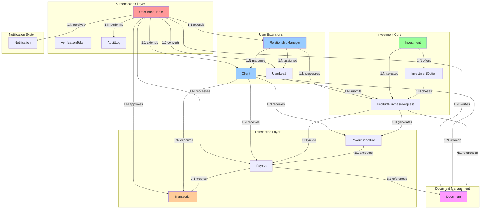
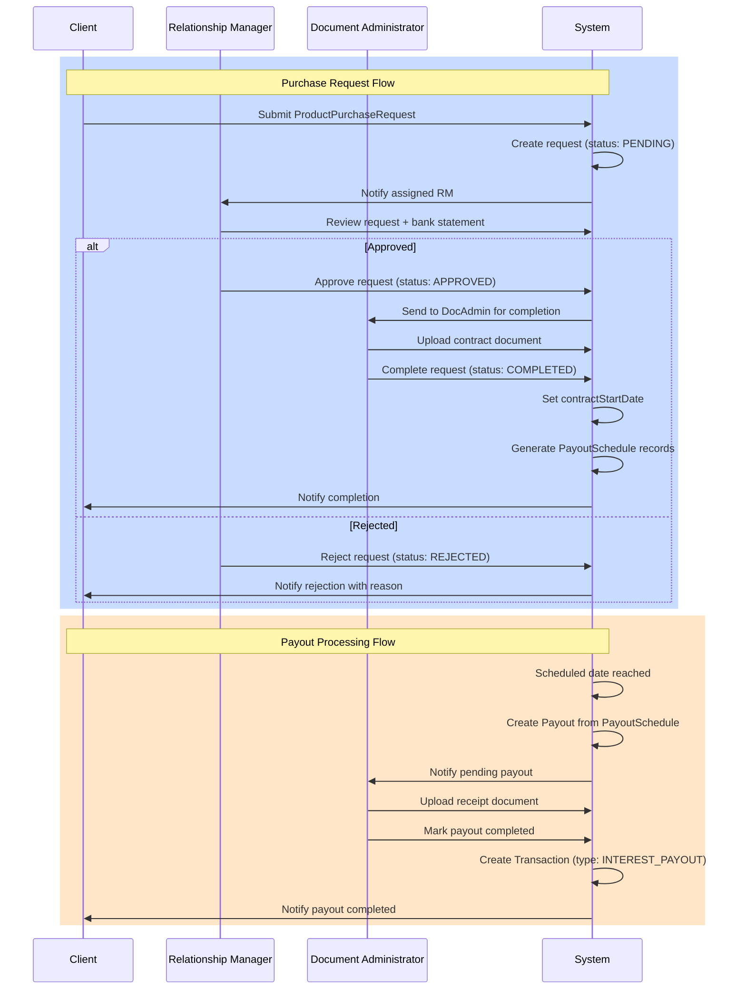
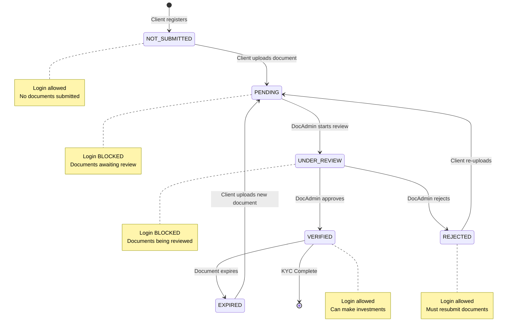
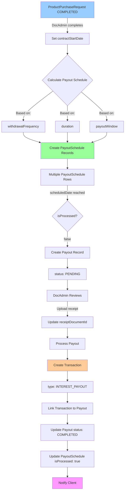
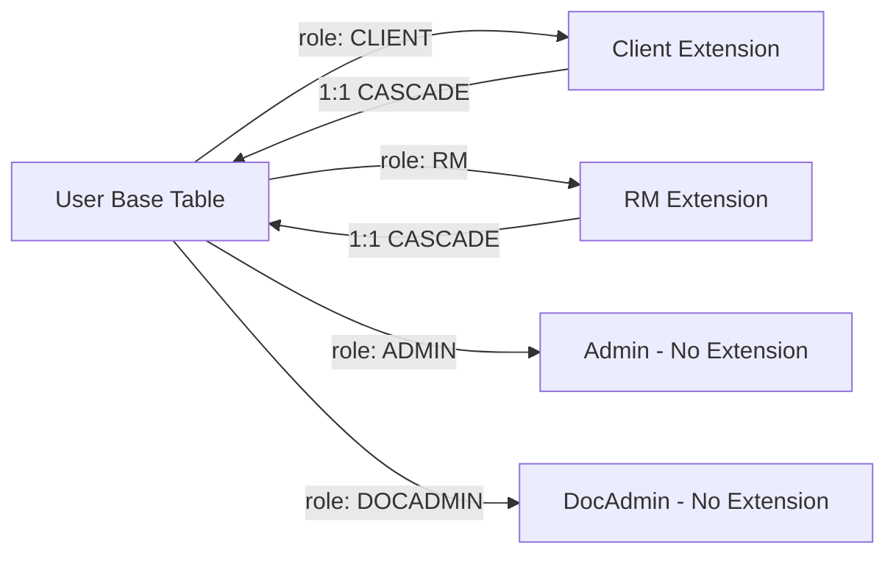
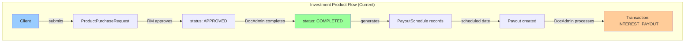
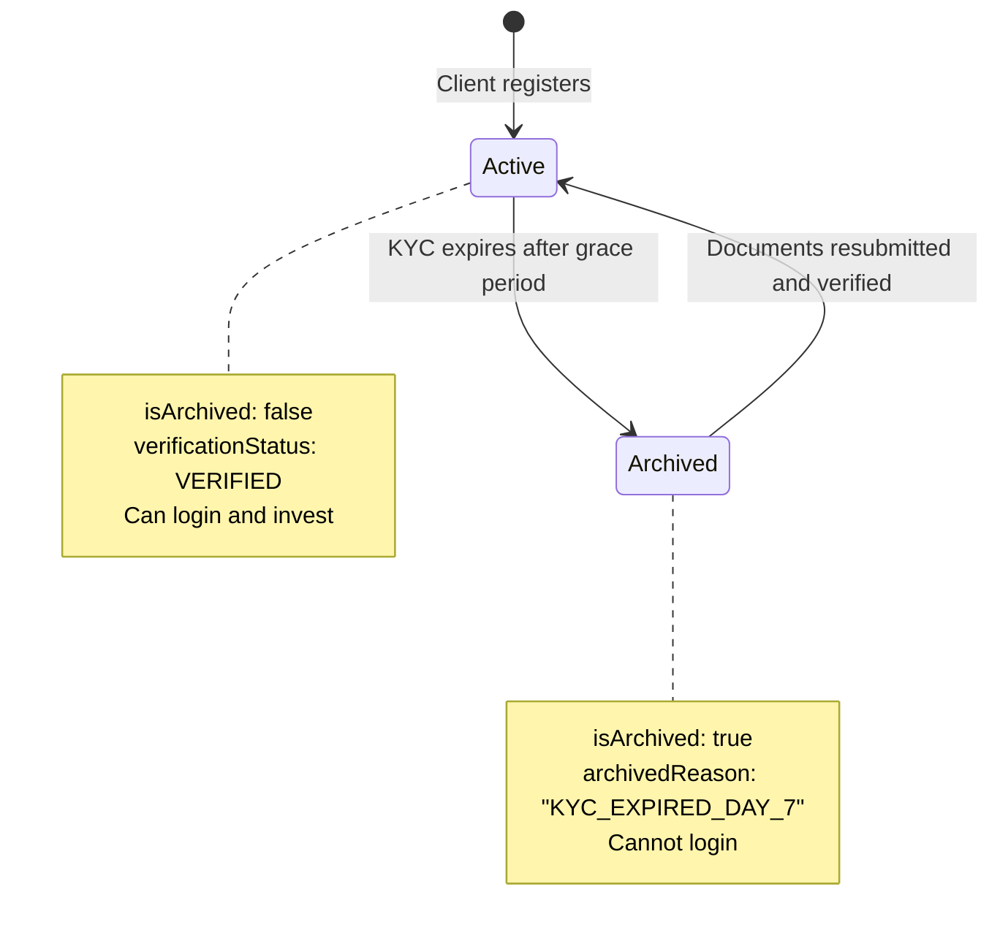
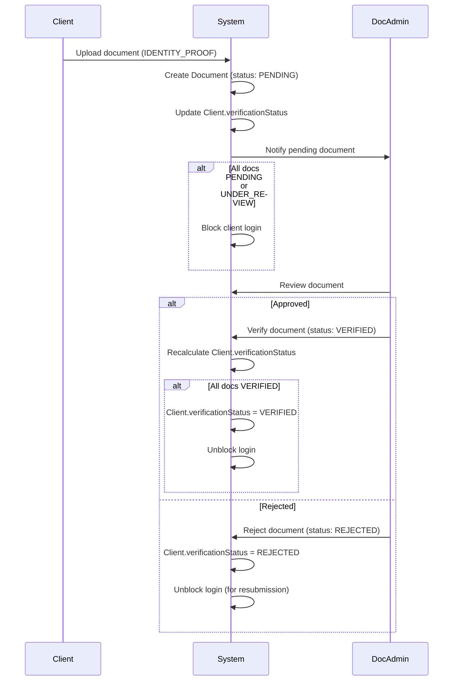

# Wealth Management CRM - Complete Database Documentation

> **Database**: PostgreSQL 15+
> **ORM**: Prisma 5.20+
> **Total Tables**: 14
> **Total Enums**: 13
> **Schema Lines**: 814

---

## Table of Contents

1. [Entity-Relationship Diagram](#-entity-relationship-diagram)
2. [Database Architecture Overview](#-database-architecture-overview)
3. [User Role Hierarchy](#-user-role-hierarchy)
4. [Transaction Flow Diagram](#-transaction-flow-diagram)
5. [Document Verification Flow](#-document-verification-flow)
6. [Payout System Architecture](#-payout-system-architecture)
7. [Complete Table Schemas](#-complete-table-schemas)
8. [Enum Definitions](#-enum-definitions)
9. [Relationship Mapping](#-relationship-mapping-summary)
10. [Key Design Patterns](#-key-design-patterns)

---

## Entity-Relationship Diagram

    ```mermaid
    erDiagram
        %% Core User Entities
        User ||--o| Client : "extends (1:1)"
        User ||--o| RelationshipManager : "extends (1:1)"
        User ||--o| UserLead : "converts from (1:1)"
        User ||--o{ AuditLog : "performs actions"
        User ||--o{ Notification : "receives"
        User ||--o{ Document : "verifies (DOCADMIN/ADMIN)"
        User ||--o{ Transaction : "approves (ADMIN)"
        User ||--o{ ProductPurchaseRequest : "completes (DOCADMIN)"
        User ||--o{ Payout : "processes (DOCADMIN)"

        %% Client Relationships
        RelationshipManager ||--o{ Client : "manages"
        Client ||--o{ Transaction : "executes"
        Client ||--o{ Document : "uploads"
        Client ||--o{ ProductPurchaseRequest : "requests"
        Client ||--o{ PayoutSchedule : "scheduled for"
        Client ||--o{ Payout : "receives"

        %% Transaction Processing
        Transaction }o--o| RelationshipManager : "processed by (RM)"
        Transaction }o--o| User : "approved by (ADMIN)"
        Transaction }o--o| Payout : "generated from"

        %% Investment Products
        Investment ||--o{ InvestmentOption : "offers"
        Investment ||--o{ ProductPurchaseRequest : "selected in"
        InvestmentOption ||--o{ ProductPurchaseRequest : "chosen in"
        ProductPurchaseRequest }o--|| RelationshipManager : "assigned to"
        ProductPurchaseRequest }o--o| Document : "has contract"
        ProductPurchaseRequest ||--o{ PayoutSchedule : "generates"
        ProductPurchaseRequest ||--o{ Payout : "yields"

        %% Payout System
        PayoutSchedule ||--|| Payout : "executes as"
        Payout }o--o| Document : "has receipt"
        Payout }o--o| Transaction : "creates"

        %% Lead Management
        RelationshipManager ||--o{ UserLead : "assigned to"

        %% User Entities
        User {
            UUID id PK
            VARCHAR email UK
            VARCHAR password
            ENUM role
            VARCHAR firstName
            VARCHAR lastName
            VARCHAR phone
            ENUM status
            BOOLEAN isActive
            BOOLEAN emailVerified
            INT failedLoginAttempts
            TIMESTAMP accountLockedUntil
            TIMESTAMP lastLogin
            TIMESTAMP lastFailedLogin
            BOOLEAN isArchived
            TIMESTAMP archivedAt
            TIMESTAMP createdAt
            TIMESTAMP updatedAt
            TIMESTAMP deletedAt
        }

        Client {
            UUID id PK
            UUID userId UK
            UUID assignedRMId FK
            VARCHAR riskTolerance
            TEXT investmentGoals
            BOOLEAN kycVerified
            TEXT kycDocuments
            ENUM verificationStatus
            TIMESTAMP assignedAt
            TEXT archivedReason
        }

        RelationshipManager {
            UUID id PK
            UUID userId UK
            VARCHAR specialization
            TEXT certifications
            INT maxClientLimit
            DECIMAL totalAUM
        }

        Transaction {
            UUID id PK
            UUID clientId FK
            ENUM type
            ENUM status
            DECIMAL amount
            DECIMAL total
            DECIMAL fees
            DECIMAL netAmount
            VARCHAR currency
            TEXT bankStatementReference
            TEXT paymentProof
            UUID processedById FK
            UUID approvedById FK
            UUID payoutId UK
            TIMESTAMP completedAt
            TEXT notes
            TEXT metadata
            TEXT failureReason
            TIMESTAMP createdAt
            TIMESTAMP updatedAt
            TIMESTAMP deletedAt
        }

        Document {
            UUID id PK
            UUID clientId FK
            ENUM documentType
            VARCHAR filePath
            ENUM verificationStatus
            UUID verifiedById FK
            TIMESTAMP verifiedAt
            TEXT rejectionReason
            VARCHAR fileName
            INT fileSize
            VARCHAR mimeType
            TEXT description
            TIMESTAMP expiryDate
            TIMESTAMP uploadedAt
            TIMESTAMP createdAt
            TIMESTAMP updatedAt
        }

        Investment {
            UUID id PK
            VARCHAR name
            TEXT description
            DECIMAL minAmount
            DECIMAL maxAmount
            VARCHAR currency
            INT displayOrder
            BOOLEAN isActive
            TIMESTAMP createdAt
            TIMESTAMP updatedAt
        }

        InvestmentOption {
            UUID id PK
            UUID investmentId FK
            VARCHAR duration
            VARCHAR withdrawalFrequency
            DECIMAL roi
            DECIMAL annualReturn
            INT displayOrder
            BOOLEAN isActive
            TIMESTAMP createdAt
            TIMESTAMP updatedAt
        }

        ProductPurchaseRequest {
            UUID id PK
            VARCHAR trackingNumber UK
            UUID clientId FK
            UUID investmentId FK
            UUID investmentOptionId FK
            DECIMAL amount
            ENUM status
            UUID assignedRMId FK
            TIMESTAMP processedAt
            VARCHAR payoutWindow
            UUID contractDocumentId FK
            TIMESTAMP contractStartDate
            TIMESTAMP completedAt
            UUID completedById FK
            TEXT clientNotes
            TEXT rmNotes
            TEXT rejectionReason
            TIMESTAMP createdAt
            TIMESTAMP updatedAt
        }

        PayoutSchedule {
            UUID id PK
            UUID productPurchaseRequestId FK
            UUID clientId FK
            TIMESTAMP scheduledDate
            TIMESTAMP periodStart
            TIMESTAMP periodEnd
            DECIMAL interestAmount
            BOOLEAN isProcessed
            TIMESTAMP createdAt
            TIMESTAMP updatedAt
        }

        Payout {
            UUID id PK
            UUID productPurchaseRequestId FK
            UUID payoutScheduleId UK
            UUID clientId FK
            DECIMAL amount
            TIMESTAMP periodStart
            TIMESTAMP periodEnd
            TIMESTAMP scheduledDate
            ENUM status
            UUID processedById FK
            TIMESTAMP processedAt
            UUID receiptDocumentId UK
            UUID transactionId UK
            TEXT notes
            TIMESTAMP createdAt
            TIMESTAMP updatedAt
        }

        UserLead {
            UUID id PK
            VARCHAR firstName
            VARCHAR lastName
            VARCHAR email UK
            VARCHAR phoneNumber
            ENUM leadSource
            VARCHAR rmReference
            ENUM status
            UUID assignedRMId FK
            UUID userId UK
            TIMESTAMP createdAt
            TIMESTAMP updatedAt
        }

        AuditLog {
            UUID id PK
            UUID userId FK
            ENUM action
            TEXT description
            VARCHAR entityType
            VARCHAR entityId
            JSON oldValues
            JSON newValues
            VARCHAR ipAddress
            TEXT userAgent
            JSON metadata
            VARCHAR severity
            BOOLEAN success
            TEXT errorMessage
            VARCHAR sessionId
            TIMESTAMP retentionDate
            TIMESTAMP createdAt
        }

        Notification {
            UUID id PK
            UUID userId FK
            ENUM type
            ENUM category
            VARCHAR title
            TEXT message
            BOOLEAN isRead
            TIMESTAMP readAt
            BOOLEAN isDismissed
            VARCHAR actionUrl
            VARCHAR actionText
            VARCHAR entityType
            VARCHAR entityId
            VARCHAR priority
            TIMESTAMP expiresAt
            JSON metadata
            TIMESTAMP createdAt
            TIMESTAMP updatedAt
        }

        VerificationToken {
            UUID id PK
            VARCHAR email
            VARCHAR token UK
            TIMESTAMP expiresAt
            VARCHAR type
            BOOLEAN used
            TIMESTAMP usedAt
            TIMESTAMP createdAt
            TIMESTAMP updatedAt
        }
    ```

---

## Database Architecture Overview



---

## User Role Hierarchy

```mermaid
graph TD
    A[User Base Entity]

    A -->|role: CLIENT| B[Client]
    A -->|role: RM| C[Relationship Manager]
    A -->|role: ADMIN| D[Administrator]
    A -->|role: DOCADMIN| E[Document Administrator]

    B -->|can| B1[Submit Purchase Requests]
    B -->|can| B2[View Portfolio]
    B -->|can| B3[Upload Documents]
    B -->|can| B4[View Transactions]

    C -->|can| C1[Process Purchase Requests]
    C -->|can| C2[Manage Assigned Clients]
    C -->|can| C3[Upload Client Documents]
    C -->|can| C4[Process Transactions]

    D -->|can| D1[Approve Withdrawals]
    D -->|can| D2[Create Investments]
    D -->|can| D3[Assign RMs to Clients]
    D -->|can| D4[View All System Data]
    D -->|can| D5[Verify Documents]

    E -->|can| E1[Verify Documents]
    E -->|can| E2[Assign RMs to Clients]
    E -->|can| E3[Complete Purchase Requests]
    E -->|can| E4[Process Payouts]
    E -->|can| E5[Upload Receipts]

    style A fill:#ff9999
    style B fill:#99ccff
    style C fill:#99ff99
    style D fill:#ffcc99
    style E fill:#ff99ff
```



---

## Transaction Flow Diagram



---

## Document Verification Flow



---

## Payout System Architecture



---

## Complete Table Schemas

### 1. **users** (`User`)

**Purpose**: Base authentication and user management table for all system actors.

| Column | Type | Constraints | Description |
|--------|------|-------------|-------------|
| `id` | UUID | PRIMARY KEY | Unique identifier |
| `email` | VARCHAR | UNIQUE, NOT NULL | Login email |
| `password` | VARCHAR | NOT NULL | bcrypt hashed password (rounds=12) |
| `role` | UserRole | NOT NULL | CLIENT, RM, ADMIN, DOCADMIN |
| `firstName` | VARCHAR | NOT NULL | User's first name |
| `lastName` | VARCHAR | NOT NULL | User's last name |
| `phone` | VARCHAR | NULLABLE | Contact number |
| `status` | AccountStatus | DEFAULT: ACTIVE | ACTIVE, INACTIVE, LOCKED, SUSPENDED |
| `isActive` | BOOLEAN | DEFAULT: true | Active flag |
| `emailVerified` | BOOLEAN | DEFAULT: false | Email verification status |
| `failedLoginAttempts` | INTEGER | DEFAULT: 0 | Failed login counter (locks at 5) |
| `accountLockedUntil` | TIMESTAMP | NULLABLE | Auto-unlock after 30 minutes |
| `lastLogin` | TIMESTAMP | NULLABLE | Last successful login |
| `lastFailedLogin` | TIMESTAMP | NULLABLE | Last failed attempt |
| `isArchived` | BOOLEAN | DEFAULT: false | Archival flag (KYC expired) |
| `archivedAt` | TIMESTAMP | NULLABLE | When archived |
| `createdAt` | TIMESTAMP | DEFAULT: now() | Creation timestamp |
| `updatedAt` | TIMESTAMP | AUTO UPDATE | Last update |
| `deletedAt` | TIMESTAMP | NULLABLE | Soft delete timestamp |

**Indexes**: `email`, `role`, `status`, `isArchived`

**Relationships**:
- 1:1 → `Client` (via `userId`)
- 1:1 → `RelationshipManager` (via `userId`)
- 1:1 → `UserLead` (via `userId`)
- 1:N → `AuditLog`, `Notification`, `Document` (verifier), `Transaction` (approver), `ProductPurchaseRequest` (completer), `Payout` (processor)

---

### 2. **clients** (`Client`)

**Purpose**: Client-specific profile extending User with investment preferences and KYC data.

| Column | Type | Constraints | Description |
|--------|------|-------------|-------------|
| `id` | UUID | PRIMARY KEY | Unique identifier |
| `userId` | UUID | UNIQUE, FK → users.id, CASCADE | Reference to User |
| `assignedRMId` | UUID | NULLABLE, FK → relationship_managers.id | Assigned RM (optional until admin assigns) |
| `riskTolerance` | VARCHAR | NULLABLE | LOW, MEDIUM, HIGH |
| `investmentGoals` | TEXT | NULLABLE | Client's investment goals |
| `kycVerified` | BOOLEAN | DEFAULT: false | KYC completion flag (legacy) |
| `kycDocuments` | TEXT | NULLABLE | JSON array of document URLs (legacy) |
| `verificationStatus` | VerificationStatus | DEFAULT: NOT_SUBMITTED | Current KYC status |
| `assignedAt` | TIMESTAMP | DEFAULT: now() | When RM was assigned |
| `archivedReason` | TEXT | NULLABLE | Reason for archival (e.g., "KYC_EXPIRED_DAY_7") |

**Indexes**: `assignedRMId`, `verificationStatus`

**Relationships**:
- N:1 → `User` (via `userId`, CASCADE delete)
- N:1 → `RelationshipManager` (via `assignedRMId`)
- 1:N → `Transaction`, `Document`, `ProductPurchaseRequest`, `PayoutSchedule`, `Payout`

**Business Rules**:
- Each client can have only ONE RM at a time
- One RM can manage multiple clients
- `verificationStatus` blocks login when PENDING or UNDER_REVIEW
- RM assignment happens during document verification OR via Admin assignment page

---

### 3. **relationship_managers** (`RelationshipManager`)

**Purpose**: RM-specific data extending User with performance metrics.

| Column | Type | Constraints | Description |
|--------|------|-------------|-------------|
| `id` | UUID | PRIMARY KEY | Unique identifier |
| `userId` | UUID | UNIQUE, FK → users.id, CASCADE | Reference to User |
| `specialization` | VARCHAR | NULLABLE | e.g., "High Net Worth", "Retirement Planning" |
| `certifications` | TEXT | NULLABLE | JSON array of certifications |
| `maxClientLimit` | INTEGER | DEFAULT: 50 | Maximum clients allowed |
| `totalAUM` | DECIMAL(15,2) | DEFAULT: 0 | Assets Under Management |

**Relationships**:
- N:1 → `User` (via `userId`, CASCADE delete)
- 1:N → `Client`, `Transaction` (processor), `ProductPurchaseRequest`, `UserLead`

---

### 4. **transactions** (`Transaction`)

**Purpose**: Immutable ledger of all completed financial transactions.

| Column | Type | Constraints | Description |
|--------|------|-------------|-------------|
| `id` | UUID | PRIMARY KEY | Unique identifier |
| `clientId` | UUID | FK → clients.id, CASCADE | Transaction owner |
| `type` | TransactionType | NOT NULL | PURCHASE, WITHDRAWAL, INTEREST_PAYOUT, DIVIDEND, ADJUSTMENT |
| `status` | TransactionStatus | DEFAULT: COMPLETED | COMPLETED, FAILED, REVERSED, PENDING_SETTLEMENT |
| `amount` | DECIMAL(15,2) | NOT NULL | Transaction amount |
| `total` | DECIMAL(15,2) | NOT NULL | Total transaction value |
| `fees` | DECIMAL(15,2) | DEFAULT: 0 | Transaction fees/commissions |
| `netAmount` | DECIMAL(15,2) | NOT NULL | Amount after fees |
| `currency` | VARCHAR(3) | DEFAULT: 'AED' | Currency code (AED for UAE) |
| `bankStatementReference` | TEXT | NULLABLE | Reference to bank statement document |
| `paymentProof` | TEXT | NULLABLE | Path or reference to payment proof |
| `processedById` | UUID | NULLABLE, FK → relationship_managers.id | Processing RM |
| `approvedById` | UUID | NULLABLE, FK → users.id | Approving admin (for withdrawals) |
| `payoutId` | UUID | UNIQUE, NULLABLE | Related payout (for INTEREST_PAYOUT type) |
| `completedAt` | TIMESTAMP | DEFAULT: now() | When transaction was completed |
| `notes` | TEXT | NULLABLE | Transaction notes |
| `metadata` | TEXT | NULLABLE | JSON for additional data |
| `failureReason` | TEXT | NULLABLE | If status is FAILED |
| `createdAt` | TIMESTAMP | DEFAULT: now() | Creation timestamp |
| `updatedAt` | TIMESTAMP | AUTO UPDATE | Last update |
| `deletedAt` | TIMESTAMP | NULLABLE | Soft delete (for reversed transactions) |

**Indexes**: `clientId`, `type`, `status`, `completedAt`, `processedById`, `createdAt`

**Relationships**:
- N:1 → `Client` (via `clientId`, CASCADE delete)
- N:1 → `RelationshipManager` (via `processedById`)
- N:1 → `User` (via `approvedById`)
- 1:1 → `Payout` (via `payoutId`)

**Business Rules**:
- Withdrawal type transactions require admin approval (`approvedById`)
- INTEREST_PAYOUT transactions are auto-created from Payout completion
- Manual bank statement verification required (no payment gateway)

---

### 5. **audit_logs** (`AuditLog`)

**Purpose**: Comprehensive audit trail for compliance and security (7-year retention).

| Column | Type | Constraints | Description |
|--------|------|-------------|-------------|
| `id` | UUID | PRIMARY KEY | Unique identifier |
| `userId` | UUID | FK → users.id | Actor user |
| `action` | AuditAction | NOT NULL | Action performed (30+ types) |
| `description` | TEXT | NULLABLE | Human-readable description |
| `entityType` | VARCHAR(50) | NOT NULL | Affected entity type (e.g., "User", "Transaction") |
| `entityId` | VARCHAR | NOT NULL | Affected entity ID |
| `oldValues` | JSON | NULLABLE | Previous state before action |
| `newValues` | JSON | NULLABLE | New state after action |
| `ipAddress` | VARCHAR(45) | NULLABLE | Client IP (IPv4 or IPv6) |
| `userAgent` | TEXT | NULLABLE | Browser/client info |
| `metadata` | JSON | NULLABLE | Additional contextual data |
| `severity` | VARCHAR(20) | DEFAULT: 'INFO' | INFO, WARNING, ERROR, CRITICAL |
| `success` | BOOLEAN | DEFAULT: true | Action success flag |
| `errorMessage` | TEXT | NULLABLE | Error details if failed |
| `sessionId` | VARCHAR(100) | NULLABLE | Session identifier |
| `retentionDate` | TIMESTAMP | NULLABLE | When log can be archived/deleted |
| `createdAt` | TIMESTAMP | DEFAULT: now() | Creation timestamp |

**Indexes**: `userId`, `action`, `(entityType, entityId)` composite, `createdAt`, `severity`, `ipAddress`

**Relationships**:
- N:1 → `User` (via `userId`)

**Business Rules**:
- Captures all critical operations: login, transactions, approvals, document verification
- Immutable - no updates or deletes
- JSON change tracking with `oldValues` and `newValues`
- Used for compliance, security investigations, and debugging

---

### 6. **notifications** (`Notification`)

**Purpose**: In-app notification system for user alerts.

| Column | Type | Constraints | Description |
|--------|------|-------------|-------------|
| `id` | UUID | PRIMARY KEY | Unique identifier |
| `userId` | UUID | FK → users.id, CASCADE | Recipient user |
| `type` | NotificationType | NOT NULL | INFO, SUCCESS, WARNING, ERROR, ALERT |
| `category` | NotificationCategory | NOT NULL | TRANSACTION, REQUEST, ASSIGNMENT, SYSTEM, PORTFOLIO, SECURITY |
| `title` | VARCHAR(255) | NOT NULL | Notification title |
| `message` | TEXT | NOT NULL | Notification message |
| `isRead` | BOOLEAN | DEFAULT: false | Read status |
| `readAt` | TIMESTAMP | NULLABLE | When read |
| `isDismissed` | BOOLEAN | DEFAULT: false | Dismissed flag |
| `actionUrl` | VARCHAR(500) | NULLABLE | Action link (e.g., "/client/requests/123") |
| `actionText` | VARCHAR(100) | NULLABLE | Action button text (e.g., "View Request") |
| `entityType` | VARCHAR(50) | NULLABLE | Related entity type |
| `entityId` | VARCHAR | NULLABLE | Related entity ID |
| `priority` | VARCHAR(20) | DEFAULT: 'NORMAL' | LOW, NORMAL, HIGH, URGENT |
| `expiresAt` | TIMESTAMP | NULLABLE | When notification becomes irrelevant |
| `metadata` | JSON | NULLABLE | Additional contextual data |
| `createdAt` | TIMESTAMP | DEFAULT: now() | Creation timestamp |
| `updatedAt` | TIMESTAMP | AUTO UPDATE | Last update |

**Indexes**: `(userId, isRead)` composite, `(userId, createdAt)` composite, `category`, `type`, `expiresAt`

**Relationships**:
- N:1 → `User` (via `userId`, CASCADE delete)

**Display**:
- Bell icon in header shows unread count
- `/notifications` page shows all notifications
- Click notification navigates to `actionUrl` if present

---

### 7. **verification_tokens** (`VerificationToken`)

**Purpose**: Email verification and password reset tokens (24-hour expiry).

| Column | Type | Constraints | Description |
|--------|------|-------------|-------------|
| `id` | UUID | PRIMARY KEY | Unique identifier |
| `email` | VARCHAR(255) | NOT NULL | Target email address |
| `token` | VARCHAR(255) | UNIQUE, NOT NULL | Verification token (UUID or random string) |
| `expiresAt` | TIMESTAMP | NOT NULL | Token expiration (24 hours from creation) |
| `type` | VARCHAR(50) | DEFAULT: 'EMAIL_VERIFICATION' | EMAIL_VERIFICATION, PASSWORD_RESET |
| `used` | BOOLEAN | DEFAULT: false | Usage flag (prevents reuse) |
| `usedAt` | TIMESTAMP | NULLABLE | When token was used |
| `createdAt` | TIMESTAMP | DEFAULT: now() | Creation timestamp |
| `updatedAt` | TIMESTAMP | AUTO UPDATE | Last update |

**Indexes**: `email`, `token`, `expiresAt`, `type`

**Business Rules**:
- Email verification sent on registration
- Token expires after 24 hours
- Once used, cannot be reused (`used` flag)
- Password reset tokens also use this table

---

### 8. **documents** (`Document`)

**Purpose**: Client document storage for KYC, contracts, and payout receipts.

| Column | Type | Constraints | Description |
|--------|------|-------------|-------------|
| `id` | UUID | PRIMARY KEY | Unique identifier |
| `clientId` | UUID | FK → clients.id, CASCADE | Document owner |
| `documentType` | DocumentType | NOT NULL | IDENTITY_PROOF, INVESTMENT_AGREEMENT, OTHER |
| `filePath` | VARCHAR(500) | NOT NULL | Storage path (local `/uploads/` directory) |
| `verificationStatus` | VerificationStatus | DEFAULT: PENDING | NOT_SUBMITTED, PENDING, UNDER_REVIEW, VERIFIED, REJECTED, EXPIRED |
| `verifiedById` | UUID | NULLABLE, FK → users.id | Verifier (DOCADMIN or ADMIN) |
| `verifiedAt` | TIMESTAMP | NULLABLE | Verification timestamp |
| `rejectionReason` | TEXT | NULLABLE | Reason if rejected |
| `fileName` | VARCHAR(255) | NULLABLE | Original filename |
| `fileSize` | INTEGER | NULLABLE | File size in bytes |
| `mimeType` | VARCHAR(100) | NULLABLE | MIME type (e.g., "application/pdf") |
| `description` | TEXT | NULLABLE | Optional description by client |
| `expiryDate` | TIMESTAMP | NULLABLE | Document expiry (for IDs, passports) |
| `uploadedAt` | TIMESTAMP | DEFAULT: now() | Upload timestamp |
| `createdAt` | TIMESTAMP | DEFAULT: now() | Creation timestamp |
| `updatedAt` | TIMESTAMP | AUTO UPDATE | Last update |

**Indexes**: `clientId`, `(clientId, documentType)` composite, `documentType`, `verificationStatus`, `verifiedById`, `uploadedAt`

**Relationships**:
- N:1 → `Client` (via `clientId`, CASCADE delete)
- N:1 → `User` (via `verifiedById`)
- 1:N → `ProductPurchaseRequest` (as contract document)
- 1:N → `Payout` (as receipt document)

**Business Rules**:
- Client uploads via `/api/documents/upload`
- DocAdmin/Admin verifies via `/api/documents/verify`
- Client's overall `verificationStatus` is calculated from all documents
- PENDING or UNDER_REVIEW status blocks client login

---

### 9. **user_leads** (`UserLead`)

**Purpose**: Lead capture from public wealth management form (separate from User registration).

| Column | Type | Constraints | Description |
|--------|------|-------------|-------------|
| `id` | UUID | PRIMARY KEY | Unique identifier |
| `firstName` | VARCHAR(255) | NOT NULL | Lead's first name |
| `lastName` | VARCHAR(255) | NOT NULL | Lead's last name |
| `email` | VARCHAR(255) | UNIQUE, NOT NULL | Contact email |
| `phoneNumber` | VARCHAR(50) | NOT NULL | Contact phone |
| `leadSource` | LeadSource | NOT NULL | INSTAGRAM, YOUTUBE, FACEBOOK_ADS, GOOGLE_ADS, WEBSITE, REFERRAL, OTHER |
| `rmReference` | VARCHAR(255) | NULLABLE | Optional RM name or code from user input |
| `status` | LeadStatus | DEFAULT: NEW | NEW, CONTACTED, INTERESTED, NOT_INTERESTED, CONVERTED, LOST |
| `assignedRMId` | UUID | NULLABLE, FK → relationship_managers.id | Assigned RM (set by DocAdmin) |
| `userId` | UUID | UNIQUE, NULLABLE, FK → users.id | Link to registered user (if converted) |
| `createdAt` | TIMESTAMP | DEFAULT: now() | Creation timestamp |
| `updatedAt` | TIMESTAMP | AUTO UPDATE | Last update |

**Indexes**: `email`, `leadSource`, `status`, `assignedRMId`, `createdAt`

**Relationships**:
- N:1 → `RelationshipManager` (via `assignedRMId`)
- 1:1 → `User` (via `userId`)

**Business Rules**:
- Submitted via public `/user-form` (2-step form)
- Separate from user registration (no automatic conversion)
- DocAdmin can assign RM to leads
- No workflow to convert leads to registered users (known limitation)

---

### 10. **investments** (`Investment`)

**Purpose**: Investment product tiers/ranges (e.g., "AED 50,000 - 99,999").

| Column | Type | Constraints | Description |
|--------|------|-------------|-------------|
| `id` | UUID | PRIMARY KEY | Unique identifier |
| `name` | VARCHAR(255) | NOT NULL | Tier name (e.g., "AED 50,000 - 99,999") |
| `description` | TEXT | NULLABLE | Description of investment tier |
| `minAmount` | DECIMAL(15,2) | NOT NULL | Minimum investment amount |
| `maxAmount` | DECIMAL(15,2) | NULLABLE | Maximum amount (null = "and Above") |
| `currency` | VARCHAR(3) | DEFAULT: 'AED' | Currency code |
| `displayOrder` | INTEGER | DEFAULT: 0 | Display order in UI |
| `isActive` | BOOLEAN | DEFAULT: true | Active status |
| `createdAt` | TIMESTAMP | DEFAULT: now() | Creation timestamp |
| `updatedAt` | TIMESTAMP | AUTO UPDATE | Last update |

**Indexes**: `isActive`, `displayOrder`

**Relationships**:
- 1:N → `InvestmentOption`, `ProductPurchaseRequest`

**Business Rules**:
- Created by Admin
- Amount ranges define investment tiers
- Each tier has multiple options (duration, ROI combinations)

---

### 11. **investment_options** (`InvestmentOption`)

**Purpose**: Specific investment terms (duration, withdrawal frequency, ROI).

| Column | Type | Constraints | Description |
|--------|------|-------------|-------------|
| `id` | UUID | PRIMARY KEY | Unique identifier |
| `investmentId` | UUID | FK → investments.id, CASCADE | Parent investment tier |
| `duration` | VARCHAR(50) | NOT NULL | Lock-in period (e.g., "1 Year", "2 Years") |
| `withdrawalFrequency` | VARCHAR(50) | NOT NULL | Payout frequency (e.g., "Monthly", "Quarterly") |
| `roi` | DECIMAL(5,2) | NOT NULL | ROI percentage per period (e.g., 2.00, 3.00, 10.00) |
| `annualReturn` | DECIMAL(5,2) | NOT NULL | Annual return percentage (e.g., 24.00, 36.00, 60.00) |
| `displayOrder` | INTEGER | DEFAULT: 0 | Display order in UI |
| `isActive` | BOOLEAN | DEFAULT: true | Active status |
| `createdAt` | TIMESTAMP | DEFAULT: now() | Creation timestamp |
| `updatedAt` | TIMESTAMP | AUTO UPDATE | Last update |

**Indexes**: `investmentId`, `isActive`

**Relationships**:
- N:1 → `Investment` (via `investmentId`, CASCADE delete)
- 1:N → `ProductPurchaseRequest`

**Business Rules**:
- Each Investment can have multiple options (different durations/ROI)
- Client selects both Investment AND InvestmentOption when requesting

---

### 12. **investment_purchase_requests** (`ProductPurchaseRequest`)

**Purpose**: Client requests for investment products (fixed-income flow).

| Column | Type | Constraints | Description |
|--------|------|-------------|-------------|
| `id` | UUID | PRIMARY KEY | Unique identifier |
| `trackingNumber` | VARCHAR(50) | UNIQUE, NOT NULL | Client reference number (auto-generated) |
| `clientId` | UUID | FK → clients.id, CASCADE | Requesting client |
| `investmentId` | UUID | FK → investments.id | Selected investment tier |
| `investmentOptionId` | UUID | FK → investment_options.id | Selected option |
| `amount` | DECIMAL(15,2) | NOT NULL | Investment amount |
| `status` | RequestStatus | DEFAULT: PENDING | PENDING, PROCESSING, APPROVED, REJECTED, COMPLETED, CANCELLED |
| `assignedRMId` | UUID | NULLABLE, FK → relationship_managers.id | RM assigned at request time |
| `processedAt` | TIMESTAMP | NULLABLE | When RM processed |
| `payoutWindow` | VARCHAR(10) | NULLABLE | "1-15" or "16-30" (selected by RM during approval) |
| `contractDocumentId` | UUID | NULLABLE, FK → documents.id | Contract document (uploaded by DocAdmin) |
| `contractStartDate` | TIMESTAMP | NULLABLE | Contract start date (auto-set to completion date) |
| `completedAt` | TIMESTAMP | NULLABLE | When DocAdmin completed |
| `completedById` | UUID | NULLABLE, FK → users.id | Completing DOCADMIN |
| `clientNotes` | TEXT | NULLABLE | Client's notes |
| `rmNotes` | TEXT | NULLABLE | RM's processing notes |
| `rejectionReason` | TEXT | NULLABLE | Rejection reason if REJECTED |
| `createdAt` | TIMESTAMP | DEFAULT: now() | Creation timestamp |
| `updatedAt` | TIMESTAMP | AUTO UPDATE | Last update |

**Indexes**: `clientId`, `investmentId`, `investmentOptionId`, `assignedRMId`, `status`, `createdAt`, `contractDocumentId`

**Relationships**:
- N:1 → `Client`, `Investment`, `InvestmentOption`, `RelationshipManager`, `Document` (contract), `User` (completer)
- 1:N → `PayoutSchedule`, `Payout`

**Business Rules**:
- Client submits → `status: PENDING`
- RM reviews and approves → `status: APPROVED`
- DocAdmin uploads contract and completes → `status: COMPLETED`
- On completion, `contractStartDate` is set and `PayoutSchedule` records are auto-generated

---

### 13. **payout_schedules** (`PayoutSchedule`)

**Purpose**: Auto-generated schedule of future interest payments (created on request completion).

| Column | Type | Constraints | Description |
|--------|------|-------------|-------------|
| `id` | UUID | PRIMARY KEY | Unique identifier |
| `productPurchaseRequestId` | UUID | FK → investment_purchase_requests.id, CASCADE | Source purchase request |
| `clientId` | UUID | FK → clients.id | Recipient client |
| `scheduledDate` | TIMESTAMP | NOT NULL | Scheduled payout date |
| `periodStart` | TIMESTAMP | NOT NULL | Interest calculation period start |
| `periodEnd` | TIMESTAMP | NOT NULL | Interest calculation period end |
| `interestAmount` | DECIMAL(15,2) | NOT NULL | Calculated interest for this period |
| `isProcessed` | BOOLEAN | DEFAULT: false | True when Payout record created |
| `createdAt` | TIMESTAMP | DEFAULT: now() | Creation timestamp |
| `updatedAt` | TIMESTAMP | AUTO UPDATE | Last update |

**Unique Constraint**: `(productPurchaseRequestId, scheduledDate)` - prevents duplicate schedules

**Indexes**: `productPurchaseRequestId`, `clientId`, `scheduledDate`, `isProcessed`

**Relationships**:
- N:1 → `ProductPurchaseRequest` (via `productPurchaseRequestId`, CASCADE delete)
- N:1 → `Client` (via `clientId`)
- 1:1 → `Payout`

**Business Rules**:
- Auto-created when ProductPurchaseRequest is completed
- Number of records based on `duration` and `withdrawalFrequency`
- Scheduled dates calculated based on `payoutWindow` ("1-15" or "16-30")
- `isProcessed` flag prevents duplicate payout creation

---

### 14. **payouts** (`Payout`)

**Purpose**: Actual payout execution records (processed by DOCADMIN).

| Column | Type | Constraints | Description |
|--------|------|-------------|-------------|
| `id` | UUID | PRIMARY KEY | Unique identifier |
| `productPurchaseRequestId` | UUID | FK → investment_purchase_requests.id | Source purchase request |
| `payoutScheduleId` | UUID | UNIQUE, FK → payout_schedules.id | Source schedule entry |
| `clientId` | UUID | FK → clients.id | Recipient client |
| `amount` | DECIMAL(15,2) | NOT NULL | Payout amount (interest) |
| `periodStart` | TIMESTAMP | NOT NULL | Interest period start |
| `periodEnd` | TIMESTAMP | NOT NULL | Interest period end |
| `scheduledDate` | TIMESTAMP | NOT NULL | Original scheduled date |
| `status` | PayoutStatus | DEFAULT: PENDING | PENDING, COMPLETED, FAILED |
| `processedById` | UUID | NULLABLE, FK → users.id | Processing DOCADMIN |
| `processedAt` | TIMESTAMP | NULLABLE | When DocAdmin marked as completed |
| `receiptDocumentId` | UUID | UNIQUE, NULLABLE, FK → documents.id | Receipt document uploaded by DocAdmin |
| `transactionId` | UUID | UNIQUE, NULLABLE, FK → transactions.id | Created transaction when completed |
| `notes` | TEXT | NULLABLE | Processing notes |
| `createdAt` | TIMESTAMP | DEFAULT: now() | Creation timestamp |
| `updatedAt` | TIMESTAMP | AUTO UPDATE | Last update |

**Indexes**: `productPurchaseRequestId`, `clientId`, `status`, `scheduledDate`, `processedById`

**Relationships**:
- N:1 → `ProductPurchaseRequest`, `PayoutSchedule`, `Client`, `User` (processor), `Document` (receipt)
- 1:1 → `Transaction` (via `transactionId`)

**Business Rules**:
- Created from `PayoutSchedule` when scheduled date reached
- DocAdmin uploads receipt document
- DocAdmin marks as completed → creates `Transaction` with type `INTEREST_PAYOUT`
- Transaction is linked via `transactionId`
- Client is notified of completed payout

---

## Enum Definitions

### UserRole
```typescript
enum UserRole {
  CLIENT    // End user/investor
  RM        // Relationship Manager
  ADMIN     // System administrator with full access
  DOCADMIN  // Document administrator for verification workflow
}
```

### AccountStatus
```typescript
enum AccountStatus {
  ACTIVE     // Account is active and operational
  INACTIVE   // Account is inactive
  LOCKED     // Account locked due to security (5 failed login attempts)
  SUSPENDED  // Account suspended by admin
}
```

**Business Rules**:
- LOCKED: Auto-locked after 5 failed login attempts
- Auto-unlocks after 30 minutes (`accountLockedUntil`)

### RequestStatus
```typescript
enum RequestStatus {
  PENDING     // Awaiting RM processing
  PROCESSING  // Currently being processed by RM
  APPROVED    // Approved by RM, sent to DocAdmin
  REJECTED    // Rejected by RM
  COMPLETED   // Fully completed by DocAdmin
  CANCELLED   // Cancelled by client or system
}
```

**Flow**: `PENDING → PROCESSING → APPROVED → COMPLETED` (or `REJECTED`, `CANCELLED`)

### TransactionType
```typescript
enum TransactionType {
  PURCHASE         // Asset purchase transaction
  WITHDRAWAL       // Fund withdrawal (legacy - kept for historical data)
  INTEREST_PAYOUT  // Automated interest payment from payout system
  DIVIDEND         // Dividend payment
  ADJUSTMENT       // Manual adjustment by admin
}
```

**Note**: `INTEREST_PAYOUT` is auto-created when Payout is completed

### PayoutStatus
```typescript
enum PayoutStatus {
  PENDING    // Awaiting DocAdmin processing
  COMPLETED  // Successfully paid out
  FAILED     // Payment failed
}
```

### TransactionStatus
```typescript
enum TransactionStatus {
  COMPLETED           // Successfully completed
  FAILED              // Transaction failed
  REVERSED            // Transaction reversed (refund)
  PENDING_SETTLEMENT  // Awaiting settlement
}
```

### VerificationStatus
```typescript
enum VerificationStatus {
  NOT_SUBMITTED  // No documents submitted yet
  PENDING        // Documents submitted, awaiting review (BLOCKS LOGIN)
  UNDER_REVIEW   // Documents being reviewed (BLOCKS LOGIN)
  VERIFIED       // All documents verified successfully
  REJECTED       // Documents rejected, need resubmission
  EXPIRED        // Verification expired, need renewal
}
```

**Critical**: `PENDING` and `UNDER_REVIEW` block client login

### DocumentType
```typescript
enum DocumentType {
  IDENTITY_PROOF         // Government ID, Passport, Driver's License
  INVESTMENT_AGREEMENT   // Signed investment agreements/contracts
  OTHER                  // Other document types (includes payout receipts)
}
```

### LeadSource
```typescript
enum LeadSource {
  INSTAGRAM      // Instagram ads/organic
  YOUTUBE        // YouTube marketing
  FACEBOOK_ADS   // Facebook advertising
  GOOGLE_ADS     // Google advertising
  WEBSITE        // Direct website
  REFERRAL       // Referral program
  OTHER          // Other sources
}
```

### LeadStatus
```typescript
enum LeadStatus {
  NEW             // New lead, not yet contacted
  CONTACTED       // RM has contacted the lead
  INTERESTED      // Lead showed interest
  NOT_INTERESTED  // Lead is not interested
  CONVERTED       // Lead converted to registered client
  LOST            // Lead lost/dead
}
```

### NotificationType
```typescript
enum NotificationType {
  INFO     // Informational notification
  SUCCESS  // Success message
  WARNING  // Warning message
  ERROR    // Error message
  ALERT    // Urgent alert
}
```

### NotificationCategory
```typescript
enum NotificationCategory {
  TRANSACTION  // Transaction-related notifications
  REQUEST      // Request-related notifications
  ASSIGNMENT   // RM assignment changes
  SYSTEM       // System notifications
  PORTFOLIO    // Portfolio updates
  SECURITY     // Security alerts
}
```

### AuditAction (30+ actions)
```typescript
enum AuditAction {
  // Authentication
  LOGIN, LOGOUT, PASSWORD_CHANGE, MFA_ENABLE, MFA_DISABLE

  // User management
  USER_CREATE, USER_UPDATE, USER_DELETE, USER_ACTIVATE, USER_DEACTIVATE

  // Client-RM assignment
  CLIENT_ASSIGN, CLIENT_REASSIGN

  // Transaction requests
  PURCHASE_REQUEST_CREATE, PURCHASE_REQUEST_APPROVE, PURCHASE_REQUEST_REJECT, PURCHASE_REQUEST_CANCEL
  WITHDRAWAL_REQUEST_CREATE, WITHDRAWAL_REQUEST_RM_APPROVE, WITHDRAWAL_REQUEST_RM_REJECT
  WITHDRAWAL_REQUEST_ADMIN_APPROVE, WITHDRAWAL_REQUEST_ADMIN_REJECT, WITHDRAWAL_REQUEST_CANCEL

  // Transactions
  TRANSACTION_CREATE, TRANSACTION_REVERSE, TRANSACTION_FAIL

  // Document verification
  DOCUMENT_UPLOAD, DOCUMENT_VERIFY, DOCUMENT_REJECT, DOCUMENT_DELETE
  CLIENT_VERIFICATION_STATUS_UPDATE

  // Payout operations
  PAYOUT_SCHEDULE_CREATED, PAYOUT_CREATED, PAYOUT_COMPLETED, PAYOUT_FAILED, PAYOUT_RECEIPT_UPLOADED

  // Investment management
  INVESTMENT_CREATE, INVESTMENT_UPDATE, INVESTMENT_DELETE
  INVESTMENT_OPTION_CREATE, INVESTMENT_OPTION_UPDATE, INVESTMENT_OPTION_DELETE

  // Archival
  CLIENT_ARCHIVE, CLIENT_RESTORE

  // System
  SYSTEM_CONFIG_CHANGE, DATA_EXPORT, DATA_IMPORT
}
```

---

## 🔗 Relationship Mapping Summary

### Core User Extensions

| Parent Table | Child Table | Type | FK Column | Delete Rule | Description |
|--------------|-------------|------|-----------|-------------|-------------|
| `users` | `clients` | 1:1 | `userId` | CASCADE | User extends to Client role |
| `users` | `relationship_managers` | 1:1 | `userId` | CASCADE | User extends to RM role |
| `users` | `user_leads` | 1:1 | `userId` | - | Lead converts to User |

### User Activity

| Parent Table | Child Table | Type | FK Column | Delete Rule | Description |
|--------------|-------------|------|-----------|-------------|-------------|
| `users` | `audit_logs` | 1:N | `userId` | - | User performs actions |
| `users` | `notifications` | 1:N | `userId` | CASCADE | User receives notifications |

### Client Management

| Parent Table | Child Table | Type | FK Column | Delete Rule | Description |
|--------------|-------------|------|-----------|-------------|-------------|
| `relationship_managers` | `clients` | 1:N | `assignedRMId` | - | RM manages multiple clients |
| `relationship_managers` | `user_leads` | 1:N | `assignedRMId` | - | RM assigned to leads |

### Client Operations

| Parent Table | Child Table | Type | FK Column | Delete Rule | Description |
|--------------|-------------|------|-----------|-------------|-------------|
| `clients` | `transactions` | 1:N | `clientId` | CASCADE | Client executes transactions |
| `clients` | `documents` | 1:N | `clientId` | CASCADE | Client uploads documents |
| `clients` | `product_purchase_requests` | 1:N | `clientId` | CASCADE | Client submits requests |
| `clients` | `payout_schedules` | 1:N | `clientId` | - | Client receives scheduled payouts |
| `clients` | `payouts` | 1:N | `clientId` | - | Client receives payouts |

### Investment Structure

| Parent Table | Child Table | Type | FK Column | Delete Rule | Description |
|--------------|-------------|------|-----------|-------------|-------------|
| `investments` | `investment_options` | 1:N | `investmentId` | CASCADE | Investment has multiple options |
| `investments` | `product_purchase_requests` | 1:N | `investmentId` | - | Investment selected in requests |
| `investment_options` | `product_purchase_requests` | 1:N | `investmentOptionId` | - | Option chosen in requests |

### Request Processing

| Parent Table | Child Table | Type | FK Column | Delete Rule | Description |
|--------------|-------------|------|-----------|-------------|-------------|
| `relationship_managers` | `product_purchase_requests` | 1:N | `assignedRMId` | - | RM processes requests |
| `users` | `product_purchase_requests` | 1:N | `completedById` | - | DOCADMIN completes requests |
| `documents` | `product_purchase_requests` | 1:N | `contractDocumentId` | - | Contract attached to request |

### Payout System

| Parent Table | Child Table | Type | FK Column | Delete Rule | Description |
|--------------|-------------|------|-----------|-------------|-------------|
| `product_purchase_requests` | `payout_schedules` | 1:N | `productPurchaseRequestId` | CASCADE | Request generates schedules |
| `product_purchase_requests` | `payouts` | 1:N | `productPurchaseRequestId` | - | Request yields payouts |
| `payout_schedules` | `payouts` | 1:1 | `payoutScheduleId` | - | Schedule executes as payout |
| `documents` | `payouts` | 1:N | `receiptDocumentId` | - | Receipt attached to payout |
| `payouts` | `transactions` | 1:1 | `transactionId` | - | Payout creates transaction |

### Transaction Processing

| Parent Table | Child Table | Type | FK Column | Delete Rule | Description |
|--------------|-------------|------|-----------|-------------|-------------|
| `relationship_managers` | `transactions` | 1:N | `processedById` | - | RM processes transactions |
| `users` | `transactions` | 1:N | `approvedById` | - | ADMIN approves withdrawals |

### Document Verification

| Parent Table | Child Table | Type | FK Column | Delete Rule | Description |
|--------------|-------------|------|-----------|-------------|-------------|
| `users` | `documents` | 1:N | `verifiedById` | - | DOCADMIN/ADMIN verifies documents |

---

## Key Design Patterns

### 1. **User Polymorphism via Role Extensions**



**Key Points**:
- Single `User` table for authentication
- Role-specific data in extension tables (`Client`, `RelationshipManager`)
- 1:1 relationship via `userId` foreign key
- CASCADE delete ensures data integrity
- ADMIN and DOCADMIN roles have no extensions (base User is sufficient)

---

### 2. **Dual Transaction Flows**



**Key Points**:
- Investment products use `ProductPurchaseRequest` → `PayoutSchedule` → `Payout` → `Transaction`
- Auto-generation of payout schedules on request completion
- Manual payout processing by DocAdmin

---

### 3. **Soft Delete Pattern**

Tables with soft delete (`deletedAt` timestamp):
- `User`
- `Transaction`

**Why**:
- Preserves audit trail and referential integrity
- Allows "undo" operations
- Maintains compliance requirements (7-year retention)

**Implementation**:
```sql
-- Soft delete
UPDATE users SET deletedAt = NOW() WHERE id = '...';

-- Query excludes soft-deleted
SELECT * FROM users WHERE deletedAt IS NULL;
```

---

### 4. **Client Archival System**



**Fields**:
- `User.isArchived` (boolean)
- `User.archivedAt` (timestamp)
- `Client.archivedReason` (text)

**Business Rules**:
- Clients archived when KYC expires after grace period
- `archivedReason` tracks compliance (e.g., "KYC_EXPIRED_DAY_7")
- Can be restored when documents are resubmitted and verified

---

### 5. **Document Verification Workflow**



**Key Tables**:
- `Document.verificationStatus` (per-document)
- `Client.verificationStatus` (overall status, calculated from all documents)

**Login Blocking**:
- `PENDING` or `UNDER_REVIEW` → Login blocked
- `NOT_SUBMITTED`, `REJECTED`, `VERIFIED`, `EXPIRED` → Login allowed

---

### 6. **Comprehensive Audit Trail**

```typescript
// Example AuditLog entry for document verification
{
  userId: "docadmin-uuid",
  action: "DOCUMENT_VERIFY",
  entityType: "Document",
  entityId: "doc-uuid",
  oldValues: {
    verificationStatus: "PENDING",
    verifiedById: null
  },
  newValues: {
    verificationStatus: "VERIFIED",
    verifiedById: "docadmin-uuid",
    verifiedAt: "2025-01-15T10:30:00Z"
  },
  ipAddress: "192.168.1.100",
  userAgent: "Mozilla/5.0...",
  severity: "INFO",
  success: true,
  createdAt: "2025-01-15T10:30:00Z"
}
```

**Features**:
- JSON change tracking (`oldValues`, `newValues`)
- IP address and user agent capture
- Session tracking
- 30+ action types
- 7-year retention for compliance

---

### 7. **Payout Schedule Auto-Generation**

```typescript
// Pseudocode for payout schedule generation
function generatePayoutSchedules(request: ProductPurchaseRequest) {
  const {
    investmentOption,
    amount,
    contractStartDate,
    payoutWindow
  } = request;

  const { duration, withdrawalFrequency, roi } = investmentOption;

  const schedules = [];
  const endDate = addDuration(contractStartDate, duration); // e.g., +1 year
  const frequency = parseFrequency(withdrawalFrequency); // e.g., "Monthly" → 1 month

  let currentDate = contractStartDate;

  while (currentDate < endDate) {
    const periodStart = currentDate;
    const periodEnd = addPeriod(currentDate, frequency);
    const interestAmount = calculateInterest(amount, roi);

    // Apply payout window ("1-15" or "16-30")
    const scheduledDate = applyPayoutWindow(periodEnd, payoutWindow);

    schedules.push({
      productPurchaseRequestId: request.id,
      clientId: request.clientId,
      scheduledDate,
      periodStart,
      periodEnd,
      interestAmount,
      isProcessed: false
    });

    currentDate = periodEnd;
  }

  return schedules;
}
```

**Key Points**:
- Auto-generated when `ProductPurchaseRequest` is completed
- Number of schedules based on `duration` and `withdrawalFrequency`
- `payoutWindow` determines specific day within month ("1-15" or "16-30")
- `isProcessed` flag prevents duplicate payout creation

---

### 8. **Unique Tracking Numbers**

Pattern used for client-facing request IDs:

```typescript
// Example implementation
function generateTrackingNumber(): string {
  const prefix = "INV"; // Investment
  const timestamp = Date.now().toString(36).toUpperCase();
  const random = Math.random().toString(36).substring(2, 7).toUpperCase();
  return `${prefix}-${timestamp}-${random}`;
}

// Example: "INV-LKJH23-4F5G6"
```

**Tables using tracking numbers**:
- `ProductPurchaseRequest.trackingNumber`

**Benefits**:
- Short, memorable reference for clients
- No sequential IDs that reveal business volume
- Sortable by creation time (timestamp component)

---

## Database Statistics

- **Total Tables**: 14
- **Total Enums**: 13
- **Total Relationships**: 35+
- **Cascade Deletes**: 8 (User→Client, User→RM, Investment→Option, etc.)
- **Unique Constraints**: 12+ (email, token, trackingNumber, etc.)
- **Composite Indexes**: 6+ ((userId, isRead), (clientId, documentType), etc.)
- **JSON Fields**: 4 (AuditLog.oldValues, .newValues, .metadata; Notification.metadata)
- **Soft Delete Tables**: 2 (User, Transaction)


### ER DIAGRAM SHORT

erDiagram

User ||--o| Client : extends
User ||--o| RelationshipManager : extends
User ||--o| UserLead : converts_from
User ||--o{ AuditLog : performs
User ||--o{ Notification : receives

RelationshipManager ||--o{ Client : manages
RelationshipManager ||--o{ UserLead : assigned
Client ||--o{ Document : uploads
Client ||--o{ Transaction : executes

Investment ||--o{ InvestmentOption : offers

Client ||--o{ ProductPurchaseRequest : requests
Investment ||--o{ ProductPurchaseRequest : selected
InvestmentOption ||--o{ ProductPurchaseRequest : chosen
RelationshipManager }o--|| ProductPurchaseRequest : assigned_to
ProductPurchaseRequest }o--o| Document : contract
ProductPurchaseRequest ||--o{ PayoutSchedule : generates
ProductPurchaseRequest ||--o{ Payout : yields

Transaction }o--o| RelationshipManager : processed_by
Transaction }o--o| User : approved_by
Transaction }o--o| Payout : generated_from

PayoutSchedule ||--|| Payout : executes_as
Payout }o--o| Transaction : creates
Payout }o--o| Document : receipt

VerificationToken }o--|| User : verifies

User {
    UUID id PK
    VARCHAR email UK
    ENUM role
    ENUM status
    BOOLEAN isActive
    TIMESTAMP createdAt
}

Client {
    UUID id PK
    UUID userId UK
    UUID assignedRMId FK
    BOOLEAN kycVerified
    ENUM verificationStatus
}

RelationshipManager {
    UUID id PK
    UUID userId UK
    VARCHAR specialization
    DECIMAL totalAUM
}

Investment {
    UUID id PK
    VARCHAR name
    DECIMAL minAmount
    DECIMAL maxAmount
    BOOLEAN isActive
}

InvestmentOption {
    UUID id PK
    UUID investmentId FK
    DECIMAL roi
    DECIMAL annualReturn
    BOOLEAN isActive
}

ProductPurchaseRequest {
    UUID id PK
    UUID clientId FK
    UUID investmentId FK
    UUID investmentOptionId FK
    DECIMAL amount
    ENUM status
}

PayoutSchedule {
    UUID id PK
    UUID productPurchaseRequestId FK
    TIMESTAMP scheduledDate
    DECIMAL interestAmount
}

Payout {
    UUID id PK
    UUID payoutScheduleId UK
    UUID transactionId UK
    DECIMAL amount
    ENUM status
}

Transaction {
    UUID id PK
    UUID clientId FK
    ENUM type
    ENUM status
    DECIMAL amount
}

Document {
    UUID id PK
    UUID clientId FK
    ENUM documentType
    ENUM verificationStatus
}

UserLead {
    UUID id PK
    VARCHAR email UK
    ENUM status
}

AuditLog {
    UUID id PK
    UUID userId FK
    ENUM action
    TIMESTAMP createdAt
}

Notification {
    UUID id PK
    UUID userId FK
    ENUM type
    BOOLEAN isRead
}

VerificationToken {
    UUID id PK
    VARCHAR token UK
    TIMESTAMP expiresAt
}


### User flow
flowchart TD
    A[Client Registers] --> B[Email Verification]

    B --> C{KYC Status}
    C -->|NOT_SUBMITTED| D[Upload KYC Documents]
    D --> E[KYC Pending Review]

    E -->|Rejected| F[View Rejection Reason]
    F --> D

    E -->|Approved| G[Client VERIFIED]
    G --> H[Login Enabled]

    H --> I[View Investment Plans]
    I --> J[Select Investment + Option]
    J --> K[Submit Product Purchase Request]

    K --> L[Request Status = PENDING]
    L --> M[RM Review]

    M -->|Rejected| N[View Rejection Reason]
    M -->|Approved| O[Await DocAdmin Completion]

    O --> P[Contract Uploaded]
    P --> Q[Request COMPLETED]

    Q --> R[Payout Schedule Generated]
    R --> S[View Upcoming Payouts]

    S --> T[Payout Processed]
    T --> U[Transaction Created]
    U --> V[View Transaction History]

    H --> W[Upload Documents Anytime]
    H --> X[View Notifications]
    H --> Y[View Contracts & Receipts]


### LEAD USER FLOW
flowchart TD
    A[Public User Visits Website] --> B[user-form Submission]
    B --> C[Create UserLead Record]
    C --> D[Lead Status = NEW]
    D --> E[Lead Stored]

    E --> F[Await RM Assignment]
    F --> G[No Login / No Dashboard Access]


### RM FLOW
flowchart TD
    A[RM Login] --> B[RM Dashboard]

    B --> C[Leads]
    B --> D[Registered Clients<br/>No KYC]
    B --> E[KYC Pending Clients]
    B --> F[Active Clients]
    B --> G[Plan Requests]
    B --> H[Transactions & Payouts]

    C --> C1[View Assigned Leads]
    C1 --> C2[Contact Lead]
    C2 --> C3[Update Lead Status]

    D --> D1[View Clients Without KYC]
    D1 --> D2[Follow Up]
    D2 --> D3[Send KYC Reminder]

    E --> E1[View Submitted Documents Status]
    E1 --> E2[Track Verification Progress]
    E2 --> E3[Coordinate with Client / DocAdmin]

    F --> F1[View Active Client List]
    F1 --> F2[Open Client Profile]
    F2 --> F3[View Contracts]
    F2 --> F4[View Payout Schedules]
    F2 --> F5[View Transactions]

    G --> G1[View Investment Plan Requests]
    G1 --> G2{Approve Request?}

    G2 -->|Reject| G3[Add Rejection Reason]
    G2 -->|Approve| G4[Approve Request]

    G4 --> G5[Status → APPROVED]
    G5 --> G6[Set Payout Date <br/> 15 or 30]
    G6 --> G7[Send to DocAdmin]
    G7 --> G8[Await Contract & Payout Setup]

    H --> H1[View Transactions]
    H --> H2[View Payout Schedules]


### DOCADMIN FLOW
flowchart TD
    A[DocAdmin Login] --> B[DocAdmin Dashboard]

    B --> B1[Overview Metrics<br/>Leads, KYC, Requests, Payouts]

    B --> C[Document Verification]
    C --> C1[Review client KYC documents]
    C1 --> C2[Approve / Reject documents]
    C2 --> C3[Update client verification status]

    B --> D[RM Assignment Pending]
    D --> D1[View unassigned leads / clients]
    D1 --> D2[Assign RM]
    D2 --> D3[Notify RM]

    B --> E[New Enquiries]
    E --> E1[View leads from /user-form]
    E1 --> E2[Validate lead details]
    E2 --> E3[Assign RM to the lead]

    B --> F[Plan Requests]
    F --> F1[View RM-approved investment requests]
    F1 --> F2[Prepare for contract creation]

    B --> G[Contract Pending]
    G --> G1[Upload signed investment contract]
    G1 --> G2[Finalize request]
    G2 --> G3[Trigger payout schedule generation]

    B --> H[Contract Created]
    H --> H1[View active & completed contracts]

    B --> I[Payouts]
    I --> I1[View payouts due <br/>15th / 30th]
    I1 --> I2[Upload payout receipt]
    I2 --> I3[Mark payout as completed]
    I3 --> I4[Transaction auto-created & client notified]


### ADMIN FLOW
flowchart TD
    A[Admin Login] --> B[Admin Dashboard]

    B --> B1[System Overview Metrics<br/>Users, Investments, Requests]

    B --> C[User Management]
    C --> C1[View all users <br/>Client, RM, DocAdmin]

    B --> D[Client Assignments]
    D --> D1[View RM–Client mappings]

    B --> E[RM Performance]
    E --> E1[View RM metrics <br/> clients, Total Investment, plan requests]
    E1 --> E2[Performance comparison & monitoring]

    B --> F[Investment Plans]
    F --> F1[Create new investment plans]
    F1 --> F2[Add / manage investment options]
    F2 --> F3[Activate / deactivate plans & options]
    F3 --> F4[Safeguard: existing client investments unaffected]

    B --> G[Investment Requests]
    G --> G1[View all purchase requests]
    G1 --> G2[System-wide visibility & monitoring]

    B --> H[Audit Logs]
    H --> H1[View system audit trail]
    H1 --> H2[Export logs for compliance & reporting]


### PAYOUT FLOW

flowchart TD
    A[ProductPurchaseRequest COMPLETED] --> B[PayoutSchedule Records Exist]

    B --> C[Daily Cron Job Runs]

    C --> D{Is Today 15th or 30th?}

    D -->|No| E[Skip Payout Processing]
    E --> C

    D -->|Yes| F[Fetch Due PayoutSchedules]

    F --> G{Payout Frequency?}

    G -->|Monthly| H[Check Monthly Schedule]
    G -->|Quarterly| I[Check Quarterly Schedule]

    H --> J{scheduledDate = Today?}
    I --> J

    J -->|No| K[Ignore Record]
    J -->|Yes| L[Create Payout Record]

    L --> M[Payout Status = PENDING]
    M --> N[Show in DocAdmin → Pending Receipts Tab]

    N --> O[DocAdmin Reviews Payout]
    O --> P[Upload Receipt PDF/Image]

    P --> Q[Mark Payout COMPLETED]
    Q --> R[Create Transaction]

    R --> S[Link Receipt + Transaction]
    S --> T[Mark PayoutSchedule isProcessed = true]

    T --> U[Notify Client]
