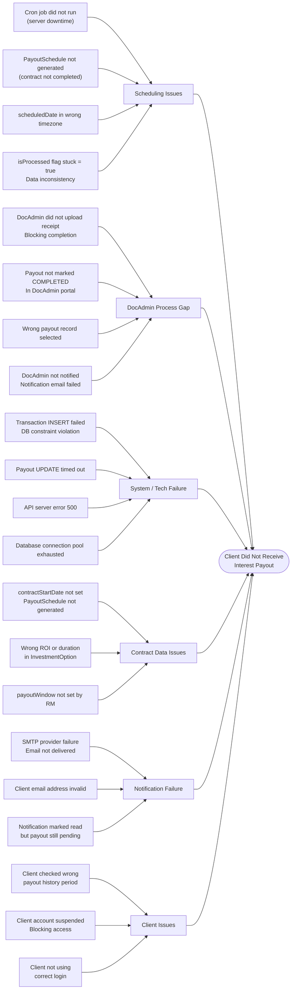
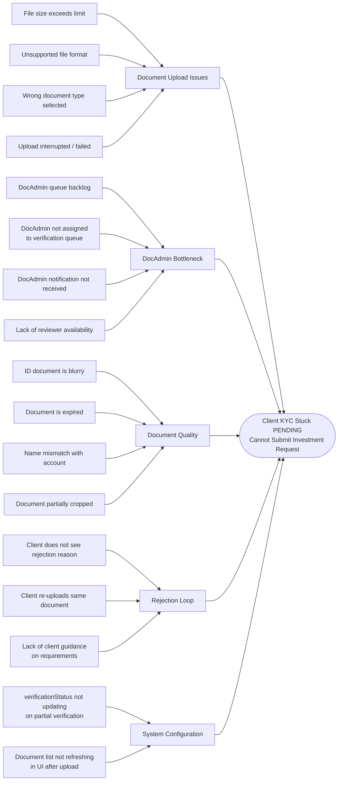

# Fishbone (Ishikawa) Diagrams — EMDEE Ventures Wealth Management CRM

---

## 1. Successful Investment Lifecycle — Cause & Effect

> **Effect:** Seamless Lead → Client → Investment → Payout Journey

```mermaid
flowchart LR

    Effect(["Successful Investment Lifecycle\nLead → Client → Investment → Payout"])

    %% ─── Main Bones ───────────────────────────────────────
    A["User Acquisition\n& Onboarding"]
    B["Document &\nKYC Management"]
    C["Investment\nConfiguration"]
    D["Purchase Request\nWorkflow"]
    E["Payout\nProcessing"]
    F["System\nInfrastructure"]

    A --> Effect
    B --> Effect
    C --> Effect
    D --> Effect
    E --> Effect
    F --> Effect

    %% ─── A: User Acquisition ──────────────────────────────
    A1["Lead Form Submission\n/user-form"]
    A2["Lead Source Tracking\nInstagram/YouTube/Referral"]
    A3["RM Assignment by DocAdmin"]
    A4["Lead → Registered User\nConversion"]
    A5["Email Verification\nVerificationToken"]
    A6["Client Profile Creation\nKYC Pending"]

    A1 --> A
    A2 --> A
    A3 --> A
    A4 --> A
    A5 --> A
    A6 --> A

    %% ─── B: Document & KYC ────────────────────────────────
    B1["Identity Document Upload\nPASSPORT / NATIONAL ID"]
    B2["DocAdmin Review Workflow\nPENDING → UNDER_REVIEW"]
    B3["Verification Decision\nVERIFIED / REJECTED"]
    B4["Rejection Handling\nRe-submission Loop"]
    B5["Client Status Sync\nverificationStatus field"]
    B6["Investment Agreement\nContract Storage"]

    B1 --> B
    B2 --> B
    B3 --> B
    B4 --> B
    B5 --> B
    B6 --> B

    %% ─── C: Investment Configuration ──────────────────────
    C1["Investment Tiers\nAED 50K / 100K / 500K+"]
    C2["Investment Options\nDuration + ROI + Frequency"]
    C3["Admin Plan Management\nCreate / Activate / Deactivate"]
    C4["ROI Calculation\nMonthly Interest = Amount × ROI%"]
    C5["Payout Window Config\n1-15 or 16-30 of month"]

    C1 --> C
    C2 --> C
    C3 --> C
    C4 --> C
    C5 --> C

    %% ─── D: Purchase Workflow ──────────────────────────────
    D1["Client Submits Request\nWM-xxxx Tracking Number"]
    D2["RM Review & Approval\nWith Payout Window"]
    D3["DocAdmin Contract Upload\nINVESTMENT_AGREEMENT"]
    D4["Contract Activation\nstatus = COMPLETED"]
    D5["PayoutSchedule Generation\nAuto on completion"]

    D1 --> D
    D2 --> D
    D3 --> D
    D4 --> D
    D5 --> D

    %% ─── E: Payout Processing ──────────────────────────────
    E1["Daily Cron Job\nScheduled 2AM UTC"]
    E2["Due Schedule Detection\nscheduledDate <= TODAY"]
    E3["Payout Record Creation\nstatus = PENDING"]
    E4["DocAdmin Receipt Upload\nProof of payment"]
    E5["Transaction Creation\nINTEREST_PAYOUT type"]
    E6["Client Notification\nEmail + In-App"]

    E1 --> E
    E2 --> E
    E3 --> E
    E4 --> E
    E5 --> E
    E6 --> E

    %% ─── F: System Infrastructure ──────────────────────────
    F1["PostgreSQL Database\nPrisma ORM"]
    F2["NextAuth.js\nSession Management"]
    F3["Email Service\nBranded HTML Templates"]
    F4["Audit Logging\nAll critical actions traced"]
    F5["In-App Notifications\nReal-time alerts"]
    F6["File Storage\nDocuments / Contracts / Receipts"]
    F7["Role-Based Access Control\nCLIENT / RM / DOCADMIN / ADMIN"]

    F1 --> F
    F2 --> F
    F3 --> F
    F4 --> F
    F5 --> F
    F6 --> F
    F7 --> F
```

---

## 2. Payout Failure Root Cause Analysis

> **Effect:** Interest Payout Not Received by Client

---

## 3. KYC Verification Delays — Root Cause Analysis

> **Effect:** Client Stuck in PENDING Verification — Cannot Invest

