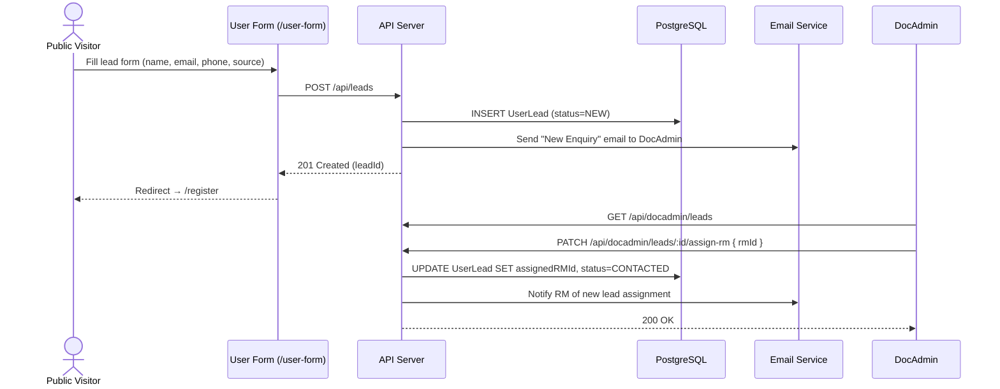
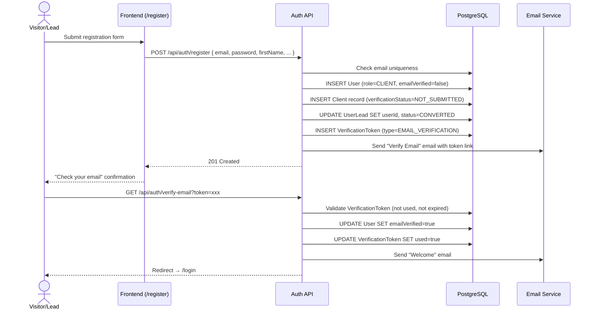
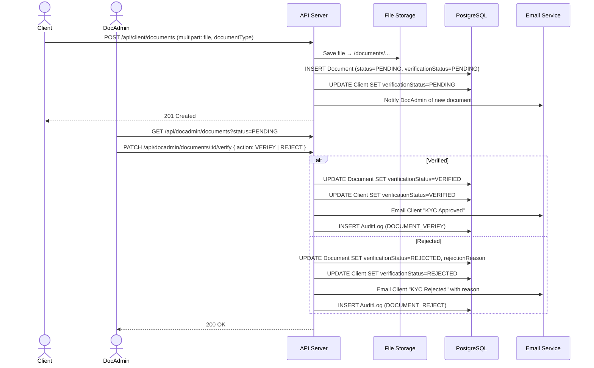
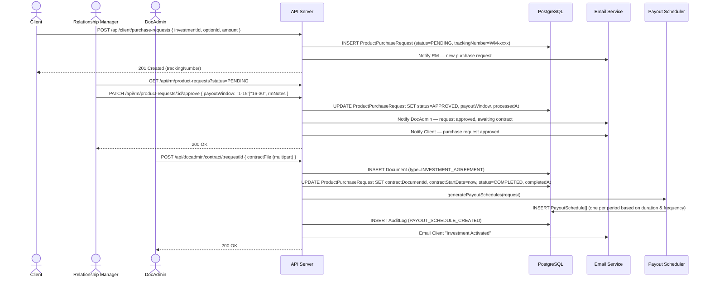
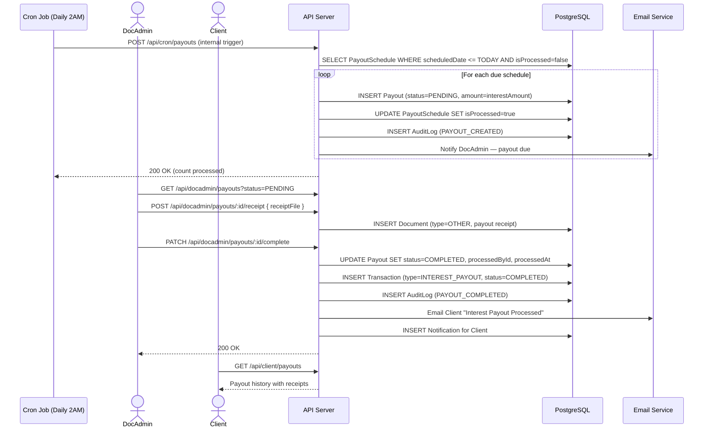
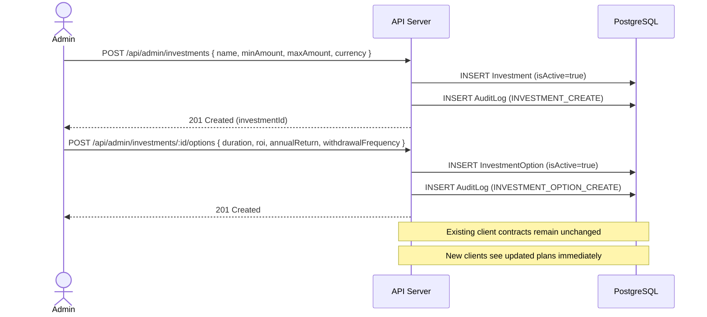
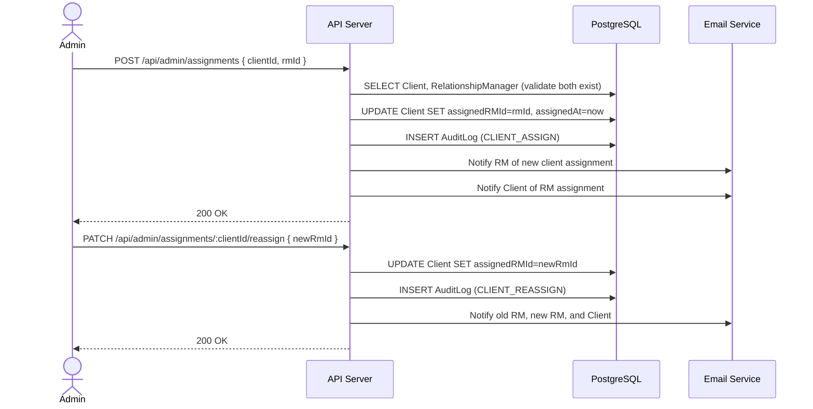

# Sequence Diagrams — EMDEE Ventures Wealth Management CRM

---

## 1. Lead Capture & RM Assignment

---

## 2. Client Registration & Email Verification

---

## 3. KYC Document Upload & Verification

---

## 4. Investment Purchase Request → RM Approval → Contract

---

## 5. Interest Payout Processing (Automated + DocAdmin)

---

## 6. Admin — Investment Plan Management

---

## 7. Admin — RM & Client Assignment

