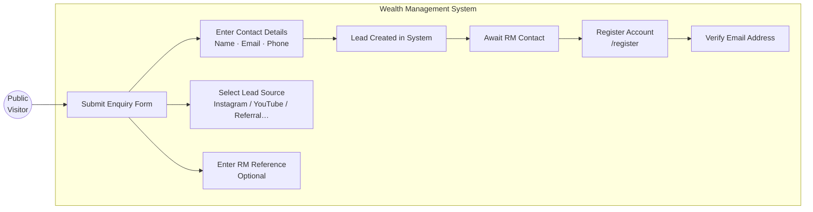
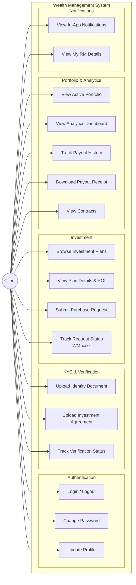
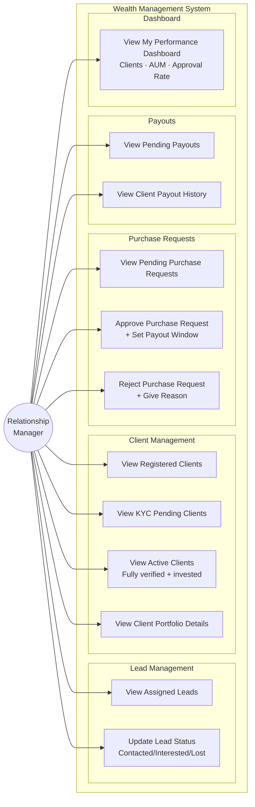
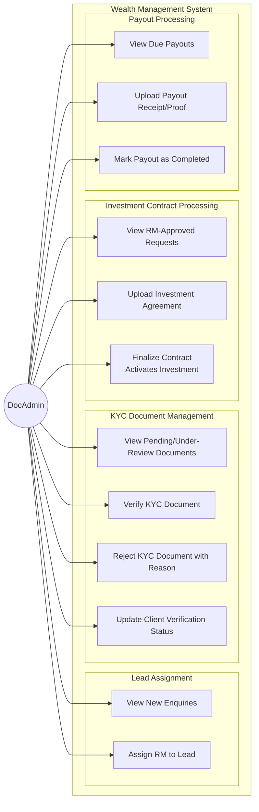
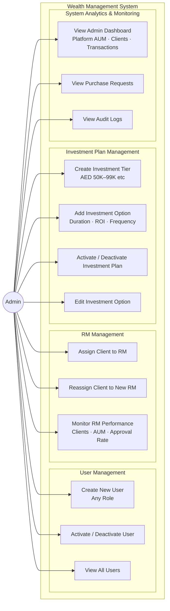
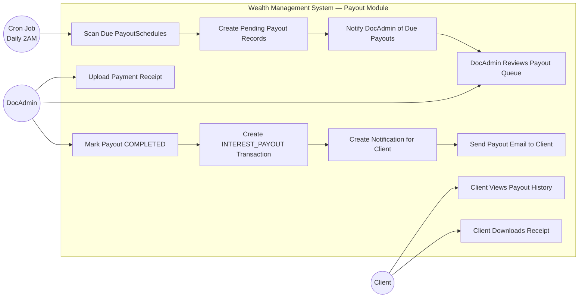

# Use Case Diagrams — EMDEE Ventures Wealth Management CRM

---

## 1. Public Visitor Use Cases

---

## 2. Client Use Cases

---

## 3. Relationship Manager (RM) Use Cases

---

## 4. Document Admin (DocAdmin) Use Cases

---

## 5. Admin Use Cases

---

## 6. Automated Payout System Use Case

