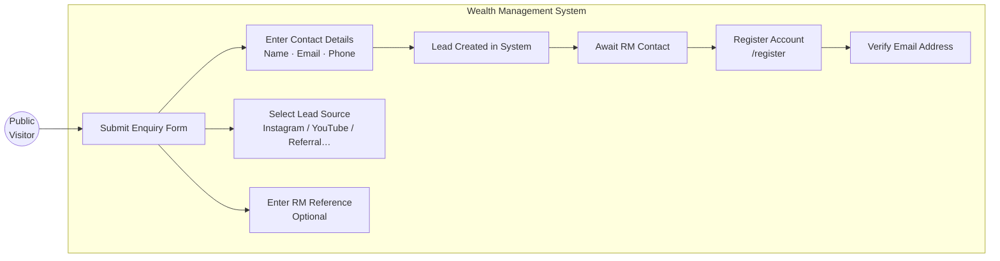
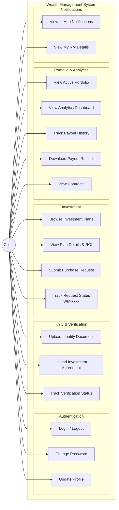
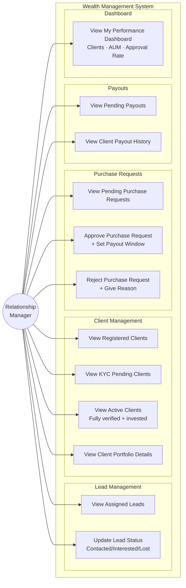
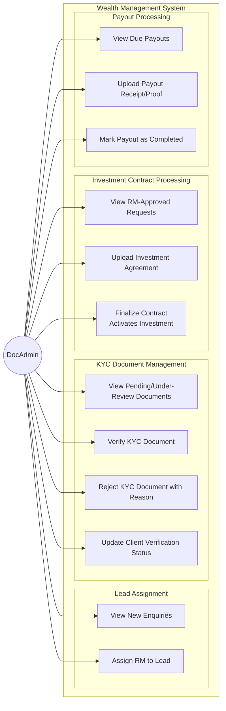
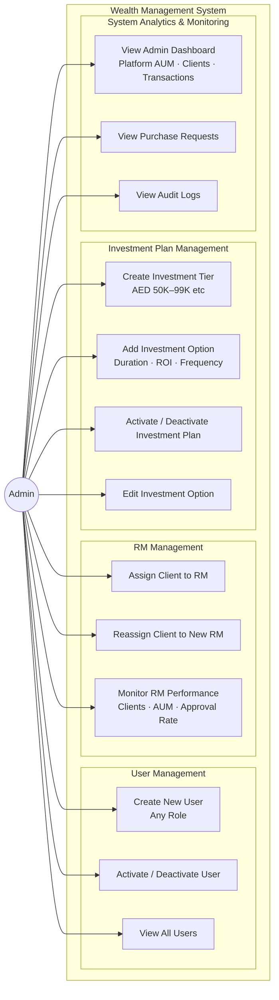
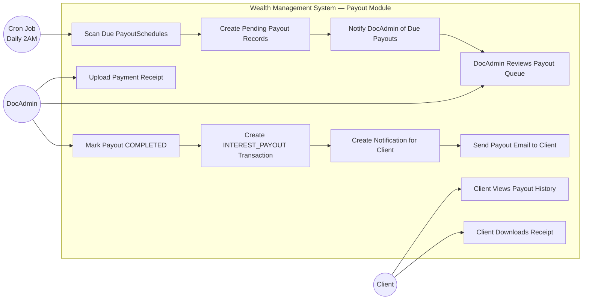

# Use Case Diagrams — EMDEE Ventures Wealth Management CRM

---

## 1. Public Visitor Use Cases

---

## 2. Client Use Cases
<mxfile host="app.diagrams.net" agent="Mozilla/5.0 (Windows NT 10.0; Win64; x64) AppleWebKit/537.36 (KHTML, like Gecko) Chrome/146.0.0.0 Safari/537.36" version="29.6.1">
  <diagram name="Wealth Management Use Case" id="0">
    <mxGraphModel dx="2365" dy="2682" grid="1" gridSize="10" guides="1" tooltips="1" connect="1" arrows="1" fold="1" page="1" pageScale="1" pageWidth="827" pageHeight="1169" math="0" shadow="0">
      <root>
        <mxCell id="0" />
        <mxCell id="1" parent="0" />
        <mxCell id="actor1" parent="1" style="shape=umlActor;verticalLabelPosition=bottom;verticalAlign=top;labelBackgroundColor=none;rounded=0;" value="Client" vertex="1">
          <mxGeometry height="80" width="40" x="50" y="250" as="geometry" />
        </mxCell>
        <mxCell id="system" parent="1" style="shape=rectangle;strokeWidth=2;labelBackgroundColor=none;rounded=0;fillColor=#647687;fontColor=#ffffff;strokeColor=#314354;" value="" vertex="1">
          <mxGeometry height="980" width="900" x="310" y="-280" as="geometry" />
        </mxCell>
        <mxCell id="uc1" parent="system" style="ellipse;fontSize=13;labelBackgroundColor=none;rounded=0;" value="Login / Logout" vertex="1">
          <mxGeometry height="70" width="160" x="20" y="80" as="geometry" />
        </mxCell>
        <mxCell id="uc2" parent="system" style="ellipse;labelBackgroundColor=none;rounded=0;" value="Change Password" vertex="1">
          <mxGeometry height="70" width="160" x="370" y="80" as="geometry" />
        </mxCell>
        <mxCell id="uc3" parent="system" style="ellipse;labelBackgroundColor=none;rounded=0;" value="Update Profile" vertex="1">
          <mxGeometry height="70" width="160" x="190" y="80" as="geometry" />
        </mxCell>
        <mxCell id="uc4" parent="system" style="ellipse;labelBackgroundColor=none;rounded=0;" value="Upload Identity Document" vertex="1">
          <mxGeometry height="70" width="200" x="540" y="80" as="geometry" />
        </mxCell>
        <mxCell id="uc5" parent="system" style="ellipse;labelBackgroundColor=none;rounded=0;" value="Upload Investment Agreement" vertex="1">
          <mxGeometry height="70" width="220" x="670" y="470" as="geometry" />
        </mxCell>
        <mxCell id="uc6" parent="system" style="ellipse;labelBackgroundColor=none;rounded=0;" value="Track Verification Status" vertex="1">
          <mxGeometry height="70" width="220" x="677" y="550" as="geometry" />
        </mxCell>
        <mxCell id="uc7" parent="system" style="ellipse;fontSize=13;labelBackgroundColor=none;rounded=0;" value="Browse Investment Plans" vertex="1">
          <mxGeometry height="70" width="200" x="680" y="142" as="geometry" />
        </mxCell>
        <mxCell id="uc8" parent="system" style="ellipse;labelBackgroundColor=none;rounded=0;" value="View Plan Details &amp; ROI" vertex="1">
          <mxGeometry height="70" width="240" x="652" y="388" as="geometry" />
        </mxCell>
        <mxCell id="uc9" parent="system" style="ellipse;labelBackgroundColor=none;rounded=0;" value="Submit Purchase Request" vertex="1">
          <mxGeometry height="70" width="220" x="680" y="630" as="geometry" />
        </mxCell>
        <mxCell id="uc10" parent="system" style="ellipse;labelBackgroundColor=none;rounded=0;" value="Track Request Status (WM-xxxx)" vertex="1">
          <mxGeometry height="70" width="240" x="650" y="800" as="geometry" />
        </mxCell>
        <mxCell id="uc11" parent="system" style="ellipse;labelBackgroundColor=none;rounded=0;" value="View Active Portfolio" vertex="1">
          <mxGeometry height="70" width="200" x="687" y="220" as="geometry" />
        </mxCell>
        <mxCell id="uc12" parent="system" style="ellipse;labelBackgroundColor=none;rounded=0;" value="View Analytics Dashboard" vertex="1">
          <mxGeometry height="70" width="220" x="665" y="300" as="geometry" />
        </mxCell>
        <mxCell id="uc13" parent="system" style="ellipse;labelBackgroundColor=none;rounded=0;" value="Track Payout History" vertex="1">
          <mxGeometry height="70" width="200" x="687" y="720" as="geometry" />
        </mxCell>
        <mxCell id="uc14" parent="system" style="ellipse;labelBackgroundColor=none;rounded=0;" value="Download Payout Receipt" vertex="1">
          <mxGeometry height="70" width="220" x="660" y="890" as="geometry" />
        </mxCell>
        <mxCell id="uc15" parent="system" style="ellipse;labelBackgroundColor=none;rounded=0;" value="View Contracts" vertex="1">
          <mxGeometry height="70" width="180" x="480" y="896" as="geometry" />
        </mxCell>
        <mxCell id="uc16" parent="system" style="ellipse;labelBackgroundColor=none;rounded=0;" value="View In-App Notifications" vertex="1">
          <mxGeometry height="70" width="240" x="230" y="896" as="geometry" />
        </mxCell>
        <mxCell id="uc17" parent="system" style="ellipse;labelBackgroundColor=none;rounded=0;" value="View My RM Details" vertex="1">
          <mxGeometry height="70" width="200" x="20" y="900" as="geometry" />
        </mxCell>
        <mxCell id="e1" edge="1" parent="1" source="actor1" style="endArrow=none;labelBackgroundColor=none;fontColor=default;rounded=0;" target="uc1">
          <mxGeometry relative="1" as="geometry" />
        </mxCell>
        <mxCell id="e2" edge="1" parent="1" source="actor1" style="endArrow=none;labelBackgroundColor=none;fontColor=default;rounded=0;" target="uc2">
          <mxGeometry relative="1" as="geometry" />
        </mxCell>
        <mxCell id="e3" edge="1" parent="1" source="actor1" style="endArrow=none;labelBackgroundColor=none;fontColor=default;rounded=0;" target="uc3">
          <mxGeometry relative="1" as="geometry" />
        </mxCell>
        <mxCell id="e4" edge="1" parent="1" source="actor1" style="endArrow=none;labelBackgroundColor=none;fontColor=default;rounded=0;" target="uc4">
          <mxGeometry relative="1" as="geometry" />
        </mxCell>
        <mxCell id="e5" edge="1" parent="1" source="actor1" style="endArrow=none;labelBackgroundColor=none;fontColor=default;rounded=0;" target="uc5">
          <mxGeometry relative="1" as="geometry" />
        </mxCell>
        <mxCell id="e6" edge="1" parent="1" source="actor1" style="endArrow=none;labelBackgroundColor=none;fontColor=default;rounded=0;" target="uc6">
          <mxGeometry relative="1" as="geometry" />
        </mxCell>
        <mxCell id="e7" edge="1" parent="1" source="actor1" style="endArrow=none;labelBackgroundColor=none;fontColor=default;rounded=0;" target="uc7">
          <mxGeometry relative="1" as="geometry" />
        </mxCell>
        <mxCell id="e8" edge="1" parent="1" source="actor1" style="endArrow=none;labelBackgroundColor=none;fontColor=default;rounded=0;" target="uc8">
          <mxGeometry relative="1" as="geometry" />
        </mxCell>
        <mxCell id="e9" edge="1" parent="1" source="actor1" style="endArrow=none;labelBackgroundColor=none;fontColor=default;rounded=0;" target="uc9">
          <mxGeometry relative="1" as="geometry" />
        </mxCell>
        <mxCell id="e10" edge="1" parent="1" source="actor1" style="endArrow=none;labelBackgroundColor=none;fontColor=default;rounded=0;" target="uc10">
          <mxGeometry relative="1" as="geometry" />
        </mxCell>
        <mxCell id="e11" edge="1" parent="1" source="actor1" style="endArrow=none;labelBackgroundColor=none;fontColor=default;rounded=0;" target="uc11">
          <mxGeometry relative="1" as="geometry" />
        </mxCell>
        <mxCell id="e12" edge="1" parent="1" source="actor1" style="endArrow=none;labelBackgroundColor=none;fontColor=default;rounded=0;" target="uc12">
          <mxGeometry relative="1" as="geometry" />
        </mxCell>
        <mxCell id="e13" edge="1" parent="1" source="actor1" style="endArrow=none;labelBackgroundColor=none;fontColor=default;rounded=0;" target="uc13">
          <mxGeometry relative="1" as="geometry" />
        </mxCell>
        <mxCell id="e14" edge="1" parent="1" source="actor1" style="endArrow=none;labelBackgroundColor=none;fontColor=default;rounded=0;" target="uc14">
          <mxGeometry relative="1" as="geometry" />
        </mxCell>
        <mxCell id="e15" edge="1" parent="1" source="actor1" style="endArrow=none;labelBackgroundColor=none;fontColor=default;rounded=0;" target="uc15">
          <mxGeometry relative="1" as="geometry" />
        </mxCell>
        <mxCell id="e16" edge="1" parent="1" source="actor1" style="endArrow=none;labelBackgroundColor=none;fontColor=default;rounded=0;" target="uc16">
          <mxGeometry relative="1" as="geometry" />
        </mxCell>
        <mxCell id="e17" edge="1" parent="1" source="actor1" style="endArrow=none;labelBackgroundColor=none;fontColor=default;rounded=0;" target="uc17">
          <mxGeometry relative="1" as="geometry" />
        </mxCell>
      </root>
    </mxGraphModel>
  </diagram>
</mxfile>

---

## 3. Relationship Manager (RM) Use Cases

---

## 4. Document Admin (DocAdmin) Use Cases

---

## 5. Admin Use Cases

---

## 6. Automated Payout System Use Case

