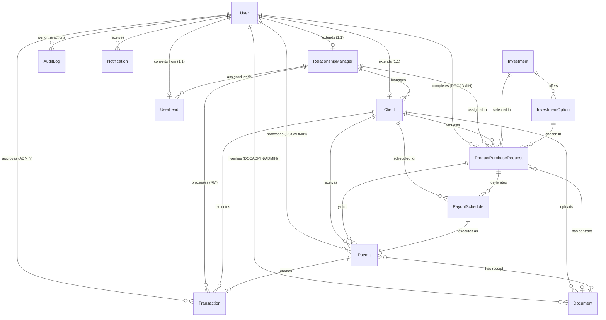

# 5. Entity-Relationship Diagram

---

## 5.1 Overview

The Wealth Management CRM database is built on **PostgreSQL 15+** with **Prisma ORM** managing the schema. The database comprises **14 tables** and **13 enums**, organized into three logical domains:

1. **User & Authentication Domain** — Users, Clients, Relationship Managers, Leads, Verification Tokens
2. **Investment & Transaction Domain** — Investments, Investment Options, Purchase Requests, Transactions, Payout Schedules, Payouts
3. **Audit & Communication Domain** — Audit Logs, Notifications, Documents

---

## 5.2 Entity-Relationship Diagram (Mermaid)



---

## 5.3 Architecture Tree

```
users
 ├── clients                        (1:1 extension via userId)
 │    ├── transactions               (many — financial records)
 │    ├── documents                  (many — KYC files)
 │    ├── investment_purchase_requests (many — investment requests)
 │    │    ├── payout_schedules      (many — auto-generated per contract)
 │    │    └── payouts               (many — executed interest payouts)
 │    └── payouts                    (many — interest received)
 └── relationship_managers           (1:1 extension via userId)
      ├── clients                    (1:many — managed clients)
      └── user_leads                 (1:many — assigned leads)

investments
 └── investment_options              (1:many — duration/ROI configurations)
      └── investment_purchase_requests (1:many — client selections)

audit_logs                           (system-wide, nullable userId for system actions)
notifications                        (per user — in-app alerts)
verification_tokens                  (per user — email/password reset tokens)
user_leads                           (public form submissions, optionally linked to user)
```

---

## 5.4 Key Relationships Explained

### 5.4.1 User → Client (1:1 Extension)
Every `Client` record has exactly one `User` record (via `userId` foreign key, `@unique`). When a user registers with the CLIENT role, both records are created simultaneously. The `User` record holds authentication data (email, password, role, status), while `Client` holds investment-specific data (verificationStatus, assignedRMId, riskTolerance).

### 5.4.2 User → RelationshipManager (1:1 Extension)
Similarly, every `RelationshipManager` extends a `User` record. RM-specific fields include specialization, certifications, maxClientLimit, and totalAUM (Assets Under Management).

### 5.4.3 Client → RelationshipManager (Many-to-One)
Multiple clients can be assigned to a single RM (One-to-Many from RM's perspective). Each client has at most ONE assigned RM (`assignedRMId` is optional until DocAdmin assigns one). This assignment is the core of the client management workflow.

### 5.4.4 Client → ProductPurchaseRequest → PayoutSchedule → Payout (Chain)
This is the core investment chain:
1. Client submits a `ProductPurchaseRequest`
2. After RM approval and DocAdmin finalization, `PayoutSchedule` records are generated
3. Each `PayoutSchedule` corresponds to one executed `Payout`
4. Each completed `Payout` creates a `Transaction` record

### 5.4.5 Document (Polymorphic)
The `Document` entity is used for three different purposes:
- **KYC Documents:** Uploaded by clients, verified by DocAdmins (type: `IDENTITY_PROOF`)
- **Investment Agreements:** Contracts uploaded by DocAdmins (type: `INVESTMENT_AGREEMENT`)
- **Payout Receipts:** Receipts uploaded by DocAdmins for completed payouts (type: `OTHER`)

### 5.4.6 UserLead → User (Optional Conversion)
`UserLead` stores public form submissions. When a lead converts (registers), the `User` record is created and linked to the `UserLead` via `userId` (optional 1:1). This preserves the full lead-to-client conversion history.

---

## 5.5 Enum Reference

| Enum Name             | Values                                                             |
|-----------------------|--------------------------------------------------------------------|
| `UserRole`            | `CLIENT`, `RM`, `ADMIN`, `DOCADMIN`                               |
| `AccountStatus`       | `ACTIVE`, `INACTIVE`, `LOCKED`, `SUSPENDED`                       |
| `VerificationStatus`  | `NOT_SUBMITTED`, `PENDING`, `UNDER_REVIEW`, `VERIFIED`, `REJECTED`, `EXPIRED` |
| `RequestStatus`       | `PENDING`, `PROCESSING`, `APPROVED`, `REJECTED`, `COMPLETED`, `CANCELLED` |
| `TransactionType`     | `PURCHASE`, `WITHDRAWAL`, `INTEREST_PAYOUT`, `DIVIDEND`, `ADJUSTMENT` |
| `TransactionStatus`   | `COMPLETED`, `FAILED`, `REVERSED`, `PENDING_SETTLEMENT`           |
| `PayoutStatus`        | `PENDING`, `COMPLETED`, `FAILED`                                  |
| `DocumentType`        | `IDENTITY_PROOF`, `INVESTMENT_AGREEMENT`, `OTHER`                 |
| `LeadSource`          | `INSTAGRAM`, `YOUTUBE`, `FACEBOOK_ADS`, `GOOGLE_ADS`, `WEBSITE`, `REFERRAL`, `OTHER` |
| `LeadStatus`          | `NEW`, `CONTACTED`, `INTERESTED`, `NOT_INTERESTED`, `CONVERTED`, `LOST` |
| `NotificationType`    | `INFO`, `SUCCESS`, `WARNING`, `ERROR`, `ALERT`                    |
| `NotificationCategory`| `TRANSACTION`, `REQUEST`, `ASSIGNMENT`, `SYSTEM`, `PORTFOLIO`, `SECURITY` |
| `AuditAction`         | 30+ values covering all system operations (see Section 8 — Data Dictionary) |

---

## 5.6 Database Design Principles Applied

### UUID Primary Keys
All entities use UUID primary keys generated by PostgreSQL's `uuid()` function. This provides:
- Security (non-guessable IDs prevent enumeration attacks)
- Horizontal scalability (no central sequence bottleneck)
- Safe URL exposure (no sequential integer IDs in API routes)

### Decimal Precision for Financial Data
All monetary values use `Decimal(15,2)` type via Prisma's `@db.Decimal(15, 2)`. This ensures:
- No floating-point rounding errors (critical for financial calculations)
- Support for amounts up to 999,999,999,999,999.99 (quadrillions)
- AED currency default

### Composite Indexes for Performance
Critical compound queries have dedicated composite indexes:
- `(assignedRMId, verificationStatus)` on `clients` — RM dashboard KYC filter
- `(clientId, type, status)` on `transactions` — AUM/analytics queries
- `email`, `role`, `status`, `isArchived` on `users` — Auth and admin queries

### Soft Delete Pattern
`deletedAt DateTime?` on `User` and `Transaction` tables allows non-destructive record removal. Soft-deleted records are excluded from application queries but retained for audit compliance.

### Archival Pattern
`isArchived Boolean` + `archivedAt DateTime?` on `User` and `archivedReason` on `Client` supports the KYC Day-7 expiry workflow: accounts are archived (not deleted) and excluded from active operations while being retained for regulatory compliance.
