# Wealth Management CRM


An enterprise-grade, comprehensive Wealth Management CRM platform designed specifically for financial institutions, wealth managers, and their elite clients.

🌟 **Live Demo:** [https://wealthmanagementcrm.yashpandav.dev/](https://wealthmanagementcrm.yashpandav.dev/)

---

## 📸 Platform Previews

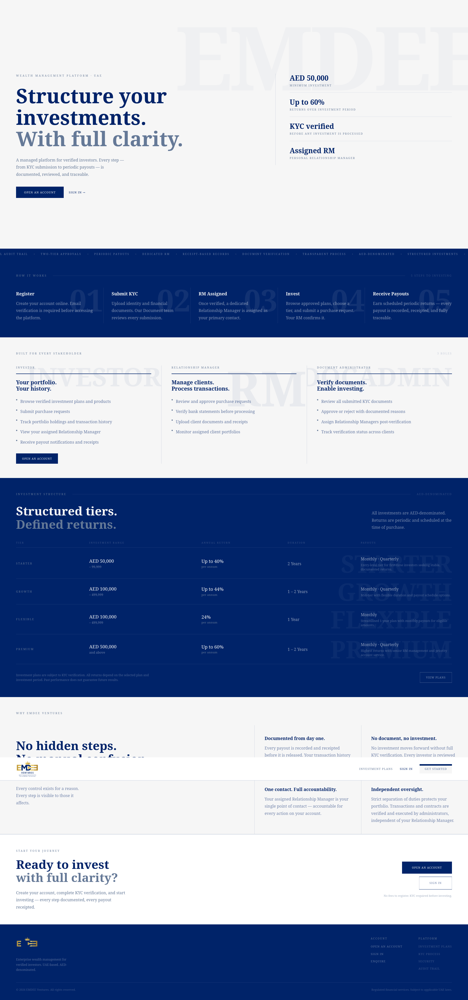

### 🔐 Public & Authentication
<table width="100%">
  <tr>
    <td width="50%"><b>Login Portal</b><br>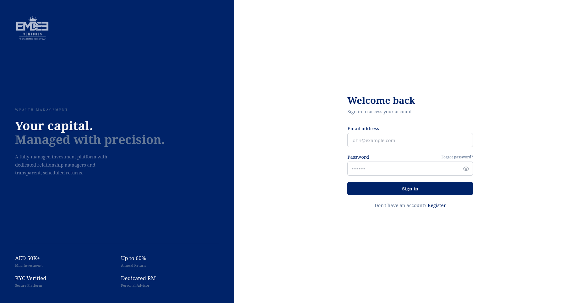</td>
    <td width="50%"><b>Registration</b><br>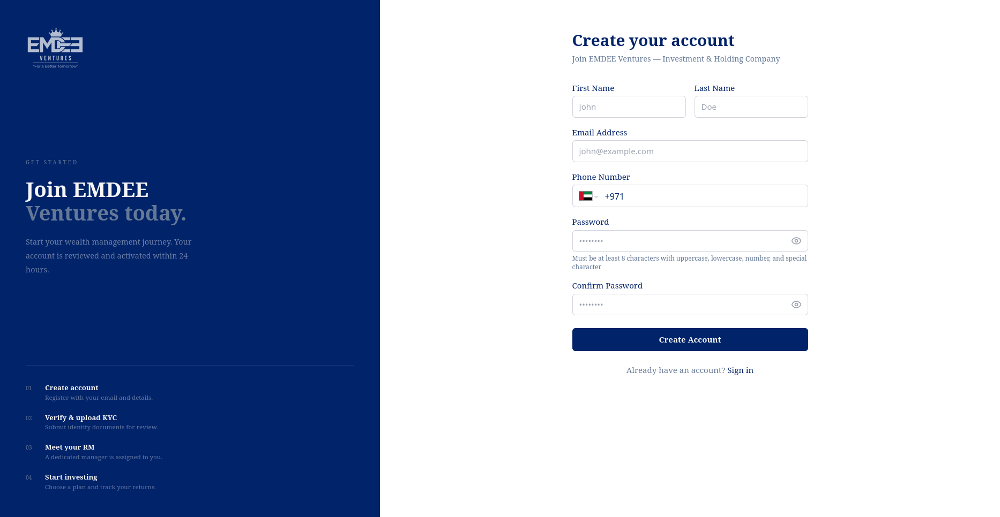</td>
  </tr>
</table>

### 👔 Client Portal
<table width="100%">
  <tr>
    <td width="50%"><b>Client Portfolio Overview</b><br>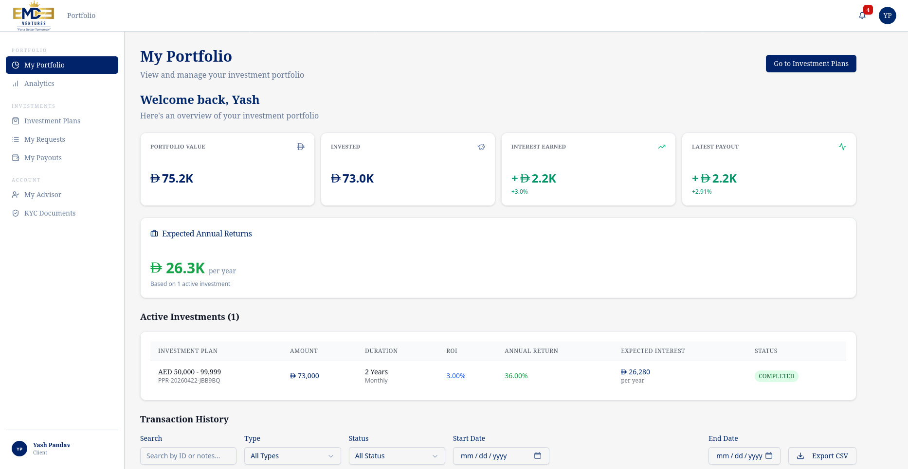</td>
    <td width="50%"><b>Earnings & Payouts</b><br>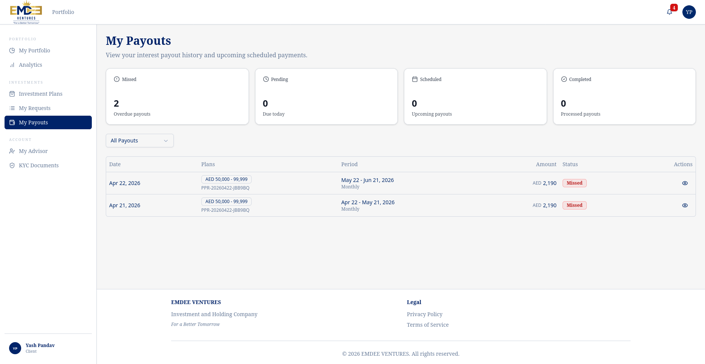</td>
  </tr>
  <tr>
    <td width="50%"><b>KYC Document Management</b><br>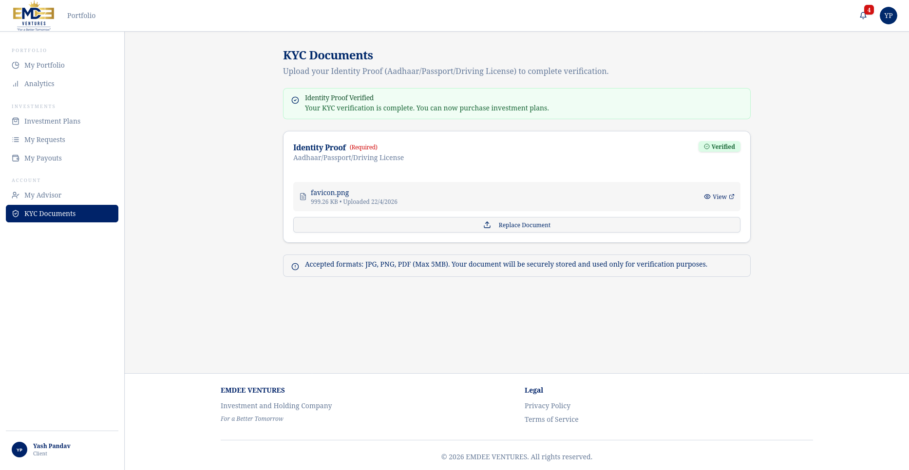</td>
    <td width="50%"></td>
  </tr>
</table>

### 💼 Relationship Manager (RM) Space
<table width="100%">
  <tr>
    <td width="50%"><b>RM Analytics Dashboard</b><br>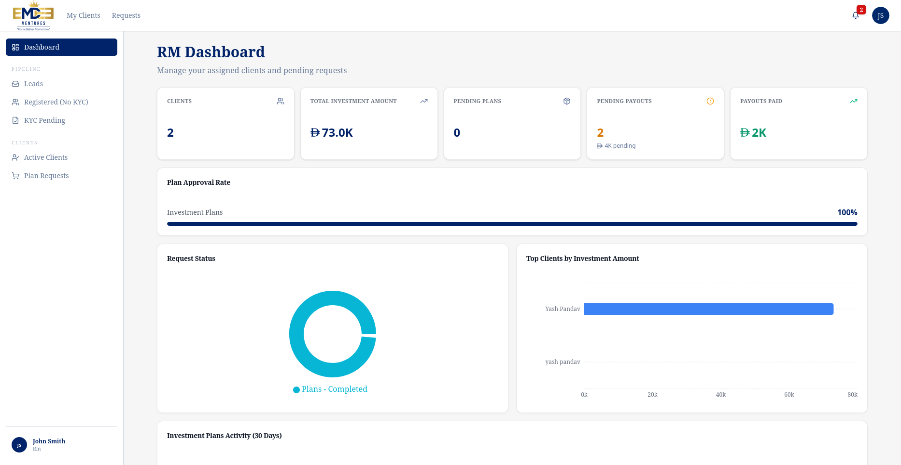</td>
    <td width="50%"><b>Active Client Tracking</b><br>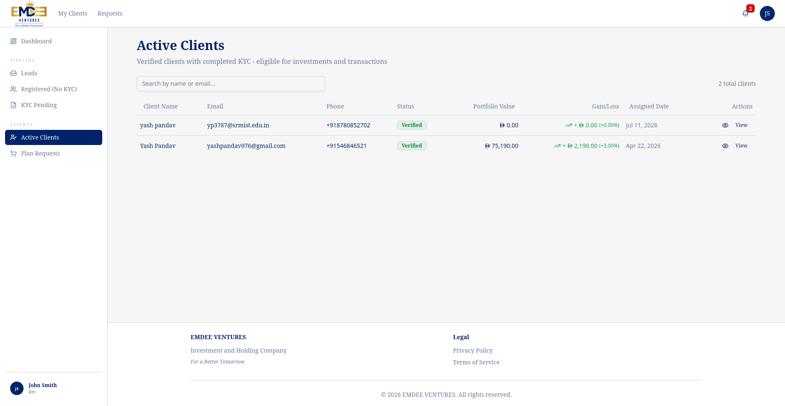</td>
  </tr>
  <tr>
    <td width="50%"><b>Investment Plan Requests</b><br>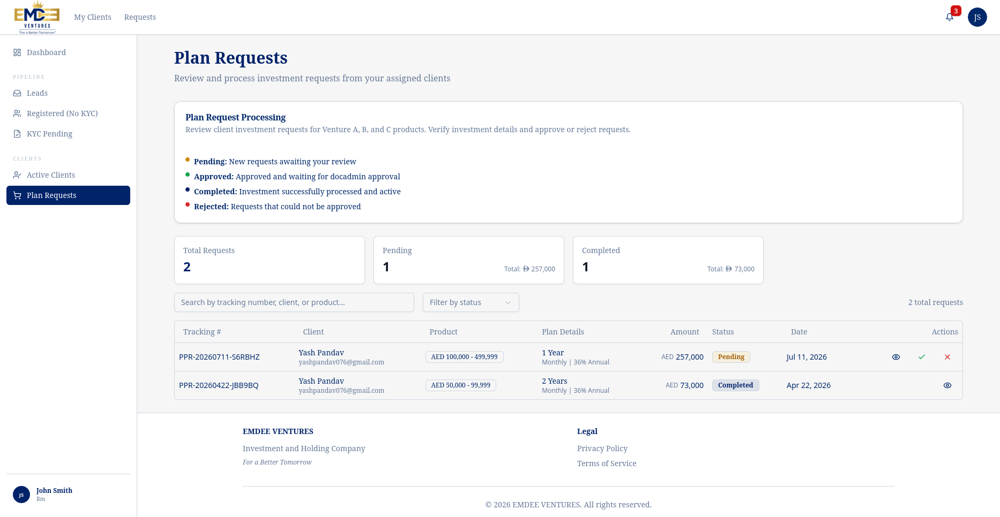</td>
    <td width="50%"></td>
  </tr>
</table>

### ⚙️ Administration & Compliance (DocAdmin)
<table width="100%">
  <tr>
    <td width="50%"><b>Global Investment Plans</b><br>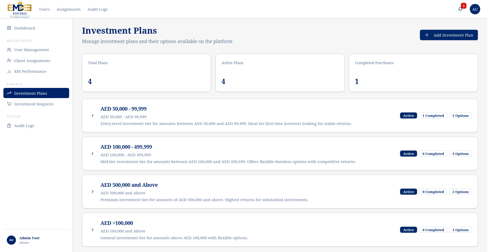</td>
    <td width="50%"><b>Document Verification Pipeline</b><br>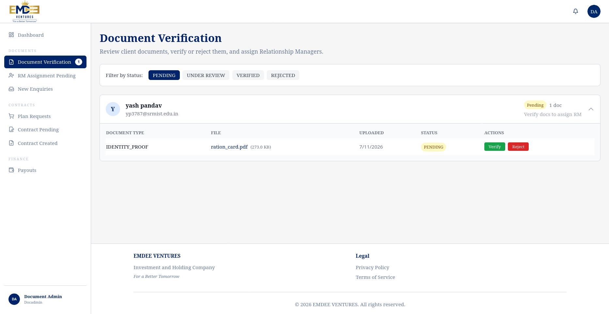</td>
  </tr>
  <tr>
    <td width="50%"><b>New Enquiries</b><br>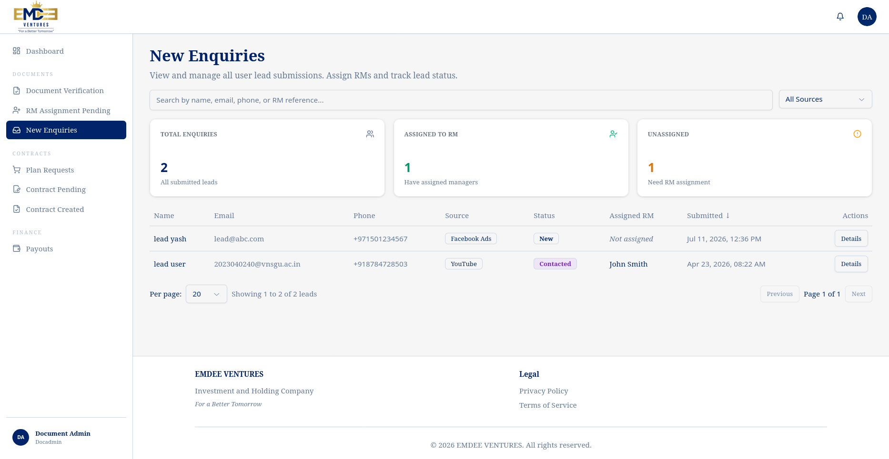</td>
    <td width="50%"><b>Pending Payout Approvals</b><br>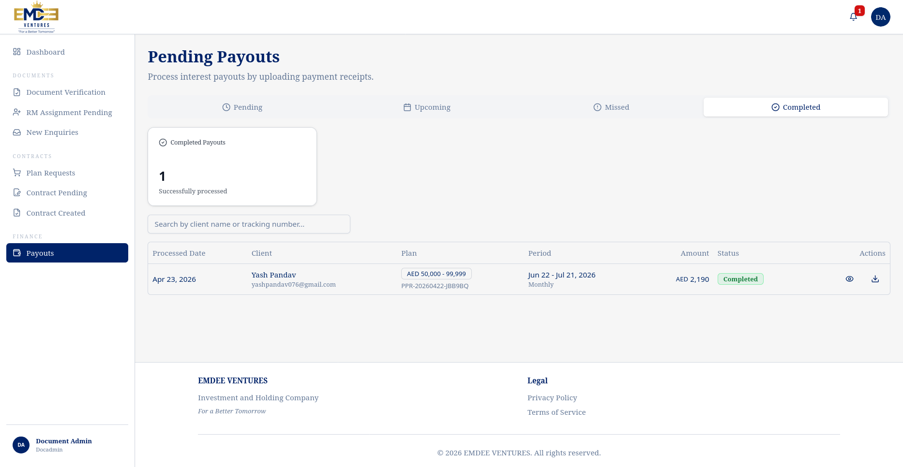</td>
  </tr>
</table>

---

## 🚀 Features

- **Client Portal**: Browse instruments, submit requests, view portfolio
- **Relationship Manager Dashboard**: Manage clients, process transactions
- **Admin Panel**: System configuration, analytics, approvals
- **Two-tier Approval**: Secure withdrawal workflow
- **Manual Processing**: Bank statement verification
- **Audit Trail**: Comprehensive logging and compliance

## Tech Stack

- **Framework**: Next.js 14+ with App Router
- **Language**: TypeScript 5+ (strict mode)
- **Database**: PostgreSQL 15+ with Prisma ORM
- **Authentication**: NextAuth.js
- **Styling**: Tailwind CSS + shadcn/ui
- **Forms**: React Hook Form + Zod validation
- **State**: TanStack Query

## Getting Started

You can run this project locally using either **Docker** (Recommended) or a **Manual Node.js Setup**.

### Option 1: Running with Docker (Recommended)
This is the easiest way to run the application. It guarantees that the environment exactly matches production and handles database initialization automatically.

**Prerequisites:**
- Docker & Docker Compose installed
- Git

**Steps:**
1. Clone the repository and navigate into it:
   ```bash
   git clone <repository-url>
   cd fin-mgmt
   ```
2. Set up environment variables:
   ```bash
   cp .env.example .env
   ```
3. Build and start the container in the background:
   ```bash
   docker compose up --build -d
   ```
4. Access the application at **[http://localhost:3001](http://localhost:3001)**. All file uploads will be persisted automatically via Docker volumes in the local `public/uploads` folder.

---

### Option 2: Manual Node.js Setup

**Prerequisites:**
- Node.js 18.17.0+
- PostgreSQL 15+
- pnpm 8.0.0+

**Steps:**
1. Install dependencies:
   ```bash
   pnpm install
   ```
2. Set up environment variables (`cp .env.example .env.local`) and configure `DATABASE_URL` and `NEXTAUTH_SECRET`.
3. Set up the database:
   ```bash
   pnpm db:generate  # Generate Prisma client
   pnpm db:migrate   # Run migrations
   pnpm db:seed      # (Optional) Seed with test data
   ```
4. Start the development server:
   ```bash
   pnpm dev
   ```
5. Open **[http://localhost:3000](http://localhost:3000)** in your browser.

## Development Scripts

```bash
pnpm dev          # Start development server
pnpm build        # Build for production
pnpm start        # Start production server
pnpm lint         # Run ESLint checks
pnpm format       # Format code with Prettier
pnpm type-check   # Check TypeScript types
```

### Database Commands (Prisma)

```bash
pnpm db:generate  # Generate Prisma client
pnpm db:migrate   # Run migrations
pnpm db:push      # Push schema changes (development)
pnpm db:studio    # Open Prisma Studio GUI
pnpm db:seed      # Seed database
```

## Project Structure

```text
wealth-management/
├── Diagrams/                # System Architecture, ER, UML, and Data Flow Diagrams
├── docs/                    # Design System, Accessibility, and Component Documentation
├── Documentation/           # Requirement Specifications, Planning, and UI Screenshots
├── prisma/                  # Database schema & migrations
│   ├── migrations/          # Version-controlled database migrations
│   ├── schema.prisma        # Prisma data model definition
│   └── seed.ts              # Database seed script for initial data
├── public/                  # Static assets (images, logos, robots.txt)
│   └── uploads/             # Local file storage directory (Docker volume for contracts/receipts)
├── src/
│   ├── app/                 # Next.js App Router (Pages & API)
│   │   ├── (auth)/          # Authentication flows (Login, Register, Forgot Password)
│   │   ├── (dashboard)/     # Role-based dashboards (Admin, DocAdmin, RM, Client)
│   │   ├── api/             # Backend API Routes (REST endpoints)
│   │   │   ├── admin/       # Administrator endpoints
│   │   │   ├── auth/        # NextAuth & custom auth endpoints
│   │   │   ├── client/      # Client portal endpoints
│   │   │   ├── cron/        # Scheduled background jobs (payouts, reminders)
│   │   │   ├── docadmin/    # Document admin endpoints
│   │   │   ├── documents/   # Secure file upload/download endpoints
│   │   │   └── rm/          # Relationship manager endpoints
│   │   └── _components/     # Landing page & global app components
│   ├── components/          # Reusable React components
│   │   ├── admin/           # Admin-specific UI (Investment Plans, Users)
│   │   ├── client/          # Client-specific UI (Portfolio, KYC, Payouts)
│   │   ├── docadmin/        # DocAdmin UI (Verification, Lead Management)
│   │   ├── layout/          # Global layouts (Sidebar, Header, Dashboard Wrapper)
│   │   ├── rm/              # RM-specific UI (Client Tracking, Requests)
│   │   ├── shared/          # Shared functional components (File Uploads, Notifications)
│   │   └── ui/              # shadcn/ui base components (Buttons, Dialogs, Tables)
│   ├── hooks/               # Custom React hooks
│   ├── lib/                 # Core business logic and utilities
│   │   ├── analytics/       # Financial calculations and reporting logic
│   │   ├── auth/            # NextAuth configuration, RBAC, session management
│   │   ├── cron/            # Cron job definitions (Email Reminders, Payouts)
│   │   ├── db/              # Prisma client initialization
│   │   ├── email/           # Email service and HTML templates
│   │   ├── security/        # Rate limiting, sanitization, and secure headers
│   │   ├── services/        # Archival and Payout services
│   │   ├── storage/         # Local File Storage / AWS S3 implementations
│   │   └── validation/      # Zod schemas for strict request validation
│   ├── scripts/             # Utility scripts (Payout testing, Demo setup)
│   ├── types/               # Global TypeScript interfaces & types
│   ├── utils/               # General helper functions
│   └── middleware.ts        # Next.js route protection & security middleware
├── Dockerfile               # Production container image definition
├── docker-compose.yml       # Local development & production orchestration
└── tailwind.config.ts       # Tailwind CSS configuration and theme tokens
```

## User Roles

### Client

- Browse investment instruments
- Submit purchase/withdrawal requests
- View portfolio and analytics
- Track request status

### Relationship Manager (RM)

- Manage assigned clients
- Process purchase requests
- Review withdrawal requests
- Generate reports

### Administrator

- Create/edit instruments
- Assign clients to RMs
- Approve withdrawal requests (final)
- View system analytics
- Access audit logs

## Security

- **Password Hashing**: bcrypt (12 rounds)
- **Session Management**: Secure cookies (httpOnly, secure, sameSite)
- **Account Lockout**: 5 failed attempts
- **Session Timeout**: 30 minutes inactivity
- **Input Validation**: Zod schemas (client & server)
- **Security Headers**: HSTS, CSP, X-Frame-Options, etc.

## Environment Variables

See `.env.example` for all available configuration options.

### Required Variables

- `DATABASE_URL`: PostgreSQL connection string
- `NEXTAUTH_URL`: Application URL
- `NEXTAUTH_SECRET`: Secret for token encryption

### Optional Variables

- Email configuration (`SMTP_*`)
- Security settings
- Feature flags
- Rate limiting
- File upload settings

## Contributing

1. Create a feature branch
2. Make your changes
3. Ensure tests pass
4. Ensure linting passes
5. Submit a pull request

## Deployment Journey: From AWS to GCP VPS

### The Motivation
Initially, this project was deployed and hosted using **AWS Elastic Beanstalk** (with files stored in Amazon S3). However, when AWS credits expired, maintaining the managed infrastructure became cost-prohibitive. Furthermore, there was a growing need for a centralized, self-managed Virtual Private Server (VPS) that could host multiple independent projects simultaneously without racking up individual service costs.

### The Migration Strategy
To solve this, the infrastructure was migrated to a **Google Cloud Platform (GCP) VPS** utilizing **Dokploy**—a free, open-source Platform as a Service (PaaS) that simplifies Docker-based deployments.

### Key Deployment Steps
1. **Infrastructure Provisioning**: 
   - Spun up a VM on Google Cloud Platform.
   - Assigned a **Static External IP** to ensure the server address remains permanent even after VM reboots.
   - Configured GCP Firewalls to explicitly allow inbound HTTP (Port 80) and HTTPS (Port 443) traffic.

2. **Dokploy & Containerization**:
   - Installed Dokploy to manage applications, databases, and SSL certificates automatically.
   - Containerized the Next.js application by writing a custom `Dockerfile` and `docker-compose.yml`.
   - Migrated away from AWS S3 by mounting a local Docker volume (`uploads:/app/public/uploads`) for persistent, free file storage.

3. **DNS Routing & Security (Cloudflare)**:
   - Mapped the custom domain (`wealthmanagementcrm.yashpandav.dev`) in **Cloudflare**.
   - Updated the `A` record to point directly to the GCP Static IP.
   - Set Cloudflare Proxy status to **DNS Only (Grey Cloud)** to allow Dokploy's built-in Traefik router to successfully negotiate and manage SSL certificates via Let's Encrypt.

This new architecture provides full root-level control over the infrastructure, eliminates recurring PaaS costs, and allows for infinite scalability when hosting additional personal projects on the exact same machine.

## License

Proprietary - All rights reserved

## Support

For support, contact your development team or refer to the internal documentation.
